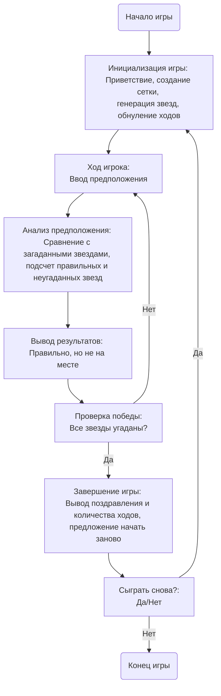

## ИНСТРУКЦИЯ:

Анализируй предоставленный код подробно и объясни его функциональность. Ответ должен включать три раздела:  

1. **<алгоритм>**: Опиши рабочий процесс в виде пошаговой блок-схемы, включая примеры для каждого логического блока, и проиллюстрируй поток данных между функциями, классами или методами.  
2. **<mermaid>**: Напиши код для диаграммы в формате `mermaid`, проанализируй и объясни все зависимости, 
    которые импортируются при создании диаграммы. 
    **ВАЖНО!** Убедитесь, что все имена переменных, используемые в диаграмме `mermaid`, 
    имеют осмысленные и описательные имена. Имена переменных вроде `A`, `B`, `C`, и т.д., не допускаются!  
    
    **Дополнительно**: Если в коде есть импорт `import header`, добавьте блок `mermaid` flowchart, объясняющий `header.py`:
    ```mermaid
    flowchart TD
        Start --> Header[<code>header.py</code><br> Determine Project Root]
    
        Header --> import[Import Global Settings: <br><code>from src import gs</code>] 
    ```

3. **<объяснение>**: Предоставьте подробные объяснения:  
   - **Импорты**: Их назначение и взаимосвязь с другими пакетами `src.`.  
   - **Классы**: Их роль, атрибуты, методы и взаимодействие с другими компонентами проекта.  
   - **Функции**: Их аргументы, возвращаемые значения, назначение и примеры.  
   - **Переменные**: Их типы и использование.  
   - Выделите потенциальные ошибки или области для улучшения.  

Дополнительно, постройте цепочку взаимосвязей с другими частями проекта (если применимо).  

Это обеспечивает всесторонний и структурированный анализ кода.
## Формат ответа: `.md` (markdown)
**КОНЕЦ ИНСТРУКЦИИ**

## <алгоритм>

1.  **Начало игры:**
    *   Выводится приветствие и правила игры.
    *   Создается игровое поле (сетка 5x5).
    *   Случайным образом генерируются координаты 5 звезд (например, (A,1), (B,3), (C,4), (D,2), (E,5)).
    *   Счетчик ходов обнуляется.
2.  **Игровой цикл:**
    *   **Ход игрока:**
        *   Игрок вводит координаты предполагаемых звезд в формате (например, A1, B2, C3, D4, E5).
        *   Предположения анализируются.
        *   **Проверка предположения:**
            *   Сравниваются координаты введенных звезд с загаданными.
            *   Подсчитывается количество звезд, угаданных в правильном положении. (например, угадал 2 звезды в правильной позиции).
            *   Подсчитывается количество звезд, угаданных, но не в правильном положении. (например, угадал 1 звезду, которая находится в другой позиции).
        *   Выводятся результаты проверки.
        *   Счетчик ходов увеличивается.
    *   **Проверка на победу:**
        *   Если все 5 звезд угаданы в правильном положении, цикл завершается.
        *   Иначе, игровой цикл продолжается.
3.  **Завершение игры:**
    *   Выводится сообщение о победе и общее количество ходов.
    *   Спрашивается, хочет ли игрок сыграть снова.
    *   Если игрок отвечает "да", игра начинается заново.
    *   Иначе, игра завершается, выводится прощальное сообщение.

## <mermaid>



**Объяснение диаграммы `mermaid`:**

*   **Start** - начало игры, служит точкой входа в процесс игры.
*   **Init** -  Инициализация игры. Этот блок отвечает за выполнение начальных операций, таких как: приветственное сообщение, создание игрового поля (сетки), генерация случайных позиций для звезд и обнуление счетчика ходов.
*   **PlayerTurn** - Ход игрока. Этот блок отвечает за получение ввода от игрока, содержащего координаты предполагаемых звезд.
*   **AnalyzeGuess** - Анализ предположения. В этом блоке происходит сравнение введенных игроком координат с загаданными. Также подсчитывается количество правильно угаданных звезд и количество звезд, которые были угаданы, но не находятся на своих местах.
*   **OutputResult** - Вывод результатов. На этом шаге программа отображает результаты сравнения: количество звезд, угаданных в правильной позиции, и количество звезд, угаданных, но не в правильной позиции.
*   **CheckWin** - Проверка победы. Этот блок проверяет, угадал ли игрок все звезды в правильной позиции. Если все звезды угаданы, то игра завершается, иначе - продолжается.
*   **EndGame** - Завершение игры. В этом блоке выводится сообщение о победе, общее количество ходов и предлагается начать игру заново.
*   **PlayAgain** - Вопрос о начале новой игры. Игроку предлагается начать игру заново.
*   **End** - Конец игры. Завершение игрового процесса.

## <объяснение>

**Импорты:**

В данном описании игры не указаны импорты, но подразумевается использование модуля `random` для генерации случайных координат звезд. Этот модуль входит в стандартную библиотеку Python.

**Классы:**

В описании игры не используются классы.

**Функции:**

1.  **`init_game()`**:
    *   **Аргументы**: Нет.
    *   **Возвращаемое значение**: Кортеж (сетка, координаты звезд, счетчик ходов).
    *   **Назначение**: Инициализирует игру: выводит приветствие, создает сетку 5x5, генерирует случайные координаты для 5 звезд и обнуляет счетчик ходов.
    *   **Пример**: `grid, stars_coords, moves_count = init_game()`
2.  **`get_player_guess()`**:
    *   **Аргументы**: Нет.
    *   **Возвращаемое значение**: Строка (предположение игрока в формате "A1, B2, C3, D4, E5").
    *   **Назначение**: Запрашивает у игрока ввод координат предполагаемых звезд.
    *   **Пример**: `guess = get_player_guess()`
3.  **`analyze_guess(guess, stars_coords)`**:
    *   **Аргументы**:
        *   `guess`: Строка (предположение игрока).
        *   `stars_coords`: Список кортежей (координаты звезд).
    *   **Возвращаемое значение**: Кортеж (правильные_позиции, неугаданные_позиции).
    *   **Назначение**: Сравнивает введенные координаты с загаданными, подсчитывает количество угаданных в правильной позиции и количество угаданных, но не в правильной позиции.
    *   **Пример**: `correct_pos, misplaced_pos = analyze_guess(guess, stars_coords)`
4.  **`print_result(correct_pos, misplaced_pos)`**:
    *   **Аргументы**:
        *   `correct_pos`: Целое число (количество правильно угаданных звезд).
        *   `misplaced_pos`: Целое число (количество угаданных, но не в правильной позиции).
    *   **Возвращаемое значение**: Нет.
    *   **Назначение**: Выводит результаты проверки предположения игрока.
    *   **Пример**: `print_result(correct_pos, misplaced_pos)`
5.  **`check_win(correct_pos)`**:
    *   **Аргументы**:
        *    `correct_pos`: Целое число (количество правильно угаданных звезд).
    *   **Возвращаемое значение**: Boolean (истина, если игрок победил, иначе ложь).
    *   **Назначение**: Проверяет, угадал ли игрок все звезды в правильной позиции.
    *   **Пример**: `if check_win(correct_pos):`
6.  **`end_game(moves_count)`**:
    *   **Аргументы**:
        *   `moves_count`: Целое число (количество ходов, которые потребовались для выигрыша).
    *   **Возвращаемое значение**: None.
    *   **Назначение**: Выводит сообщение о победе и количество ходов, которые потребовались для победы.

**Переменные:**

*   `grid`:  представляет собой сетку 5х5, которая может быть реализована как список списков или другой подобный контейнер.
*   `stars_coords`: Список кортежей, где каждый кортеж — это координаты одной звезды (например, `[(A, 1), (B, 3), (C, 4), (D, 2), (E, 5)]`).
*   `moves_count`: Целочисленная переменная, отслеживающая количество ходов, сделанных игроком.
*   `guess`: Строка, содержащая ввод игрока, представляющий собой координаты предполагаемых звезд, разделенных запятыми (например, "A1, B2, C3, D4, E5").
*   `correct_pos`: Целочисленная переменная, хранящая количество звезд, угаданных в правильном положении.
*   `misplaced_pos`: Целочисленная переменная, хранящая количество звезд, угаданных, но не в правильном положении.

**Потенциальные ошибки и области для улучшения:**

1.  **Обработка некорректного ввода:** Программа должна проверять правильность ввода координат, а именно:
    *   Соответствие формату (например, "A1", "B2", и т.д.).
    *   Корректность координат (A-E для строк, 1-5 для столбцов).
    *   Уникальность координат (звезды не должны находиться на одной клетке).
2.  **Проверка формата ввода:** Нужно проверять, что ввод игрока действительно разделен запятыми, и что все части ввода соответствуют формату координат.
3.  **Расширяемость:**  Можно добавить возможность выбора размера сетки и количества звезд.
4.  **Интерфейс:**  Реализация графического интерфейса улучшит взаимодействие с пользователем.
5.  **Многопользовательский режим:** Возможность игры между несколькими игроками.
6.  **Реализация ИИ противника**: Реализация ИИ, который мог бы играть против пользователя.

**Взаимосвязи с другими частями проекта:**

Так как в текущем описании нет кода, то о взаимодействиях можно говорить только абстрактно. Игра может быть частью более крупного проекта, например, библиотеки игр.
В этом случае, функции игры могли бы импортироваться из модуля игры в основной модуль проекта. Также можно было бы использовать классы, если бы игра была представлена в виде отдельного класса или модуля.