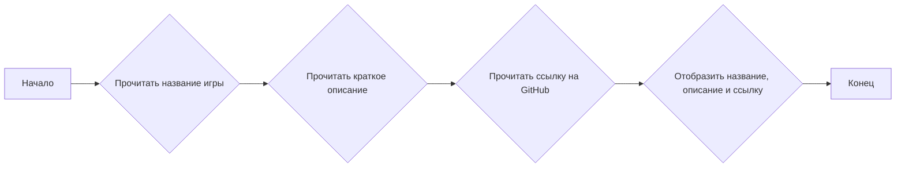
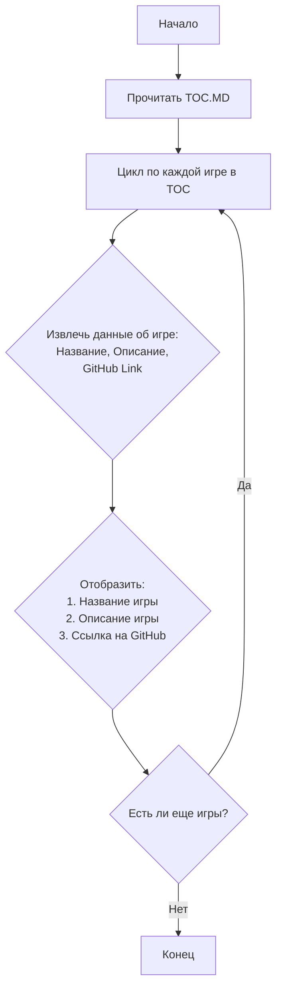

## <алгоритм>

Данный код представляет собой оглавление в формате Markdown для сборника из 101 игры из книги "More Basic Computer Games", адаптированных для проекта `hypo`. Каждая игра представлена в виде нумерованного списка, где каждый элемент списка содержит:

1.  **Название игры:** Заголовок, например, `ACE-DU`.
2.  **Brief:** Краткое описание игры на иврите, например, `משחק ניחוש מספרים.` (игра на угадывание чисел).
3.  **GitHub:** Ссылка на файл с кодом игры на GitHub.

**Пример блок-схемы для одного элемента списка (одной игры):**

**Поток данных:**

Данные (название, описание, ссылка) считываются из файла и отображаются в виде списка с гиперссылками.
Фактически, это статическое описание, а не динамический код.

## <mermaid>

**Объяснение:**

*   **Start**: Начало процесса.
*   **ReadTOC**: Чтение содержимого файла `TOC.MD`, который содержит оглавление игр.
*   **Loop**: Цикл, который перебирает каждую игру в оглавлении.
*   **ExtractGameData**: Извлечение данных об игре, таких как название, описание и ссылка на GitHub, из текущей итерации цикла.
*   **DisplayGameInfo**: Отображение информации об игре в формате Markdown.
*   **Condition**: Проверка, остались ли еще игры в оглавлении. Если да, то цикл продолжается, иначе процесс завершается.
*   **End**: Конец процесса.

В коде нет импортов.

## <объяснение>

**Общая структура:**

Файл `TOC.MD` представляет собой статический файл, который служит оглавлением для коллекции игр. Он не содержит исполняемого кода, а только структурированные данные в формате Markdown.

**Анализ Markdown структуры:**

*   **Заголовки:** `# תוכן עניינים - More Basic Computer Games` - Заголовок первого уровня, обозначающий основную тему оглавления.
*   **Нумерованные списки:** Используются для перечисления игр.
*   **Вложенные списки:** Внутри каждого элемента списка (игры) находятся:
    *   `**Brief:**` - Краткое описание игры, выделенное жирным шрифтом.
    *   `[GitHub](...)` - Гиперссылка на файл с кодом игры на GitHub.

**Назначение:**

Файл служит навигатором по играм в сборнике. Он упрощает поиск нужной игры и позволяет быстро перейти к ее коду на GitHub.

**Взаимосвязи с другими частями проекта:**

Файл `TOC.MD` связан с файлами кода каждой игры. Ссылки `[GitHub](...)` указывают на расположение файлов Python (`*.py`) в репозитории проекта `hypo`. Файл `TOC.MD` является входной точкой для того чтобы добраться к конкретным играм.

**Потенциальные улучшения:**

1.  **Автоматическое обновление:** Оглавление можно сделать автоматическим, чтобы при добавлении новой игры, файл `TOC.MD` обновлялся автоматически. Можно использовать скрипт, который будет сканировать директорию игр и генерировать Markdown оглавление.
2.  **Добавление тегов/категорий:** Можно добавить теги или категории для игр, чтобы упростить поиск по жанрам.
3.  **Предпросмотр игры:**  Можно реализовать предпросмотр игры (например, через скриншот или видео) чтобы сделать оглавление более наглядным и интерактивным.

В текущем виде `TOC.MD` не содержит ошибок, он хорошо структурирован и выполняет свою функцию оглавления.