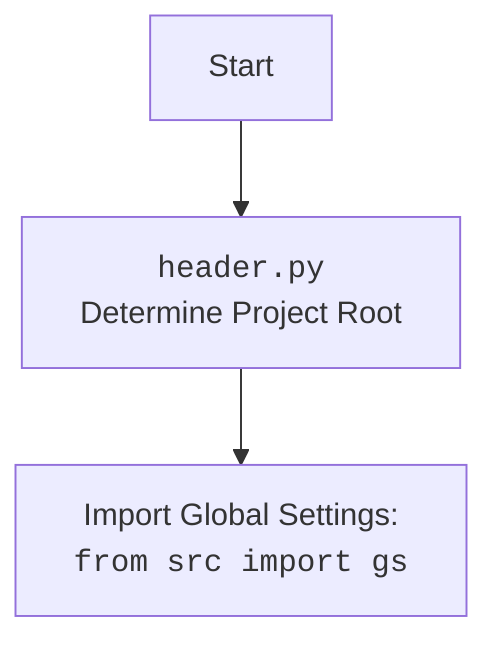

## Анализ кода `header.py`

### 1. <алгоритм>

**Функция `set_project_root`:**

1.  **Начало:** Функция `set_project_root` принимает на вход кортеж `marker_files` (по умолчанию `('__root__',)`), который содержит имена файлов или директорий, используемых для идентификации корневой директории проекта.
    *   *Пример:* `marker_files = ('__root__', '.git')`
2.  **Определение текущего пути:** Получаем абсолютный путь к директории, в которой расположен текущий файл (`__file__`).
    *   *Пример:* Если `header.py` находится в `/home/user/project/src/logger/`, то `current_path` будет равен `/home/user/project/src/logger`.
3.  **Инициализация корня проекта:** Изначально устанавливаем корневой путь проекта `__root__` равным текущему пути.
    *   *Пример:* `__root__` = `/home/user/project/src/logger`.
4.  **Поиск по родительским директориям:** Проходим по всем родительским директориям, начиная с текущей, двигаясь вверх по иерархии.
    *   *Пример:* Родительские директории `/home/user/project/src/logger` -> `/home/user/project/src` -> `/home/user/project` -> `/home/user` -> `/`.
5.  **Проверка наличия маркера:** Для каждой родительской директории проверяем, существует ли в ней хотя бы один из файлов или директорий, указанных в `marker_files`.
    *   *Пример:* Для `marker_files = ('__root__',)` проверяем наличие файла `__root__` в каждой родительской директории.
6.  **Обновление корня проекта:** Если маркер найден, обновляем `__root__` до текущей родительской директории и прерываем цикл.
    *   *Пример:* Если файл `__root__` найден в `/home/user/project`, то `__root__` станет `/home/user/project`.
7.  **Добавление в `sys.path`:** Если  `__root__` не находится в `sys.path`, добавляем его в начало списка для возможности импорта модулей относительно корня проекта.
8.  **Возврат корня проекта:** Возвращаем путь к корневой директории проекта `__root__`.

**Основная часть кода:**

1.  **Вызов `set_project_root`:** Вызываем функцию `set_project_root` для определения корневой директории проекта и сохраняем результат в глобальной переменной `__root__`.
2.  **Импорт `gs`:** Импортируем глобальные настройки из `src.gs`.
3.  **Загрузка настроек из `settings.json`:** Пытаемся открыть файл `settings.json`, который находится в директории `src` относительно корня проекта, и загрузить из него JSON данные в словарь `settings`. Если файл не найден или JSON некорректен, обрабатываем исключение и пропускаем этот шаг.
4.  **Загрузка README.MD:** Пытаемся открыть `README.MD`, который находится в директории `src` относительно корня проекта, и сохранить содержимое в `doc_str`. Если файл не найден или  есть проблемы с чтением файла, обрабатываем исключение.
5.  **Инициализация глобальных переменных:** Инициализируем глобальные переменные `__project_name__`, `__version__`, `__doc__`, `__details__`, `__author__`, `__copyright__`, `__cofee__` значениями из загруженных `settings`, если они есть, или значениями по умолчанию.

### 2. <mermaid>

```mermaid
flowchart TD
    Start(Начало) --> FindRoot[<code>set_project_root()</code><br>Найти корневую директорию проекта];
    FindRoot --> CheckMarkers[Проверить наличие маркерных файлов в родительских директориях];
    CheckMarkers -- Маркер найден --> UpdateRoot[Обновить корневую директорию проекта];
    CheckMarkers -- Маркер не найден --> UseCurrentPath[Использовать текущую директорию как корневую];
    UpdateRoot --> AddToSysPath[Добавить корневую директорию в sys.path];
    UseCurrentPath --> AddToSysPath
    AddToSysPath --> ImportGS[<code>from src import gs</code><br>Импорт глобальных настроек];
    ImportGS --> LoadSettings[Загрузка <code>settings.json</code>];
    LoadSettings -- Успешно загружено --> ReadMD[Загрузка <code>README.MD</code>];
    LoadSettings -- Ошибка загрузки --> ReadMD
    ReadMD -- Успешно загружено --> InitGlobals[Инициализация глобальных переменных из настроек и <code>README.MD</code>];
    ReadMD -- Ошибка загрузки --> InitGlobals
    InitGlobals --> End(Конец);
```

**Анализ зависимостей в mermaid:**

*   `Start`: Начальная точка выполнения скрипта.
*   `FindRoot`:  Вызов функции `set_project_root`, которая определяет корень проекта.
*   `CheckMarkers`: Проверяет наличие маркерных файлов в родительских директориях.
*   `UpdateRoot`: Обновляет корневую директорию проекта, если маркерный файл найден.
*   `UseCurrentPath`: Если маркерный файл не найден, используется текущий путь, как корень проекта.
*   `AddToSysPath`: Добавляет корневую директорию в `sys.path`, чтобы модули проекта можно было импортировать.
*   `ImportGS`: Импортирует глобальные настройки из модуля `src.gs`.
*  `LoadSettings`: Пытается загрузить настройки из файла `settings.json`.
*   `ReadMD`: Пытается загрузить документацию из файла `README.MD`.
*   `InitGlobals`: Инициализирует глобальные переменные из `settings.json` и `README.MD`.
*   `End`: Конец выполнения скрипта.

**mermaid для header.py:**



### 3. <объяснение>

**Импорты:**

*   `sys`: Модуль `sys` используется для доступа к некоторым переменным и функциям, взаимодействующим с интерпретатором Python. В данном коде используется для добавления корневой директории проекта в `sys.path`. Это необходимо для того, чтобы Python мог находить модули, расположенные в проекте, при импорте.
*   `json`: Модуль `json` используется для работы с JSON-данными. В данном случае используется для загрузки настроек из файла `settings.json`.
*   `packaging.version.Version`: Используется для сравнения версий пакетов, но в предоставленном коде не используется напрямую.
*  `pathlib.Path`: Модуль `pathlib` предоставляет объектно-ориентированный способ работы с путями в файловой системе.
* `header`: Циклическая зависимость, из за неправильной инструкции

**Функция `set_project_root`:**

*   **Аргументы:**
    *   `marker_files`: Кортеж строк, представляющий имена файлов или директорий, которые используются для определения корневой директории проекта. По умолчанию `('__root__', )`.
*   **Возвращает:** Объект `pathlib.Path`, представляющий путь к корневой директории проекта. Если маркер не найден, возвращает директорию, в которой расположен скрипт.
*   **Назначение:** Функция `set_project_root` предназначена для автоматического определения корневой директории проекта. Она ищет родительские директории, пока не найдет маркерный файл или директорию. Это позволяет запускать скрипты из любого места в проекте, при этом пути к файлам и модулям будут считаться относительно корневой директории.

**Переменные:**

*   `__root__`: Глобальная переменная типа `pathlib.Path`, которая хранит путь к корневой директории проекта.
*   `MODE`: Строковая переменная, которая определяет режим работы приложения. В данном коде ее значение равно `'dev'`.
*   `settings`: Словарь, в который загружаются настройки из `settings.json`. Если файл не найден или произошла ошибка при загрузке, `settings` остается равным `None`.
*   `doc_str`: Строка, в которую сохраняется содержимое файла `README.MD`. Если файл не найден или произошла ошибка при загрузке, `doc_str` остается равным `None`.
*   `__project_name__`, `__version__`, `__doc__`, `__details__`, `__author__`, `__copyright__`, `__cofee__`: Глобальные строковые переменные, которые хранят соответствующие значения, полученные из файла `settings.json`, если он загружен, или значения по умолчанию, если файл не был найден.

**Взаимосвязь с другими частями проекта:**

*   Модуль `header.py` устанавливает корневую директорию проекта, что позволяет модулям из других частей проекта, например `src.gs`  использовать относительные пути.
*   `settings.json` содержит настройки проекта, которые используются в `header.py` для инициализации глобальных переменных.
*   `README.MD` содержит документацию проекта, которая загружается в `header.py` и сохраняется в глобальной переменной `__doc__`.

**Потенциальные ошибки или области для улучшения:**

*   **Обработка исключений:** В блоках `try-except` используется `...` для обработки исключений `FileNotFoundError` и `json.JSONDecodeError`.  Лучше добавить логирование или более подробную обработку ошибок.
*   **Циклическая зависимость:** Импорт `header` создает циклическую зависимость, это ошибка в инструкции.
*   **Неиспользуемые импорты:** Импорт `from packaging.version import Version` не используется. Его можно убрать.
*   **Использование `MODE`**: Переменная MODE не используется в коде.

**Цепочка взаимосвязей:**
* `header.py` -> `src.gs` -> `settings.json` -> `README.MD`
    `header.py` определяет корневую директорию проекта,  `src.gs` использует эту директорию для доступа к файлам конфигурации, `settings.json` хранит настройки проекта, `README.MD` содержит документацию проекта.