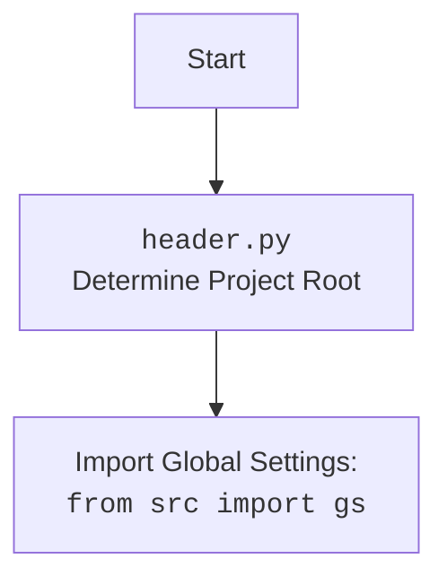

## АНАЛИЗ КОДА: `header.py`

### <алгоритм>

**Описание работы кода `header.py`:**

1.  **Инициализация**:
    *   Начало работы скрипта `header.py`.
    *   Импортируются необходимые модули `pathlib.Path` и `sys`.
    *   Пример: `import sys`

2.  **Определение функции `set_project_root`**:
    *   Определение функции, которая будет искать корень проекта.
    *   На вход не принимает никаких аргументов.
    *   Пример: `def set_project_root():`

3.  **Определение текущей директории**:
    *   Определение директории, где находится сам скрипт `header.py`.
    *   Используется `Path(__file__).resolve().parent` для получения абсолютного пути.
    *   Пример: `current_dir = Path(__file__).resolve().parent`

4.  **Список маркеров для поиска корня проекта**:
    *   Создаётся список имён файлов или папок, которые считаются признаком корня проекта.
    *   Пример: `marker_files = ['pyproject.toml', 'requirements.txt', '.git']`

5.  **Поиск корня проекта**:
    *   Начинаем цикл, перебирая каждую директорию в пути к файлу `header.py`.
    *   Для каждой директории проверяем, есть ли в ней любой из файлов или папок из списка `marker_files`.
    *   Если такой маркер найден, директория считается корнем проекта и цикл завершается.
    *   Пример: цикл `while` и проверка `any( (current_dir / marker).exists() for marker in marker_files)`

6.  **Добавление корня проекта в `sys.path`**:
    *   Если найденный корень проекта не находится в списке `sys.path` (то есть, Python его не знает), то добавляем его в начало списка, чтобы Python мог находить модули из этой директории.
    *   Пример: проверка `if str(current_dir) not in sys.path` и добавление `sys.path.insert(0, str(current_dir))`

7.  **Возвращение пути к корню проекта**:
    *   Функция возвращает объект `Path`, представляющий путь к корню проекта.
    *   Пример: `return current_dir`

8.  **Сохранение корня проекта в `__root__`**:
    *   Вызов функции `set_project_root` и сохранение результата в переменную `__root__`. Эта переменная используется для доступа к корню проекта в других частях программы.
    *   Пример: `__root__ = set_project_root()`

### <mermaid>

```mermaid
flowchart TD
    Start[Start: <code>header.py</code>] --> Init[Init: import pathlib.Path, sys]
    Init --> SetProjectRoot[<code>set_project_root()</code><br> Function to Determine Project Root]
    SetProjectRoot --> CurrentDir[Get Current Directory<br><code>Path(__file__).resolve().parent</code>]
    CurrentDir --> MarkerFiles[Define Marker Files<br><code>marker_files = [...]</code>]
    MarkerFiles --> SearchRoot[Search for Root Directory<br> using marker files<br> <code>while loop</code>]
    SearchRoot -- Marker Found --> RootFound[Root Directory Found]
    SearchRoot -- Marker Not Found --> ParentDir[Go to Parent Directory]
    ParentDir --> SearchRoot
    RootFound --> CheckSysPath[Check if Root in <code>sys.path</code>]
    CheckSysPath -- Not in <code>sys.path</code> --> AddToSysPath[Add Root to <code>sys.path</code>]
    AddToSysPath --> ReturnRoot[Return Path object]
    CheckSysPath -- In <code>sys.path</code> --> ReturnRoot
    ReturnRoot --> SaveRoot[Save Root to <code>__root__</code>]
    SaveRoot --> End[End]
```

**Анализ зависимостей в `mermaid` диаграмме:**

*   **`Start`**: Начало процесса.
*   **`Init`**: Начальная стадия импортирует модули `pathlib.Path` и `sys`, которые используются для работы с путями и системными параметрами соответственно.
*   **`set_project_root()`**: Функция, которая является основным логическим блоком, инициирует процесс поиска корня проекта.
*   **`CurrentDir`**: Использует `pathlib.Path` для получения текущей директории скрипта.
*   **`MarkerFiles`**: Определяет список файлов (`pyproject.toml`, `requirements.txt`, `.git`), используемых для идентификации корневой директории.
*   **`SearchRoot`**: Цикл `while` ищет маркерные файлы, поднимаясь по родительским директориям.
*   **`RootFound`**: Состояние, когда корень проекта найден.
*  **`ParentDir`**: Переход к родительской директории, если маркер не найден.
*   **`CheckSysPath`**: Проверка, присутствует ли корневой каталог в `sys.path`.
*   **`AddToSysPath`**:  Добавляет корневой каталог в `sys.path`, если его там нет,  для корректного импорта модулей.
*   **`ReturnRoot`**: Возвращает объект `Path` представляющий корневой каталог.
*   **`SaveRoot`**: Сохраняет путь к корню проекта в переменную `__root__`.
*   **`End`**: Конец процесса.



### <объяснение>

1.  **Импорты:**
    *   `pathlib.Path`: Используется для представления путей к файлам и директориям в файловой системе. Это обеспечивает более объектно-ориентированный способ работы с путями, чем использование строк.
    *   `sys`: Предоставляет доступ к некоторым переменным и функциям, взаимодействующим с интерпретатором Python. В данном коде используется для добавления корневой директории проекта в список `sys.path`.

2.  **Функция `set_project_root()`:**
    *   **Аргументы**: Функция не принимает никаких аргументов.
    *   **Возвращаемое значение**: Возвращает объект `pathlib.Path`, представляющий путь к корневой директории проекта.
    *   **Назначение**: Функция отвечает за определение корневой директории проекта путём поиска "маркерных" файлов (таких как `pyproject.toml`, `requirements.txt`, `.git`) в текущей и родительских директориях. Если корень проекта найден, он добавляется в `sys.path`, чтобы упростить импорт модулей.
    *  **Пример**:
        ```python
        from pathlib import Path
        import sys

        def set_project_root():
            current_dir = Path(__file__).resolve().parent
            marker_files = ['pyproject.toml', 'requirements.txt', '.git']

            while True:
                if any( (current_dir / marker).exists() for marker in marker_files):
                   break
                if current_dir == current_dir.parent:
                    break  # stop if reach root dir

                current_dir = current_dir.parent


            if str(current_dir) not in sys.path:
                sys.path.insert(0, str(current_dir))

            return current_dir
        ```

3. **Переменные:**
    *   `current_dir` (`pathlib.Path`): Хранит текущую директорию, в которой происходит поиск корневой директории. Изначально это директория, в которой находится скрипт `header.py`.
    *   `marker_files` (`list`): Содержит список имён файлов, которые являются признаками корневой директории проекта.
    *   `__root__` (`pathlib.Path`): Переменная, в которой сохраняется путь к корневой директории проекта после вызова функции `set_project_root()`. Используется для доступа к корню проекта из других частей программы.

4. **Цепочка взаимосвязей:**
    *   **Зависимость от `pathlib`**: Функция `set_project_root()` использует модуль `pathlib` для работы с путями к файлам и директориям.
    *   **Влияние на импорт**: Добавление корневой директории в `sys.path` позволяет другим модулям проекта импортировать модули и пакеты из корневой директории, используя относительные пути. Это обеспечивает гибкость и простоту импорта.
    *   **Зависимость от структуры проекта**: Функция зависит от того, что в корневой директории присутствуют "маркерные файлы" (`pyproject.toml`, `requirements.txt`, `.git`). Если эти файлы отсутствуют в корне проекта, то функция будет подниматься вплоть до корневой директории файловой системы.

5. **Потенциальные ошибки и области для улучшения:**
    *   **Отсутствие маркерных файлов**: Если ни один из "маркерных файлов" не найден, функция продолжит подниматься по родительским директориям, пока не достигнет корневой директории файловой системы, что может быть нежелательно. В таком случае корень проекта не будет найден.
    *   **Универсальность**: Список "маркерных файлов" может быть расширен, чтобы поддерживать больше типов проектов.
    *   **Обработка ошибок**: Можно добавить обработку ошибок, чтобы более явно сообщать о проблемах при определении корневой директории.
    *   **Кэширование**: Результат работы функции `set_project_root` можно было бы кэшировать, чтобы не выполнять эту операцию каждый раз.

**Дополнительные замечания:**

*   Код `header.py` является важным компонентом для управления путями и импортом в проекте.
*   Этот код обеспечивает динамическую настройку путей, что полезно при изменении структуры проекта или переносе его в другое место.
*   Код является модульным и может быть легко переиспользован в других Python-проектах.