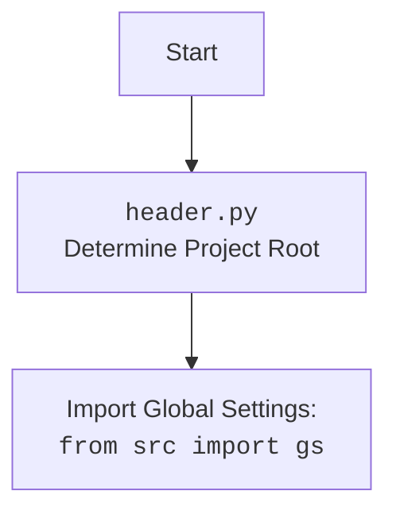

## Анализ кода `hypotez/src/logger/header.py`

### <алгоритм>

1.  **Инициализация:**
    *   Устанавливается ``.
    *   Импортируются необходимые модули: `sys`, `json`, `Version` (из `packaging.version`), `Path` (из `pathlib`), `header`.
2.  **Определение корневого каталога проекта (`set_project_root`):**
    *   Функция `set_project_root` принимает кортеж `marker_files` (по умолчанию `('__root__')`), содержащий имена файлов или каталогов, которые определяют корень проекта.
    *   Начинается поиск корня проекта от каталога, где находится текущий файл.
    *   Создается объект `Path` текущей директории.
    *   Итерируется по текущей директории и всем ее родительским директориям.
    *   Для каждой директории проверяется наличие хотя бы одного из файлов-маркеров.
    *   Если файл-маркер найден, устанавливается корневой каталог `__root__` и цикл прерывается.
    *   Если корневой каталог не в `sys.path`, добавляется в начало списка.
    *   Возвращается корневой каталог проекта.
    *   **Пример:**
        *   Если структура проекта такова:
            ```
            project/
                __root__
                src/
                    logger/
                        header.py
            ```
        *   `set_project_root` вернет `project/`.
3.  **Установка корневой директории:**
    *   Вызывается `set_project_root()` и результат сохраняется в глобальной переменной `__root__`.
4. **Импорт `gs`**:
    * Импортируется модуль `src.gs`.
5.  **Загрузка настроек из `settings.json`:**
    *   Создается переменная `settings` (тип `dict`).
    *   Попытка открыть и прочитать файл `settings.json` из каталога `src` внутри корневого каталога проекта.
    *   Если файл успешно прочитан, настройки загружаются в переменную `settings`.
    *   Если файл не найден или ошибка декодирования JSON, пропускается (используется `try-except` с `...`).
6.  **Загрузка документации из `README.MD`:**
    *   Создается переменная `doc_str` (тип `str`).
    *   Попытка открыть и прочитать файл `README.MD` из каталога `src` внутри корневого каталога проекта.
    *   Если файл успешно прочитан, содержимое файла сохраняется в переменную `doc_str`.
    *   Если файл не найден или ошибка декодирования JSON, пропускается (используется `try-except` с `...`).
7.  **Определение глобальных переменных:**
    *   Глобальные переменные, такие как `__project_name__`, `__version__`, `__doc__`, `__details__`, `__author__`, `__copyright__`, `__cofee__` устанавливаются на основе данных из `settings`, или, при отсутствии, на значения по умолчанию.

### <mermaid>

```mermaid
flowchart TD
    Start --> SetMode[]
    SetMode --> ImportModules[Import: sys, json, Version, Path, header]
    ImportModules --> FindProjectRoot[set_project_root()]
    FindProjectRoot -->  SetRoot[__root__ = result of set_project_root()]
    SetRoot --> ImportGS[Import: from src import gs]
    ImportGS --> LoadSettings[Load settings from settings.json]
    LoadSettings --> LoadReadme[Load documentation from README.MD]
    LoadReadme --> SetGlobalVars[Set global vars: __project_name__, __version__, __doc__, etc.]
    SetGlobalVars --> End
    
    subgraph set_project_root
        A[Start] --> B{current_path:Path = Path(__file__).resolve().parent}
        B --> C{Loop through parent directories}
        C -- Found marker file --> D[__root__ = parent directory]
        D --> E{Add __root__ to sys.path if needed}
        E --> F[Return __root__]
        C -- No marker file --> C
        C --> G{All parents checked?}
        G -- Yes --> E
    end
    
    subgraph LoadSettings
        LS1[Start loading] --> LS2{Open settings.json}
         LS2 -- Success --> LS3[Load settings into 'settings']
          LS3 --> LS4[End]
        LS2 -- Fail --> LS4
    end
    subgraph LoadReadme
        LR1[Start loading] --> LR2{Open README.MD}
         LR2 -- Success --> LR3[Load text into 'doc_str']
        LR3 --> LR4[End]
        LR2 -- Fail --> LR4
    end

     subgraph SetGlobalVars
        GV1[Start setting] --> GV2{settings is None?}
        GV2 -- Yes --> GV3[Set default values to vars]
        GV3 --> GV4[End]
        GV2 -- No --> GV5[Set vars from settings]
        GV5 --> GV4
     end

```



**Объяснение `mermaid`:**

1.  **`flowchart TD`**: Определяет тип диаграммы как блок-схему.
2.  **Основные блоки:**
    *   `Start`: Начало выполнения программы.
    *   `SetMode`: Установка режима (``).
    *   `ImportModules`: Импорт необходимых модулей (`sys`, `json`, `Version`, `Path`, `header`).
    *   `FindProjectRoot`: Вызов функции `set_project_root()`.
    *  `SetRoot`: Установка глобальной переменной `__root__`.
    *   `ImportGS`: Импорт глобальных настроек из модуля `src.gs`
    *   `LoadSettings`: Загрузка настроек из `settings.json`.
    *   `LoadReadme`: Загрузка документации из `README.MD`.
    *   `SetGlobalVars`: Установка глобальных переменных.
    *   `End`: Конец выполнения.
3.  **Подграфы `set_project_root`, `LoadSettings`, `LoadReadme`, `SetGlobalVars`:**
    *   Описывают более детально работу этих функциональных блоков.
    *   `set_project_root`:
        *   A: Начало поиска.
        *   B: Получение текущей директории.
        *   C: Цикл по родительским директориям.
        *   D: Найден маркерный файл, устанавливается корень.
        *   E: Добавление корня в `sys.path`.
        *   F: Возврат корня.
        *   G: Проверка, все ли родительские директории проверены?
   *  `LoadSettings`:
        * LS1: Начало загрузки.
        * LS2: Открытие файла настроек.
        * LS3: Успешная загрузка настроек.
        * LS4: Завершение загрузки.
    *  `LoadReadme`:
        * LR1: Начало загрузки.
        * LR2: Открытие файла README.MD.
        * LR3: Успешная загрузка документации.
        * LR4: Завершение загрузки.
    *  `SetGlobalVars`:
        * GV1: Начало установки глобальных переменных.
        * GV2: Проверка, является ли `settings` пустым.
        * GV3: Установка значений по умолчанию.
        * GV4: Завершение установки.
        * GV5: Установка значений из `settings`.
4.  **Стрелки**: Указывают на поток выполнения и зависимостей между блоками.
5.  **Зависимости импорта `header.py`**:
    *    Блок `Header` указывает на файл `header.py`
    *    Блок `import` показывает импорт глобальных настроек `src.gs`.

### <объяснение>

**Импорты:**

*   `sys`: Используется для работы с системными переменными, в частности, для изменения `sys.path`.
*   `json`: Используется для работы с JSON-файлами (загрузка настроек).
*   `packaging.version.Version`: Используется для работы с версиями (в текущем коде не используется непосредственно, но может быть использовано в дальнейшем).
*   `pathlib.Path`: Используется для работы с путями к файлам и каталогам.
*   `header`: Импорт самого модуля `header`, видимо для того что бы отработал механизм поиска корневой дирректории, таким образом при последующем использовании импорта `from src import gs` или `from src.logger import header` механизм поиска root директории уже будет отработан.

**Переменные:**

*   `MODE`:  Строковая константа, определяющая режим работы (в данном случае `'dev'`).
*   `__root__`: Переменная типа `Path` хранит путь к корневому каталогу проекта.
*   `settings`: Переменная типа `dict`  хранит загруженные из `settings.json` настройки.
*  `doc_str`: Переменная типа `str` хранит загруженные из `README.MD` настройки.
*   `__project_name__`:  Переменная типа `str`, имя проекта.
*   `__version__`: Переменная типа `str`, версия проекта.
*  `__doc__`: Переменная типа `str`, документация проекта.
*   `__details__`: Переменная типа `str`, детали проекта.
*   `__author__`: Переменная типа `str`, автор проекта.
*   `__copyright__`: Переменная типа `str`, информация о копирайте.
*   `__cofee__`: Переменная типа `str`, текст с ссылкой для поддержки разработчика.

**Функции:**

*   `set_project_root(marker_files: tuple = ('__root__')) -> Path`:
    *   **Аргументы:**
        *   `marker_files` (tuple, по умолчанию `('__root__')`): Кортеж с именами файлов или каталогов, которые используются для определения корневого каталога проекта.
    *   **Возвращаемое значение:**
        *   `Path`: Объект `Path`, представляющий путь к корневому каталогу проекта или текущей директории, если корневой каталог не найден.
    *   **Назначение:** Поиск корневого каталога проекта. Функция итерируется вверх по каталогам, пока не найдет один из файлов или каталогов, указанных в `marker_files`. Если маркер не найден, функция возвращает директорию в которой находится данный скрипт.
    *   **Примеры:**
        *   `set_project_root()` - поиск по умолчанию (`__root__`).
        *   `set_project_root(marker_files=('my_marker', '.git'))` - поиск по файлам `my_marker` или `.git`.

**Объяснение работы:**

1.  Модуль `header.py` предназначен для определения и установки корневого каталога проекта. Все остальные модули должны импортироваться относительно этого корня. Это нужно для удобства импорта и для того, чтобы код можно было переносить между разными средами без изменения путей.
2.  Функция `set_project_root` выполняет поиск корневого каталога, начиная от текущего файла и идя вверх по структуре каталогов. Она использует файлы-маркеры, которые обычно располагаются в корне проекта.
3.  После определения корня, он добавляется в `sys.path`, чтобы можно было импортировать модули, используя пути относительно корня.
4.  Также происходит попытка загрузить настройки из `settings.json` и документацию из `README.MD`. Эти данные используются для установки глобальных переменных проекта.
5.  В случае отсутствия настроек из `settings.json` или документации из `README.MD` используются значения по умолчанию, которые могут быть полезны при отладке или тестировании кода.
6.  Импорт `from src import gs`  используется для того, что бы можно было получить доступ к `gs` - глобальным настройкам приложения, которые в свою очередь определены в `hypotez/src/gs.py`.
7.  Код использует try-except блоки для обработки ошибок, таких как отсутствие `settings.json` или `README.MD` файла, а также ошибок при разборе JSON.

**Потенциальные ошибки и области для улучшения:**

1.  В блоке `try-except` при ошибке загрузки `settings.json` или `README.MD` используется `...` - это можно заменить на `pass` или более конкретную обработку ошибки (логирование, вывод сообщения об ошибке).
2.  Возможно, стоит добавить более явное сообщение, если корневой каталог проекта не найден, чтобы пользователь понимал, в чем проблема.
3.  Зависимость от наличия `__root__` как маркера может быть не всегда удобна, можно сделать список маркеров настраиваемым.
4.  Для загрузки настроек и документации можно добавить проверку, что файл не пустой, перед загрузкой его содержимого.

**Взаимосвязи с другими частями проекта:**

*   Модуль `header.py` является ключевым компонентом для организации импортов и определения корневого каталога проекта.
*   Другие модули в проекте, включая `src.gs`, используют `header.py` для получения пути к корню проекта и импорта других модулей.
*   Значения, полученные из `settings.json` и `README.MD`, могут использоваться в других частях проекта для конфигурации и отображения документации.
*   Импорт `from src import gs` устанавливает связь с глобальными настройками приложения, определенными в `hypotez/src/gs.py`

Этот анализ предоставляет подробное объяснение работы кода, его структуры и взаимодействия с другими частями проекта.