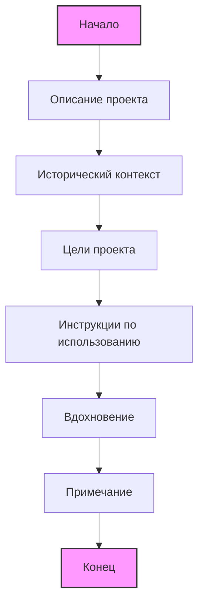

## АНАЛИЗ КОДА:

### 1. <алгоритм>

Представленный текст не является исполняемым кодом на языке Python, а является текстовым файлом в формате Markdown, описывающим проект "101 игра на Python" и историю создания книги "101 BASIC Computer Games". Следовательно, не существует пошагового алгоритма или потока данных, как в исполняемом коде.

Однако, если рассматривать Markdown-файл как некий алгоритм представления информации, можно выделить следующие логические блоки:

1.  **Введение**:
    *   Представляет проект "101 игра на Python", его цель и мотивацию.
    *   Объясняет, что проект основан на играх из книги "101 BASIC Computer Games".
2.  **История**:
    *   Рассказывает об истории создания книги "101 BASIC Computer Games" и компании DEC.
    *   Описывает контекст времени и условия, в которых создавались эти игры (мини-компьютеры, телетайпы, язык BASIC).
    *   Описывает процесс краудсорсинга игр для книги и требования к оформлению.
3.  **О проекте**:
    *   Объясняет, что представленные в репозитории игры являются *интерпретацией* оригинальных игр на Python.
    *   Подчеркивает образовательную ценность проекта, предоставляя код с пояснениями.
4.  **Как использовать репозиторий**:
    *   Инструкции по использованию репозитория.
    *   Предлагает несколько шагов, чтобы пользователь мог опробовать, изучить и изменить код.
5.  **Вдохновение**:
    *   Подчеркивает, как игры из прошлого могут вдохновить на изучение программирования сегодня.
6.  **Примечание:**
    *   Дополнительная информация о применяемых материалах при подготовке игр.

В контексте информационного потока, файл `readme.ru.md` является отправной точкой для пользователя, знакомящегося с проектом. Он направляет читателя от общего описания к деталям, позволяя понять контекст и как использовать репозиторий.

### 2. <mermaid>
Поскольку в предоставленном тексте нет кода Python, нет и импорта. В данном случае, диаграмма `mermaid` не может быть применена к самому файлу `readme.ru.md`. 
Тем не менее, если бы в тексте содержался код Python, к которому применима диаграмма, она бы выглядела примерно так:

**Объяснение:**

*   `Start`: Начало документа `readme.ru.md`
*   `ProjectDescription`: Раздел, где описывается проект и его цель.
*   `HistoricalBackground`: Раздел, описывающий исторический контекст и создание книги "101 BASIC Computer Games".
*   `ProjectGoals`: Раздел, описывающий цели проекта по адаптации игр на Python.
*   `Instructions`: Раздел, дающий инструкции по использованию репозитория.
*   `Inspiration`: Раздел, подчеркивающий вдохновение от ретро-игр.
*   `Note`: Раздел с дополнительной информацией о материалах.
*   `End`: Конец документа.

**Диаграмма не отражает код, а описывает структуру и взаимосвязь разделов в файле `readme.ru.md`.**

### 3. <объяснение>

**Файл `readme.ru.md` не содержит исполняемого кода, поэтому объяснение будет сосредоточено на анализе содержания и структуры этого файла.**

*   **Импорты**: Поскольку это markdown-файл, нет импортов Python. Markdown - это язык разметки, используемый для создания форматированного текста.

*   **Классы**: Markdown не поддерживает классы.

*   **Функции**: Отсутствуют функции.

*   **Переменные**: В markdown переменных нет. В файле содержатся текстовые описания.

**Подробные Объяснения:**

1.  **Структура файла:** Файл состоит из разделов, каждый из которых имеет свою цель. Разделы четко обозначены заголовками (##). Markdown разметка используется для выделения текста, создания списков, ссылок и форматирования.

2.  **Цели документа:**
    *   **Представить проект:** Познакомить читателей с репозиторием "101 игра на Python".
    *   **Обеспечить исторический контекст:** Рассказать о книге "101 BASIC Computer Games" и ее значимости.
    *   **Объяснить мотивацию:** Показать, зачем был создан данный проект.
    *   **Предоставить инструкции:** Помочь пользователям понять, как использовать репозиторий.

3.  **Основные разделы и их назначение:**
    *   **"101 игра на Python":** Заголовок, дающий общее представление о проекте.
    *   **"История":** Погружает читателя в историю создания оригинальной книги и технологий того времени. Этот раздел важен для понимания контекста и значимости проекта.
    *   **"О проекте":** Описывает цели проекта и его отличия от оригинала.
    *   **"Как использовать репозиторий":** Предоставляет пошаговую инструкцию для начинающих пользователей.
    *   **"Вдохновение":** Подчеркивает важность сохранения истории и использования ее для обучения современным технологиям.
    *   **Примечание:** Предоставляет дополнительную техническую информацию, не являющуюся обязательной для понимания, но дополняющей картину.

4.  **Связь с другими частями проекта:**
    *   `readme.ru.md` является отправной точкой для любого пользователя, заходящего в репозиторий.
    *   Он является частью пользовательского интерфейса и необходим для понимания содержимого проекта.
    *   Связан с файлами кода каждой конкретной игры, так как в нем описываются принципы работы проекта и дается ссылка на игры.

5.  **Потенциальные ошибки и улучшения:**
    *   **Отсутствие скриншотов/гифок:** Для улучшения вовлеченности можно добавить скриншоты или гифки с демонстрацией работы игр.
    *   **Неполное описание каждой игры:** `readme.ru.md` дает общее описание, но для каждой игры должен быть отдельный файл `README.md` с подробностями.
    *   **Отсутствие раздела для контрибьюторов:** Можно добавить раздел, описывающий как можно сделать вклад в проект.

В заключение, `readme.ru.md` является важным документом, который не является кодом, но является отправной точкой для пользователя в проекте. Он содержит много полезной информации о проекте и его истории, а также обеспечивает инструкции по использованию.