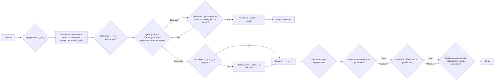
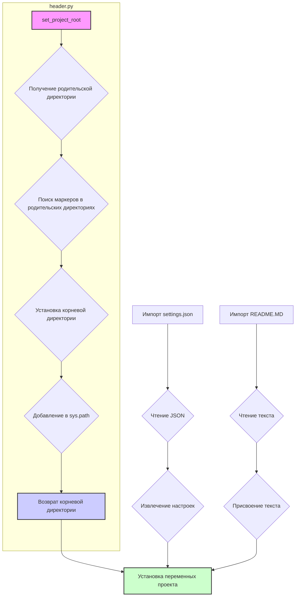

## АНАЛИЗ КОДА: `hypotez/src/logger/header.py`

### 1. <алгоритм>

**Блок-схема:**

**Примеры для блоков:**

*   **B**: `__file__` может быть `/path/to/project/src/logger/header.py`.
*   **C**: `current_path` будет `/path/to/project/src/logger`.
*   **D**: `__root__` изначально устанавливается как `/path/to/project/src/logger`.
*   **E**: Цикл перебирает `/path/to/project/src/logger`, `/path/to/project/src`, `/path/to/project` и так далее.
*  **F**: Проверяется существование файла с именем `'__root__'` в каждой родительской директории, например: `/path/to/project/src/logger/__root__`, `/path/to/project/src/__root__` и так далее.
*   **G**: Если `/path/to/project/__root__` существует, то `__root__` станет `/path/to/project`.
*   **I**: Проверяется, есть ли `/path/to/project` в `sys.path`.
*   **J**: Если нет, `/path/to/project` добавляется в `sys.path`.
*   **K**: Возвращается `/path/to/project` (корневой каталог проекта).
*   **M**: Пытается прочитать `/path/to/project/src/settings.json`.
*   **N**: Пытается прочитать `/path/to/project/src/README.MD`.
*   **O**: Устанавливает `__project_name__` из `settings` или по умолчанию 'hypotez', и другие настройки.

### 2. <mermaid>

### 3. <объяснение>

**Импорты:**

*   `sys`: Предоставляет доступ к переменным и функциям, которые взаимодействуют с интерпретатором Python. В данном случае используется для модификации `sys.path`, чтобы добавить корневой каталог проекта для импорта модулей.
*   `json`: Используется для работы с JSON-файлами, а именно для чтения `settings.json`.
*   `packaging.version.Version`: Используется для сравнения версий.
*   `pathlib.Path`: Используется для работы с путями к файлам и директориям в операционной системе.
*    `header`: импортируется из текущего пакета `logger`, т.е. сам модуль.

**Функции:**

*   `set_project_root(marker_files: tuple = ('__root__')) -> Path`:
    *   **Аргументы**: `marker_files` - кортеж с именами файлов или директорий, которые используются для определения корня проекта. По умолчанию: `('__root__')`.
    *   **Возвращает**: `Path` - путь к корневой директории проекта, где найден один из `marker_files` или путь к директории, где запущен скрипт.
    *   **Назначение**: Находит корневую директорию проекта, начиная с текущего файла, и добавляет этот путь в `sys.path`.
    *   **Пример**: Если файл `__root__` находится в `/path/to/project`, то функция вернет `Path('/path/to/project')`.

**Переменные:**

*   `MODE`: строковая переменная, устанавливающая режим работы модуля, по умолчанию 'dev'.
*    `__root__`: `Path` - хранит путь к корневой директории проекта. Инициализируется через `set_project_root()`.
*   `settings`: `dict` - словарь с настройками, загруженными из `settings.json`. Может быть `None`, если файл не найден.
*   `doc_str`: `str` - строка с текстом, загруженным из `README.MD`. Может быть `None`, если файл не найден.
*   `__project_name__`: `str` - имя проекта, значение берется из настроек или по умолчанию 'hypotez'.
*   `__version__`: `str` - версия проекта, значение берется из настроек или пустая строка.
*   `__doc__`: `str` - описание проекта, загруженное из `README.MD`, или пустая строка, если не найден.
*   `__details__`: `str` - дополнительная информация о проекте. Пока пустая строка.
*   `__author__`: `str` - автор проекта, значение берется из настроек или пустая строка.
*   `__copyright__`: `str` - информация об авторских правах, значение берется из настроек или пустая строка.
*   `__cofee__`: `str` - сообщение для поддержки автора.

**Цепочка взаимосвязей с другими частями проекта:**

1.  **Обнаружение корневой директории:** Функция `set_project_root()` определяет корневую директорию проекта, что критически важно для корректного импорта модулей из других частей проекта.
2.  **Загрузка конфигураций:** Загружает `settings.json`, что позволяет настраивать проект через файл, а не через жестко заданные переменные.
3.  **Документирование:** Загружает `README.MD`, используя информацию для дальнейшего использования.
4.  **Определение основных переменных:** Устанавливает основные переменные проекта, такие как `__project_name__`, `__version__`, и `__doc__`, которые используются в других частях проекта.
5.  **Импорт `src.gs`:** Импортирует глобальные настройки проекта из пакета `src`. Это позволяет получить доступ к настроечному пути `gs.path.root`.

**Потенциальные ошибки и области для улучшения:**

1.  **Обработка ошибок при загрузке настроек:** Используется пропуск ошибки `except ...`, что может скрыть проблемы при загрузке настроек или документации.
2.  **Жестко заданные значения по умолчанию**:  Для полей `__details__` , `__author__`, `__copyright__` заданы пустые значения, что снижает информативность.
3.  **Проверка существования файла `settings.json`:** Отсутствует проверка на наличие файла `settings.json` до его открытия, что может вызвать `FileNotFoundError` и пропуск в try...except.
4.  **Отсутствие логгирования**: При ошибках загрузки настроек или документации не ведется лог, что усложняет отладку.
5.  **Использование `...`**: в блоке `except` используется `...` для пропуска обработки исключения, что может затруднить отладку. Лучше использовать `pass` или добавить логирование.

**Рекомендации:**

*   Добавить логирование ошибок.
*   Улучшить обработку ошибок при загрузке файлов настроек и документации.
*   Рассмотреть возможность добавления проверки на существование файла перед его открытием.
*   Для `__details__` , `__author__`, `__copyright__`  добавить значения по умолчанию.

Этот модуль является важным компонентом проекта, обеспечивая возможность загрузки настроек и определения пути к корневой директории.