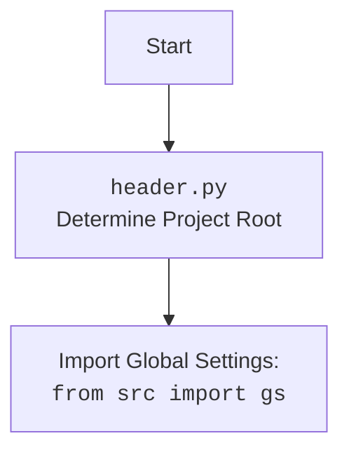

## <алгоритм>

**Общая схема работы:**

1. **Инициализация:**
   - Создается экземпляр класса `ProjectEuler` с указанием языка (по умолчанию 'en').
   - Загружаются инструкции для "Алисы" (запрос задачи) и "Боба" (решение задачи) из файлов `.md`.
   - Инициализируются экземпляры `GoogleGenerativeAI` для "Алисы" и "Боба" с использованием ключей API из глобальных настроек.
   - Определяется `base_path` - базовый путь к каталогу с настройками и ресурсами проекта.
   - Загружается конфигурация из `projecteuler.json`.

2. **Сбор задач:**
   - Функция `collect_problems` асинхронно получает формулировки задач от "Алисы" для номеров от 135 до 899.
     - Для каждого номера формируется запрос на основе инструкции "Алисы".
     - Запрос отправляется в `GoogleGenerativeAI` (Алисе).
     - Полученный текст задачи сохраняется в файл формата `e_<номер задачи>.md`.
   - Между запросами к API происходит задержка в 25 секунд.

3. **Решение задач:**
   - Функция `solve_probems` асинхронно получает решения для всех ранее сохраненных задач от "Боба".
     - Получает список файлов с задачами.
     - Для каждого файла с задачей:
       - Из имени файла извлекается номер задачи.
       - Текст задачи загружается из файла.
       - Формируется запрос на основе инструкции "Боба".
       - Запрос отправляется в `GoogleGenerativeAI` (Бобу).
       - Полученное решение сохраняется в файл формата `e_<номер задачи>.md` в каталоге `solves`.
   - Между запросами к API происходит задержка в 25 секунд.

4. **Сохранение результатов:**
   - Функция `save_problem` сохраняет текст запрошенной задачи в файл `e_<номер задачи>.md`
   - Функция `save_problem_solve` сохраняет решение запрошенной задачи в файл `e_<номер задачи>.md` в каталоге `solves`

5. **Запуск:**
   - Для каждого языка из списка (`ru`, `he`, `en`) создается экземпляр `ProjectEuler`.
   - Запускаются асинхронно функции сбора и решения задач для каждого экземпляра.

**Блок-схема:**

```mermaid
graph TD
    A[Start] --> B{Инициализация ProjectEuler};
    B --> C{Загрузка инструкций Алисы и Боба};
    C --> D{Инициализация GoogleGenerativeAI (Алиса, Боб)};
    D --> E{collect_problems()};
    E --> F{Цикл по номерам задач (135-899)};
    F --> G{Формирование запроса Алисе с <PROBLEM_NUMBER>};
    G --> H{Отправка запроса Алисе};
    H --> I{Сохранение текста задачи};
    I --> J{Задержка 25 сек};
    J --> F;
    F -- конец цикла --> K{solve_probems()};
    K --> L{Получение списка файлов задач};
    L --> M{Цикл по файлам задач};
    M --> N{Извлечение номера задачи};
    N --> O{Чтение текста задачи};
    O --> P{Формирование запроса Бобу с <PROBLEM_TO_SOLVE>};
    P --> Q{Отправка запроса Бобу};
    Q --> R{Сохранение решения задачи};
    R --> S{Задержка 25 сек};
    S --> M;
    M -- конец цикла --> T[End];
  
    subgraph "Пример блока инициализации"
       style B fill:#f9f,stroke:#333,stroke-width:2px
        B -- "lang='ru'" --> B1[ProjectEuler(lang='ru')]
        B1 -- "self.lang='ru'" --> B2[self.alice_instruction = 'instruction_ru.md']
        B2 -- "self.base_path" --> B3[self.base_path = '.../ai_games/projecteuler/']
        B3 --> B4[self.config = config_data]
    end

    subgraph "Пример блока collect_problems"
       style E fill:#ccf,stroke:#333,stroke-width:2px
        E -- "i=135" --> E1[q = self.alice_instruction.replace('<PROBLEM_NUMBER>', '135')]
        E1 --> E2[response = await self.alice.ask(q)]
        E2 --> E3[self.save_problem('135', response)]
    end

      subgraph "Пример блока solve_probems"
       style K fill:#cfc,stroke:#333,stroke-width:2px
       K --> K1[problems_to_solve_files_list = ['e_135.md', ...]]
       K1 -- "file_name='e_135.md'" --> K2[problem_number = 135]
       K2 --> K3[q = self.bob_instruction.replace('<PROBLEM_TO_SOLVE>', text_of_e_135.md)]
       K3 --> K4[response = await self.bob.ask(q)]
       K4 --> K5[self.save_problem_solve('135', response)]
    end
```

## <mermaid>

```mermaid
flowchart TD
    Start --> ProjectEulerInitialization[ProjectEuler Initialization <br> (lang: str)]
    
    ProjectEulerInitialization --> LoadInstructions[Load Instructions <br> (alice, bob)]
    LoadInstructions --> GoogleGenAIInitialization[GoogleGenerativeAI Initialization <br> (alice, bob)]
    GoogleGenAIInitialization --> CollectProblemsStart[collect_problems() <br> Start]
    
    CollectProblemsStart --> ProblemNumberLoop[Loop through Problem Numbers (135 to 899)]
    ProblemNumberLoop --> CreateAliceQuery[Create Alice Query  <br>  (replace <PROBLEM_NUMBER>)]
    CreateAliceQuery --> SendAliceQuery[Send Query to Alice]
    SendAliceQuery --> SaveProblem[Save Problem Text <br> (e_{problem_number}.md)]
    SaveProblem --> SleepAfterAliceRequest[Sleep for 25 seconds]
    SleepAfterAliceRequest --> ProblemNumberLoop
    ProblemNumberLoop -- End of Loop -->  CollectProblemsEnd[collect_problems() <br> End]
        
    CollectProblemsEnd --> SolveProblemsStart[solve_probems() Start]
    SolveProblemsStart --> GetProblemFiles[Get List of Problem Files]
    GetProblemFiles --> ProblemFileLoop[Loop through Problem Files]
    ProblemFileLoop --> ExtractProblemNumber[Extract Problem Number <br> from file name]
    ExtractProblemNumber --> ReadProblemText[Read Problem Text <br> from file]
    ReadProblemText --> CreateBobQuery[Create Bob Query <br> (replace <PROBLEM_TO_SOLVE>)]
    CreateBobQuery --> SendBobQuery[Send Query to Bob]
    SendBobQuery --> SaveSolution[Save Solution Text <br> (e_{problem_number}.md in solves)]
    SaveSolution --> SleepAfterBobRequest[Sleep for 25 seconds]
    SleepAfterBobRequest --> ProblemFileLoop
    ProblemFileLoop -- End of Loop --> SolveProblemsEnd[solve_probems() <br> End]
    
    SolveProblemsEnd --> End
    
    style Start fill:#f9f,stroke:#333,stroke-width:2px
    style End fill:#f9f,stroke:#333,stroke-width:2px
    
     subgraph "Инициализация ProjectEuler"
       style ProjectEulerInitialization fill:#ccf,stroke:#333,stroke-width:2px
        ProjectEulerInitialization -->  lang_var[lang: str]
        lang_var --> base_path_var[base_path: Path]
        base_path_var --> config_var[config: SimpleNamespace]
       
        style lang_var fill:#eee,stroke:#333,stroke-width:1px
        style base_path_var fill:#eee,stroke:#333,stroke-width:1px
        style config_var fill:#eee,stroke:#333,stroke-width:1px
      end
    
    subgraph "Запросы к Gemini (Алиса)"
        style SendAliceQuery fill:#cfc,stroke:#333,stroke-width:2px
         SendAliceQuery --> alice_response[response: str]
         style alice_response fill:#eee,stroke:#333,stroke-width:1px
    end
        
    subgraph "Запросы к Gemini (Боб)"
        style SendBobQuery fill:#cfc,stroke:#333,stroke-width:2px
         SendBobQuery --> bob_response[response: str]
        style bob_response fill:#eee,stroke:#333,stroke-width:1px
    end
```



## <объяснение>

**Импорты:**

-   `from __future__ import annotations`:  Позволяет использовать аннотации типов, которые могут ссылаться на класс, который еще не определен.
-   `from types import SimpleNamespace`: Импортирует `SimpleNamespace` для создания простых объектов с атрибутами.
-   `import asyncio`: Модуль для асинхронного программирования.
-   `import time`:  Модуль для работы со временем (используется для задержек).
-   `from pathlib import Path`:  Модуль для работы с путями к файлам и каталогам.
-   `import header`:  Импортирует модуль `header`, вероятно, для определения корневого каталога проекта и глобальных настроек.
-   `from src import gs`: Импортирует глобальные настройки проекта.
-   `from src.ai.gemini import GoogleGenerativeAI`:  Импортирует класс `GoogleGenerativeAI` для взаимодействия с API Google Gemini.
-   `from src.utils.jjson import j_loads_ns`: Импортирует функцию `j_loads_ns` для загрузки JSON-файлов в объекты `SimpleNamespace`.
-  `from src.utils.file import get_filenames`: Импортирует функцию `get_filenames` для получения списка имен файлов из каталога
-   `from src.utils.printer import pprint`: Импортирует функцию `pprint` для более читаемого вывода данных.

**Класс `ProjectEuler`:**

-   **Назначение:** Управляет процессом получения задач Project Euler и их решений с помощью AI моделей.
-   **Атрибуты:**
    -   `lang` (str): Язык, на котором будут запрашиваться задачи и решения.
    -   `alice` (GoogleGenerativeAI): Экземпляр `GoogleGenerativeAI` для запроса формулировок задач.
    -   `bob` (GoogleGenerativeAI): Экземпляр `GoogleGenerativeAI` для запроса решений задач.
    -   `base_path` (Path): Базовый путь к каталогу с ресурсами проекта.
    -   `alice_instruction` (str): Текст инструкции для "Алисы" (запрос задачи).
    -   `bob_instruction` (str): Текст инструкции для "Боба" (запрос решения).
    -   `config` (SimpleNamespace): Конфигурационные данные, загруженные из `projecteuler.json`.
-   **Методы:**
    -   `__init__(self, lang='en')`: Конструктор класса. Инициализирует атрибуты класса, загружает инструкции и создает экземпляры `GoogleGenerativeAI`.
    -   `async collect_problems(self)`: Асинхронно запрашивает у "Алисы" формулировки задач, сохраняет их в файлы.
    -   `async solve_probems(self)`: Асинхронно запрашивает у "Боба" решения задач, сохраняет их в файлы.
    -   `save_problem(self, problem_number, problem_text)`: Сохраняет текст задачи в файл.
    -   `save_problem_solve(self, problem_number, solve_text)`: Сохраняет решение задачи в файл.

**Функции:**

-   `async def collect_problems(self)`:
    -   **Аргументы:** `self` (экземпляр `ProjectEuler`).
    -   **Возвращает:** `None`.
    -   **Назначение:** Асинхронно получает формулировки задач от "Алисы" для номеров от 135 до 899, сохраняя их в файлы.
    -   **Пример:**
        ```python
        # Внутри collect_problems:
        for i in range(135, 900):
            q = self.alice_instruction.replace('<PROBLEM_NUMBER>', str(i))
            response = await self.alice.ask(q) # Запрос к Алисе
            self.save_problem(str(i), response)  # Сохранение ответа
            time.sleep(25)
        ```
-   `async def solve_probems(self)`:
    -   **Аргументы:** `self` (экземпляр `ProjectEuler`).
    -   **Возвращает:** `None`.
    -   **Назначение:** Асинхронно получает решения задач от "Боба" для всех сохраненных задач, сохраняя их в файлы.
        ```python
        # Внутри solve_probems:
        for file_name in problems_to_solve_files_list:
            problem_number = int(file_name.split('_')[1].split('.')[0])
            q = self.bob_instruction.replace('<PROBLEM_TO_SOLVE>', Path(self.base_path / {self.lang} / 'problems' / file_name).read_text(encoding='UTF-8'))
            response = await self.bob.ask(q) # Запрос к Бобу
            self.save_problem_solve(problem_number,response) # Сохранение ответа
            time.sleep(25)
        ```
-   `def save_problem(self, problem_number, problem_text)`:
    -   **Аргументы:** `self` (экземпляр `ProjectEuler`), `problem_number` (str), `problem_text` (str).
    -   **Возвращает:** `None`.
    -   **Назначение:** Сохраняет текст задачи в файл.
-   `def save_problem_solve(self, problem_number, solve_text)`:
    -   **Аргументы:** `self` (экземпляр `ProjectEuler`), `problem_number` (str), `solve_text` (str).
    -   **Возвращает:** `None`.
    -   **Назначение:** Сохраняет текст решения задачи в файл.

**Переменные:**

-   `languges_list` (list): Список языков для обработки (`ru`, `he`, `en`).
-   `euler` (ProjectEuler): Экземпляр класса `ProjectEuler`.
-  `file_name` (str) имя файла задачи, используется в функции `solve_probems`.
-   `problem_number` (int): Номер задачи.
-   `q` (str): Сформированный текст запроса к `GoogleGenerativeAI`.
-   `response` (str): Текст ответа от `GoogleGenerativeAI`.
-   `output_file` (Path): Путь к файлу для сохранения.

**Потенциальные ошибки и области для улучшения:**

1.  **Обработка ошибок API:** Отсутствует обработка ошибок при запросах к API `GoogleGenerativeAI`. Необходимо добавить обработку исключений для ситуаций, когда API недоступен или возвращает ошибку.
2.  **Управление таймаутами API:** Время ожидания между запросами `time.sleep(25)` задано жестко. Возможно, стоит использовать более динамическое управление таймаутами.
3.  **Асинхронность**:  Асинхронные вызовы `collect_problems` и `solve_probems`  выполняются последовательно, что не раскрывает потенциал параллелизма.
4.  **Использование `f-string` для путей**: В коде используются f-strings для динамического формирования путей к файлам. Необходимо убедиться, что форматирование строк выполняется корректно и нет риска инъекций в путь.
5.  **Не оптимальное использование async**: Использование `asyncio.run`  в цикле не является оптимальным решением. Лучше использовать `asyncio.gather` для одновременного запуска задач
6.  **Необработанный формат файлов:** Код предполагает, что все файлы с задачами имеют формат `e_{problem_number}.md`.  Возможны проблемы, если формат будет отличаться.
7.  **Жестко заданный диапазон задач**: Код обрабатывает задачи с номерами от 135 до 899,  необходимо сделать диапазон настраиваемым,
8.  **Отсутсвие логирования**:  Отсутсвует логирование операций, что затрудняет отладку.
9.  **Управление ресурсами:** Не обрабатывается ситуация, когда  ограничение API по количеству запросов  превышено.
10.  **Разделение обязанностей**: Класс `ProjectEuler` выполняет много функций, целесообразно разбить на несколько классов, например `ProblemCollector`, `SolutionSolver`, и другие.
11. **Не полное использование  `SimpleNamespace`**:  Переменная `config` объявляется как  `SimpleNamespace`, но используется только при инициализации `GoogleGenerativeAI`. Можно также хранить в нем пути к каталогам, настройки таймаутов и т.д.

**Взаимосвязь с другими частями проекта:**

-   Использует `src.gs` для получения глобальных настроек проекта, в том числе ключи API.
-   Использует `src.ai.gemini.GoogleGenerativeAI` для взаимодействия с моделями Gemini.
-   Использует `src.utils.jjson.j_loads_ns` для загрузки конфигурации из JSON файла.
-   Использует `src.utils.printer.pprint` для вывода отладочной информации.
-   Использует `src.utils.file.get_filenames` для получения списка файлов с задачами.
-   Зависит от структуры каталогов, хранящей инструкции, задачи и решения.

Этот анализ предоставляет подробное описание функциональности кода, его структуры, зависимостей и потенциальных проблем.