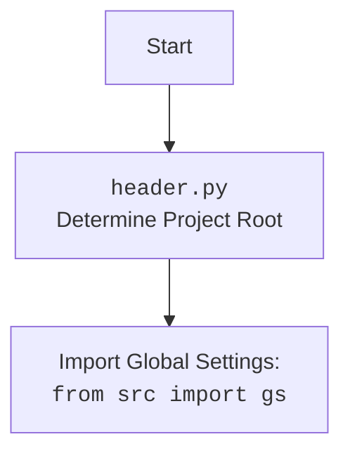

## <алгоритм>
1.  **Определение `set_project_root`:**
    *   Начинаем с текущего файла (`__file__`) и получаем его родительскую директорию (`current_path`).
        *   Пример: Если скрипт находится в `/home/user/hypotez/src/ai/helicone/header.py`, то `current_path` будет `/home/user/hypotez/src/ai/helicone`.
    *   Инициализируем переменную `__root__` значением `current_path`.
    *   Создаём список директорий для поиска, начиная с `current_path` и добавляя все её родительские директории.
        *   Пример: Если `current_path` — `/home/user/hypotez/src/ai/helicone`, то список будет `[/home/user/hypotez/src/ai/helicone, /home/user/hypotez/src/ai, /home/user/hypotez/src, /home/user/hypotez, /home/user]`.
    *   Итерируемся по списку директорий.
    *   Для каждой директории проверяем наличие в ней одного из "маркерных файлов" (`__root__` по умолчанию).
        *   Пример: проверяем наличие файла `/home/user/hypotez/src/ai/helicone/__root__`, затем `/home/user/hypotez/src/ai/__root__` и т.д.
    *   Если "маркерный файл" найден, обновляем `__root__` на директорию, где файл найден, и прерываем цикл.
        *   Пример: Если файл `__root__` найден в `/home/user/hypotez`, то `__root__` станет `/home/user/hypotez`.
    *   Проверяем, если `__root__` не в `sys.path` - добавляем.
    *   Возвращаем `__root__`.
2.  **Вызов `set_project_root`:**
    *   Вызываем функцию `set_project_root()` для определения корневой директории проекта и сохраняем её в глобальную переменную `__root__`.
3.  **Импорт `src.gs`:**
    *   Импортируем модуль `gs` из пакета `src`.
4.  **Загрузка `config.json`:**
    *   Пытаемся открыть и загрузить файл `config.json` из `<root>/src/config.json`.
    *   Если файл найден и корректен, то его содержимое сохраняется в переменную `config`.
    *   Если возникает ошибка `FileNotFoundError` или `json.JSONDecodeError`, пропускаем ошибку (ничего не делаем).
5.  **Загрузка `README.MD`:**
    *   Пытаемся открыть и прочитать файл `README.MD` из `<root>/src/README.MD`.
    *   Если файл найден и корректен, то его содержимое сохраняется в переменную `doc_str`.
    *   Если возникает ошибка `FileNotFoundError` или `json.JSONDecodeError`, пропускаем ошибку (ничего не делаем).
6.  **Инициализация глобальных переменных:**
    *   Инициализируем переменные `__project_name__`, `__version__`, `__doc__`, `__details__`, `__author__`, `__copyright__` и `__cofee__`, используя данные из загруженного `config.json` (если он существует) или заданные по умолчанию значения.
    *   Для `__project_name__` значение по умолчанию — "hypotez".
    *   Для `__version__` значение по умолчанию — "".
    *   Для `__doc__` используется `doc_str`, либо пустая строка.
    *   Для `__details__` значение по умолчанию - "".
    *   Для `__author__` значение по умолчанию — "".
    *   Для `__copyright__` значение по умолчанию — "".
    *   Для `__cofee__` значение по умолчанию — строка с предложением поддержать разработчика.

## <mermaid>
```mermaid
flowchart TD
    Start --> setProjectRoot[<code>set_project_root()</code><br>Find Project Root]
    setProjectRoot --> findParentDir[Find Parent Directories]
    findParentDir --> checkMarkerFiles{Check for Marker Files<br>(e.g., '__root__')}
    checkMarkerFiles -- File Found --> setRoot[Set Project Root]
    checkMarkerFiles -- No File --> nextParentDir[Go to Parent Directory]
    nextParentDir --> checkMarkerFiles
    setRoot --> addRootToPath{Add Root to System Path <br> <code>sys.path.insert(0, str(__root__))</code>}
    addRootToPath --> returnRoot[Return Project Root]
    returnRoot --> importGS[Import Global Settings:<br> <code>from src import gs</code>]
    importGS --> loadConfig{Load Configuration: <br> <code>config.json</code>}
    loadConfig -- Success --> loadReadme{Load README:<br><code>README.MD</code>}
    loadConfig -- Failure --> loadReadme
     loadReadme -- Success --> setGlobals{Set Global Variables}
    loadReadme -- Failure --> setGlobals
    setGlobals --> End
    
    style setProjectRoot fill:#f9f,stroke:#333,stroke-width:2px
    style checkMarkerFiles fill:#ccf,stroke:#333,stroke-width:2px
```


**Объяснение зависимостей `mermaid`:**

*   `Start`: Начало процесса.
*   `setProjectRoot`: Функция `set_project_root()`, которая находит корневой каталог проекта.
*   `findParentDir`: Поиск родительских директорий от текущего файла.
*   `checkMarkerFiles`: Проверка наличия маркерных файлов в текущей директории.
*   `setRoot`: Установка переменной `__root__` на директорию с маркерным файлом.
*   `nextParentDir`: Переход к следующей родительской директории для поиска маркерных файлов.
*   `addRootToPath`: Добавление корневой директории проекта в `sys.path`.
*   `returnRoot`: Возврат корневой директории проекта.
*   `importGS`: Импорт настроек из `src.gs`.
*   `loadConfig`: Загрузка настроек из файла `config.json`.
*   `loadReadme`: Загрузка документации из файла `README.MD`.
*   `setGlobals`: Установка глобальных переменных проекта.
*   `End`: Конец процесса.

## <объяснение>
### Импорты:
*   `sys`: Используется для добавления пути к корневой директории проекта в `sys.path`, чтобы можно было импортировать другие модули проекта. Это позволяет Python находить модули, не находящиеся в стандартных директориях.
*   `json`: Используется для работы с JSON-файлами (загрузка конфигурации из `config.json`).
*   `packaging.version.Version`: Не используется в коде.
*   `pathlib.Path`: Используется для работы с путями к файлам и директориям. Обеспечивает более удобный и кроссплатформенный способ работы с файловой системой.
*   `src.gs`: Предположительно, импортирует глобальные настройки из модуля `gs` внутри пакета `src`. `src` - это папка проекта. Модуль `gs` отвечает за глобальные настройки, используемые в проекте.

### Функции:
*   **`set_project_root(marker_files=('__root__')) -> Path`:**
    *   **Аргументы:**
        *   `marker_files`: (tuple, optional) - список имен файлов или директорий, которые будут использоваться в качестве маркеров корневой директории. По умолчанию используется `'__root__'`.
    *   **Возвращаемое значение:**
        *   `Path`: путь к корневой директории проекта. Если маркер не найден, возвращается текущая директория.
    *   **Назначение:**
        *   Функция определяет корневую директорию проекта, ищя маркерные файлы вверх по дереву директорий от текущего файла. Это позволяет запускать скрипты из разных поддиректорий проекта, не меняя пути к файлам конфигурации или импортам модулей.
        *   После нахождения корневой директории, добавляет её в `sys.path`, чтобы Python мог импортировать другие модули проекта.
    *   **Пример:**
        *   Если файл `header.py` расположен в `/home/user/hypotez/src/ai/helicone` и маркерный файл `__root__` расположен в `/home/user/hypotez`, то функция вернет `/home/user/hypotez`.

### Переменные:
*   `MODE`: Строковая константа, определяющая режим работы приложения. В данном случае - `dev`.
*   `__root__`: Глобальная переменная типа `Path`, содержащая путь к корневой директории проекта. Определяется после вызова `set_project_root()`.
*   `config`: Глобальная переменная типа `dict`, в которую загружается содержимое файла `config.json`, если он найден.
*   `doc_str`: Глобальная строковая переменная, в которую загружается содержимое файла `README.MD`, если он найден.
*   `__project_name__`: Глобальная строковая переменная, содержащая имя проекта. По умолчанию "hypotez", но может быть взято из `config.json`.
*   `__version__`: Глобальная строковая переменная, содержащая версию проекта. Может быть взята из `config.json`.
*   `__doc__`: Глобальная строковая переменная, содержащая документацию проекта. Берется из `doc_str`.
*   `__details__`: Глобальная строковая переменная, содержащая дополнительную информацию о проекте.
*   `__author__`: Глобальная строковая переменная, содержащая имя автора проекта. Может быть взята из `config.json`.
*   `__copyright__`: Глобальная строковая переменная, содержащая информацию об авторских правах проекта. Может быть взята из `config.json`.
*  `__cofee__`: Глобальная строковая переменная, содержащая предложение поддержать разработчика. Может быть взята из `config.json`, если не найдена по умолчанию значение.

### Цепочка взаимосвязей:
1.  `header.py` определяет корневую директорию проекта (`__root__`) и добавляет ее в `sys.path`.
2.  `header.py` импортирует `src.gs`, что позволяет получить доступ к глобальным настройкам проекта.
3.  `header.py` загружает конфигурацию из `config.json` и документацию из `README.MD`, которые, предположительно, используются в других частях проекта.
4.  `header.py` инициализирует глобальные переменные проекта, такие как имя, версия и автор, которые могут использоваться в других модулях проекта.

### Потенциальные ошибки и улучшения:
1.  **Обработка ошибок:** Обработка исключений `FileNotFoundError` и `json.JSONDecodeError` при загрузке файлов `config.json` и `README.MD` выполнена через `pass`, что может затруднить отладку. Желательно добавить логгирование ошибок.
2.  **Неиспользуемый импорт**: Импорт `from packaging.version import Version` не используется в коде и его можно удалить.
3.  **Зависимость от marker_file:** Использование `'__root__'` в качестве маркерного файла может быть не всегда удобным, так как его может не быть, или может быть иное имя. Следует сделать его настраиваемым через конфигурацию.
4.  **Отсутствие обработки ошибок:** Если `settings.get("cofee", ...)` вернет `None`, это вызовет ошибку. Можно использовать конструкцию `settings.get("cofee", "...") if settings else "..."`.
5.  **Много глобальных переменных:** Можно инкапсулировать переменные внутри класса.
6.  **Настройка по умолчанию:** Строки по умолчанию для `__cofee__` дублируются, лучше вынести в константу.

Этот код отвечает за базовую конфигурацию проекта, определение корневой директории и загрузку основных параметров, которые используются в других частях проекта.