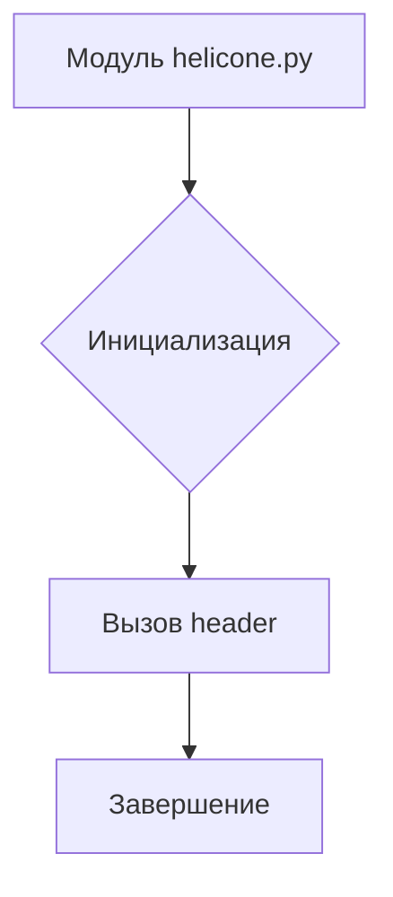
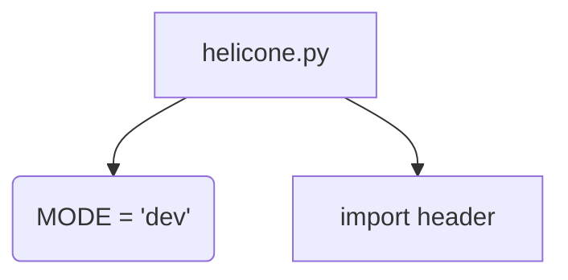

```MD
# Анализ кода файла hypotez/src/ai/helicone/helicone.py

## <input code>

```python
## \file hypotez/src/ai/helicone/helicone.py
# -*- coding: utf-8 -*-\
#! venv/Scripts/python.exe
#! venv/bin/python/python3.12

"""
.. module: src.ai.helicone 
	:platform: Windows, Unix
	:synopsis:

"""
MODE = 'dev'

"""
	:platform: Windows, Unix
	:synopsis:

"""


"""
	:platform: Windows, Unix
	:synopsis:

"""


"""
  :platform: Windows, Unix

"""
"""
  :platform: Windows, Unix
  :platform: Windows, Unix
  :synopsis:
"""MODE = 'dev'
  
""" module: src.ai.helicone """


""" HERE SHOULD BE A DESCRIPTION OF THE MODULE OPERATION ! 
quick start:   https://docs.helicone.ai/getting-started/quick-start
"""

import header
```

## <algorithm>

Алгоритм работы данного кода не может быть определен, так как он содержит только объявление модуля и константу.  Код, вероятно, представляет собой заготовку или начальный шаблон для дальнейшего развития, связанного с интеграцией с сервисом Helicone.

Пример блок-схемы (не отражающей логику работы):



В данном случае данные не передаются между функциями или классами.


## <mermaid>




## <explanation>

**Импорты:**

- `import header`:  Этот импорт предполагает, что существует модуль `header`, который содержит какие-то необходимые для работы модуля `helicone` функции или константы.  Без знания содержимого `header` сложно определить точную функциональность.  Вероятно, `header` отвечает за инициализацию, установку параметров или импорт других библиотек, необходимых для интеграции с Helicone.  Наличие многократных `"""`-блоков с документацией, но без фактического кода, показывает неполноту написания модуля.


**Классы:**

В коде нет объявленных классов.

**Функции:**

Нет определенных функций.

**Переменные:**

- `MODE = 'dev'`:  Константа, определяющая режим работы (вероятно, 'dev' - режим разработки).  Её значение может использоваться другими частями кода для принятия различных решений (например, для использования тестовых данных или настроек).

**Возможные ошибки и улучшения:**

- **Недостаток документации:** Не хватает подробного описания функциональности модуля `helicone.py`, что затрудняет понимание его цели и взаимодействия.  Нужны комментарии, описывающие, что делает модуль, какие параметры принимает и какие данные возвращает.
- **Отсутствие кода:** Файл содержит только заготовки и комментарии. Для функционирования модуля необходим код, реализующий логику работы с Helicone.
- **Неясный `header`:**  Непонятно, из каких частей состоит `header`.
- **Дублирование константы:**  Существует две объявленные переменные `MODE`.  Это потенциальная ошибка или баг, который может возникнуть при дальнейшем использовании, если разные части кода используют разные `MODE`.  Необходимо выбрать одну из них и удалить другую.
- **Не указана зависимость от других модулей:** Необходимо определить, какие другие модули или библиотеки использует данный код. Например, возможно, используются библиотеки для работы с API Helicone или для работы с базами данных.


**Взаимосвязь с другими частями проекта:**

Данный модуль (`helicone.py`) вероятно, является частью более крупного проекта (`hypotez`) и предназначен для интеграции с сервисом `Helicone` для выполнения задач, связанных с ИИ.  Чтобы полностью понять взаимосвязи, нужно проанализировать другие модули проекта.  Для понимания цели `hypotez` также необходимо дополнительное контекстное описание.