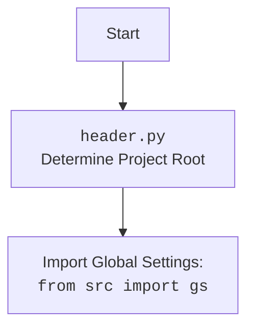

## <алгоритм>
1.  **Инициализация:**
    *   Начало программы.
    *   Загрузка переменных окружения (импорт `header`).
    *   Устанавливается режим работы ``.
    *   Создается экземпляр класса `HeliconeAI`.
    *   Создаются экземпляры классов `Helicone` и `OpenAI` внутри `HeliconeAI`.
2.  **Генерация стихотворения:**
    *   Вызывается метод `generate_poem` класса `HeliconeAI` с промптом "Напиши мне стихотворение про кота.".
    *   `generate_poem` использует `OpenAI` для генерации стихотворения на основе промпта.
    *   Результат `OpenAI` логируется с помощью `helicone.log_completion`.
    *   Возвращается сгенерированное стихотворение.
    *   Выводится в консоль.
    *   Пример: `prompt` = "Напиши мне стихотворение про кота.", результат = "Мяукает котик у окошка..."
3.  **Анализ тональности:**
    *   Вызывается метод `analyze_sentiment` класса `HeliconeAI` с текстом "Сегодня был отличный день!".
    *   `analyze_sentiment` использует `OpenAI` для анализа тональности текста.
    *   Результат `OpenAI` логируется с помощью `helicone.log_completion`.
    *   Возвращается результат анализа тональности.
    *   Выводится в консоль.
    *   Пример: `text` = "Сегодня был отличный день!", результат = "positive"
4.  **Создание краткого изложения:**
    *   Вызывается метод `summarize_text` класса `HeliconeAI` с длинным текстом "Длинный текст для изложения...".
    *   `summarize_text` использует `OpenAI` для создания краткого изложения текста.
    *   Результат `OpenAI` логируется с помощью `helicone.log_completion`.
    *   Возвращается краткое изложение.
    *   Выводится в консоль.
    *   Пример: `text` = "Длинный текст для изложения...", результат = "Краткое изложение длинного текста."
5.  **Перевод текста:**
    *   Вызывается метод `translate_text` класса `HeliconeAI` с текстом "Hello, how are you?" и целевым языком "русский".
    *   `translate_text` использует `OpenAI` для перевода текста на указанный язык.
    *   Результат `OpenAI` логируется с помощью `helicone.log_completion`.
    *   Возвращается переведенный текст.
    *   Выводится в консоль.
    *   Пример: `text` = "Hello, how are you?", `target_language` = "русский", результат = "Привет, как дела?"
6.  **Завершение:**
    *   Программа завершает выполнение.

## <mermaid>
```mermaid
flowchart TD
    Start[Start] --> Initialize[Initialize HeliconeAI]
    Initialize --> CreateHelicone[Create Helicone Instance]
    Initialize --> CreateOpenAI[Create OpenAI Instance]

    CreateHelicone --> HeliconeAI_Instance[HeliconeAI Instance]
    CreateOpenAI --> HeliconeAI_Instance
    
    HeliconeAI_Instance --> GeneratePoemCall[Call generate_poem]
    GeneratePoemCall --> GeneratePoem[Generate Poem]
    GeneratePoem --> LogCompletionPoem[Log Completion (Helicone)]
    LogCompletionPoem --> PrintPoem[Print Poem]
    
    PrintPoem --> AnalyzeSentimentCall[Call analyze_sentiment]
    AnalyzeSentimentCall --> AnalyzeSentiment[Analyze Sentiment]
    AnalyzeSentiment --> LogCompletionSentiment[Log Completion (Helicone)]
    LogCompletionSentiment --> PrintSentiment[Print Sentiment]
    
    PrintSentiment --> SummarizeTextCall[Call summarize_text]
    SummarizeTextCall --> SummarizeText[Summarize Text]
    SummarizeText --> LogCompletionSummary[Log Completion (Helicone)]
     LogCompletionSummary --> PrintSummary[Print Summary]

    PrintSummary --> TranslateTextCall[Call translate_text]
    TranslateTextCall --> TranslateText[Translate Text]
    TranslateText --> LogCompletionTranslate[Log Completion (Helicone)]
    LogCompletionTranslate --> PrintTranslation[Print Translation]
    
     PrintTranslation --> End[End]
  
    classDef function_call fill:#f9f,stroke:#333,stroke-width:2px
    class GeneratePoemCall, AnalyzeSentimentCall, SummarizeTextCall, TranslateTextCall function_call
    classDef process fill:#ccf,stroke:#333,stroke-width:2px
    class Initialize, CreateHelicone, CreateOpenAI, GeneratePoem, AnalyzeSentiment, SummarizeText, TranslateText process
    classDef io fill:#afa,stroke:#333,stroke-width:2px
    class PrintPoem, PrintSentiment, PrintSummary, PrintTranslation io
    classDef object fill:#cfc,stroke:#333,stroke-width:2px
    class HeliconeAI_Instance object
    classDef log fill:#ffc,stroke:#333,stroke-width:2px
    class LogCompletionPoem, LogCompletionSentiment, LogCompletionSummary, LogCompletionTranslate log

```

### **Объяснение зависимостей `mermaid`:**

1.  **`Start`:** Начало выполнения программы.
2.  **`Initialize HeliconeAI`**: Создание экземпляра класса `HeliconeAI`.
3.  **`Create Helicone Instance`:** Создание экземпляра класса `Helicone` внутри `HeliconeAI`.
4.  **`Create OpenAI Instance`:** Создание экземпляра класса `OpenAI` внутри `HeliconeAI`.
5.  **`HeliconeAI Instance`:** Объект класса `HeliconeAI`, который управляет экземплярами `Helicone` и `OpenAI`.
6.  **`Call generate_poem`**: Вызов метода `generate_poem` с промптом для генерации стихотворения.
7.  **`Generate Poem`:** Генерация стихотворения с помощью `OpenAI`.
8.  **`Log Completion (Helicone)`:** Логирование результатов выполнения `OpenAI` с помощью `Helicone`.
9.  **`Print Poem`:** Вывод сгенерированного стихотворения в консоль.
10. **`Call analyze_sentiment`**: Вызов метода `analyze_sentiment` для анализа тональности текста.
11. **`Analyze Sentiment`:** Анализ тональности текста с помощью `OpenAI`.
12. **`Log Completion (Helicone)`:** Логирование результатов выполнения `OpenAI` с помощью `Helicone`.
13. **`Print Sentiment`:** Вывод результата анализа тональности в консоль.
14. **`Call summarize_text`**: Вызов метода `summarize_text` для создания краткого изложения текста.
15. **`Summarize Text`:** Создание краткого изложения текста с помощью `OpenAI`.
16. **`Log Completion (Helicone)`:** Логирование результатов выполнения `OpenAI` с помощью `Helicone`.
17. **`Print Summary`:** Вывод краткого изложения в консоль.
18. **`Call translate_text`**: Вызов метода `translate_text` для перевода текста на указанный язык.
19. **`Translate Text`:** Перевод текста с помощью `OpenAI`.
20. **`Log Completion (Helicone)`:** Логирование результатов выполнения `OpenAI` с помощью `Helicone`.
21. **`Print Translation`:** Вывод переведенного текста в консоль.
22. **`End`:** Завершение выполнения программы.
23. **`Header`**: Выполнение `header.py` для определения корня проекта.
24. **`ImportGS`**: Импорт глобальных настроек из `src.gs`.

## <объяснение>
### **Импорты:**

1.  `import header`: Импортирует модуль `header.py`, который, вероятно, используется для определения корня проекта и загрузки общих настроек.
    *   **Взаимосвязь с `src`:** `header.py` находится в корне проекта и помогает настроить пути для импорта других модулей из пакета `src`.
2.  `from helicone import Helicone`: Импортирует класс `Helicone` из пакета `helicone`.
    *   **Взаимосвязь с `src`:**  Класс `Helicone` вероятно,  предоставляет функциональность для логирования запросов и ответов к языковым моделям, что помогает в отладке и мониторинге. Он может быть частью более крупной системы логирования, используемой в `src`.
3.  `from openai import OpenAI`: Импортирует класс `OpenAI` из пакета `openai`.
    *   **Взаимосвязь с `src`:** Класс `OpenAI` используется для взаимодействия с API OpenAI, являясь ключевым компонентом для работы с языковыми моделями.

### **Классы:**

1.  `class HeliconeAI:`
    *   **Роль:**  Предоставляет интерфейс для взаимодействия с моделями OpenAI через `Helicone`.
    *   **Атрибуты:**
        *   `self.helicone`: Экземпляр класса `Helicone`.
        *   `self.client`: Экземпляр класса `OpenAI`.
    *   **Методы:**
        *   `__init__(self)`: Инициализирует атрибуты `helicone` и `client`.
        *   `generate_poem(self, prompt: str) -> str`: Генерирует стихотворение на основе заданного промпта.
        *   `analyze_sentiment(self, text: str) -> str`: Анализирует тональность текста.
        *   `summarize_text(self, text: str) -> str`: Создает краткое изложение текста.
        *   `translate_text(self, text: str, target_language: str) -> str`: Переводит текст на указанный язык.
    *   **Взаимодействие:**
        *   Использует `Helicone` для логирования запросов.
        *   Использует `OpenAI` для доступа к языковым моделям.
        *   Пример: Экземпляр `HeliconeAI` используется для вызова `generate_poem`, `analyze_sentiment`, `summarize_text` и `translate_text`.

### **Функции:**

1.  `generate_poem(self, prompt: str) -> str:`
    *   **Аргументы:**
        *   `prompt` (str): Текст запроса для генерации стихотворения.
    *   **Возвращаемое значение:**
        *   str: Сгенерированное стихотворение.
    *   **Назначение:** Генерирует стихотворение с использованием модели `gpt-3.5-turbo` через `OpenAI`. Результат логируется `Helicone`.
    *   **Пример:** `prompt` = "Напиши стих про осень", возвращает "Осень, рыжая подруга,..."
2.  `analyze_sentiment(self, text: str) -> str:`
    *   **Аргументы:**
        *   `text` (str): Текст для анализа тональности.
    *   **Возвращаемое значение:**
        *   str: Результат анализа тональности (например, "positive", "negative", "neutral").
    *   **Назначение:** Анализирует тональность текста с помощью модели `text-davinci-003` через `OpenAI`. Результат логируется `Helicone`.
    *   **Пример:** `text` = "Я очень рад", возвращает "positive"
3.  `summarize_text(self, text: str) -> str:`
    *   **Аргументы:**
        *   `text` (str): Текст для создания краткого изложения.
    *   **Возвращаемое значение:**
        *   str: Краткое изложение текста.
    *   **Назначение:** Создает краткое изложение текста с помощью модели `text-davinci-003` через `OpenAI`. Результат логируется `Helicone`.
    *   **Пример:** `text` = "Длинный текст...", возвращает "Краткое изложение текста..."
4.  `translate_text(self, text: str, target_language: str) -> str:`
    *   **Аргументы:**
        *   `text` (str): Текст для перевода.
        *   `target_language` (str): Целевой язык перевода.
    *   **Возвращаемое значение:**
        *   str: Переведенный текст.
    *   **Назначение:** Переводит текст на указанный язык с помощью модели `text-davinci-003` через `OpenAI`. Результат логируется `Helicone`.
    *   **Пример:** `text` = "Hello", `target_language` = "fr", возвращает "Bonjour"
5.  `main():`
    *   **Аргументы:** Нет
    *   **Возвращаемое значение:** Нет
    *   **Назначение:** Создает экземпляр `HeliconeAI` и вызывает методы для генерации стихотворения, анализа тональности, создания краткого изложения и перевода текста, выводя результаты в консоль.
    *   **Пример:** Запускает демонстрационный сценарий использования `HeliconeAI`.

### **Переменные:**

*   `MODE`: Глобальная переменная, устанавливающая режим работы ('dev' в данном случае).
*   `helicone_ai`: Экземпляр класса `HeliconeAI` в функции `main`.
*   `poem`, `sentiment`, `summary`, `translation`: Переменные типа `str`, хранящие результаты вызова соответствующих методов `HeliconeAI`.

### **Потенциальные ошибки и области для улучшения:**

1.  **Обработка ошибок:** В коде отсутствует явная обработка ошибок, например, ошибок при вызове API OpenAI.
2.  **Настройка моделей:** Использование фиксированных моделей (`gpt-3.5-turbo` и `text-davinci-003`). Может быть полезно сделать выбор моделей настраиваемым.
3.  **Параметры OpenAI:** Использование фиксированных параметров при создании запросов к OpenAI, таких как `max_tokens`.
4.  **Использование `header.py`:** Понимание, как именно `header.py` влияет на конфигурацию приложения, особенно при импорте глобальных настроек `from src import gs`, важно для корректной работы.
5.  **Конфигурация:** Отсутствует конфигурация для ключей API OpenAI и других параметров. Необходимо использовать переменные окружения или файлы конфигурации.
6.  **Улучшение логирования:** Логирование `Helicone` может быть дополнено, например, добавлением информации о времени выполнения запросов.
7.  **Асинхронность:** Запросы к API можно сделать асинхронными для повышения производительности.
8.  **Проверка входных данных:** Нет проверок входных данных.

### **Цепочка взаимосвязей:**

1.  `header.py` -> Загрузка общих настроек из `src`  -> `HeliconeAI`.
2.  `HeliconeAI` -> `Helicone` (логирование) -> `OpenAI` (вызов API) -> `main` (использование результатов).
3.  `OpenAI` -> Вызовы API OpenAI (генерация, анализ, изложение, перевод) -> `HeliconeAI`.
4.  `main()` -> `HeliconeAI` -> Вызов методов `generate_poem`, `analyze_sentiment`, `summarize_text`, `translate_text`.

Этот анализ обеспечивает полное понимание кода, его функциональности и связей с другими частями проекта.