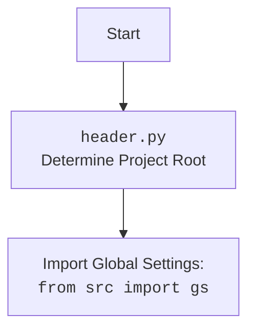

## <алгоритм>

**1. Инициализация:**
   - Создается экземпляр класса `HeliconeAI`.
     *Пример:* `helicone_ai = HeliconeAI()`
   - Внутри `HeliconeAI.__init__()` создаются экземпляры `Helicone` и `OpenAI`.

**2. Генерация стихотворения:**
   - Метод `generate_poem(prompt)` вызывается с промптом для генерации стихотворения.
     *Пример:* `poem = helicone_ai.generate_poem("Напиши мне стихотворение про кота.")`
   - Используется `OpenAI.chat.completions.create()` для генерации текста с использованием модели "gpt-3.5-turbo".
   - Логируется ответ с помощью `helicone.log_completion(response)`.
   - Возвращается сгенерированное стихотворение.

**3. Анализ тональности:**
    - Метод `analyze_sentiment(text)` вызывается с текстом для анализа.
      *Пример:* `sentiment = helicone_ai.analyze_sentiment("Сегодня был отличный день!")`
    - Используется `OpenAI.completions.create()` для анализа тональности с использованием модели "text-davinci-003".
    - Логируется ответ с помощью `helicone.log_completion(response)`.
    - Возвращается результат анализа.

**4. Краткое изложение текста:**
    - Метод `summarize_text(text)` вызывается с текстом для изложения.
      *Пример:* `summary = helicone_ai.summarize_text("Длинный текст для изложения...")`
    - Используется `OpenAI.completions.create()` для создания краткого изложения с использованием модели "text-davinci-003".
    - Логируется ответ с помощью `helicone.log_completion(response)`.
    - Возвращается краткое изложение текста.

**5. Перевод текста:**
    - Метод `translate_text(text, target_language)` вызывается с текстом и целевым языком для перевода.
      *Пример:* `translation = helicone_ai.translate_text("Hello, how are you?", "русский")`
    - Используется `OpenAI.completions.create()` для перевода текста с использованием модели "text-davinci-003".
    - Логируется ответ с помощью `helicone.log_completion(response)`.
    - Возвращается переведенный текст.

**6. Вывод результатов:**
   - Результаты каждой операции (стихотворение, тональность, изложение, перевод) выводятся на экран.
     *Пример:* `print("Generated Poem:\\n", poem)`

## <mermaid>
```mermaid
flowchart TD
    Start --> InitializeHeliconeAI[Initialize HeliconeAI Class]
    InitializeHeliconeAI --> CreateHeliconeClient[Create Helicone Client]
    InitializeHeliconeAI --> CreateOpenAIClient[Create OpenAI Client]
    
    CreateHeliconeClient --> GeneratePoemCall[Call generate_poem()]
    CreateOpenAIClient --> GeneratePoemCall
    GeneratePoemCall --> OpenAIChatCompletion[OpenAI Chat Completion with gpt-3.5-turbo]
    OpenAIChatCompletion --> LogPoemCompletion[Log Completion to Helicone]
    LogPoemCompletion --> ReturnPoem[Return Generated Poem]
    
    CreateHeliconeClient --> AnalyzeSentimentCall[Call analyze_sentiment()]
    CreateOpenAIClient --> AnalyzeSentimentCall
    AnalyzeSentimentCall --> OpenAICompletionSentiment[OpenAI Completion with text-davinci-003 for sentiment]
    OpenAICompletionSentiment --> LogSentimentCompletion[Log Completion to Helicone]
    LogSentimentCompletion --> ReturnSentiment[Return Sentiment Analysis]
    
    CreateHeliconeClient --> SummarizeTextCall[Call summarize_text()]
    CreateOpenAIClient --> SummarizeTextCall    
    SummarizeTextCall --> OpenAICompletionSummary[OpenAI Completion with text-davinci-003 for summary]
    OpenAICompletionSummary --> LogSummaryCompletion[Log Completion to Helicone]
    LogSummaryCompletion --> ReturnSummary[Return Text Summary]
    
    CreateHeliconeClient --> TranslateTextCall[Call translate_text()]
    CreateOpenAIClient --> TranslateTextCall
    TranslateTextCall --> OpenAICompletionTranslation[OpenAI Completion with text-davinci-003 for translation]
    OpenAICompletionTranslation --> LogTranslationCompletion[Log Completion to Helicone]
    LogTranslationCompletion --> ReturnTranslation[Return Translated Text]    
    
    ReturnPoem --> PrintPoem[Print Generated Poem]
    ReturnSentiment --> PrintSentiment[Print Sentiment Analysis]
    ReturnSummary --> PrintSummary[Print Text Summary]
    ReturnTranslation --> PrintTranslation[Print Translated Text]

     PrintPoem --> End
    PrintSentiment --> End
    PrintSummary --> End
     PrintTranslation --> End
```

## <объяснение>

**Импорты:**

- `import header`: Импортирует модуль `header.py` для определения корневой директории проекта, что может быть использовано для загрузки глобальных настроек или доступа к другим ресурсам проекта.
    - **Взаимосвязь с другими пакетами `src`**: Модуль `header.py` является частью структуры проекта `src` и обеспечивает доступ к общим настройкам, которые могут использоваться другими модулями проекта.
- `from helicone import Helicone`: Импортирует класс `Helicone` из пакета `helicone`. Этот класс, вероятно, используется для взаимодействия с API Helicone и логирования запросов.
    - **Взаимосвязь с другими пакетами `src`**: Этот пакет предназначен для интеграции с Helicone, что позволяет отслеживать и анализировать использование моделей AI.
- `from openai import OpenAI`: Импортирует класс `OpenAI` из пакета `openai`. Этот класс обеспечивает доступ к API OpenAI для работы с различными моделями, такими как `gpt-3.5-turbo` и `text-davinci-003`.
    - **Взаимосвязь с другими пакетами `src`**: Является внешним пакетом, используемым для доступа к моделям OpenAI.

**Класс `HeliconeAI`:**

- **Роль:** Класс `HeliconeAI` выступает как интерфейс для взаимодействия с моделями OpenAI через API, а также интегрируется с Helicone для логирования запросов.
- **Атрибуты:**
    - `self.helicone`: Экземпляр класса `Helicone`, используемый для логирования.
    - `self.client`: Экземпляр класса `OpenAI`, используемый для работы с API OpenAI.
- **Методы:**
    - `__init__(self)`: Конструктор класса, инициализирует атрибуты `self.helicone` и `self.client`.
    - `generate_poem(self, prompt: str) -> str`: Генерирует стихотворение на основе заданного промпта, используя модель `gpt-3.5-turbo`. Логирует запрос и возвращает результат.
        - **Аргументы:** `prompt` (строка) - текстовый запрос для генерации стихотворения.
        - **Возвращаемое значение:** `str` - сгенерированное стихотворение.
        - **Пример:** `generate_poem("Напиши мне стихотворение про кота.")`
    - `analyze_sentiment(self, text: str) -> str`: Анализирует тональность текста, используя модель `text-davinci-003`. Логирует запрос и возвращает результат.
        - **Аргументы:** `text` (строка) - текст для анализа тональности.
        - **Возвращаемое значение:** `str` - результат анализа тональности.
        - **Пример:** `analyze_sentiment("Сегодня был отличный день!")`
    - `summarize_text(self, text: str) -> str`: Создает краткое изложение текста, используя модель `text-davinci-003`. Логирует запрос и возвращает результат.
        - **Аргументы:** `text` (строка) - текст для изложения.
        - **Возвращаемое значение:** `str` - краткое изложение текста.
        - **Пример:** `summarize_text("Длинный текст для изложения...")`
    - `translate_text(self, text: str, target_language: str) -> str`: Переводит текст на указанный язык, используя модель `text-davinci-003`. Логирует запрос и возвращает результат.
        - **Аргументы:** `text` (строка) - текст для перевода, `target_language` (строка) - целевой язык перевода.
        - **Возвращаемое значение:** `str` - переведенный текст.
        - **Пример:** `translate_text("Hello, how are you?", "русский")`

**Функция `main()`:**

- **Роль:** Основная функция, которая создает экземпляр `HeliconeAI` и вызывает его методы для демонстрации работы.
- **Действия:**
  - Создает экземпляр `HeliconeAI`: `helicone_ai = HeliconeAI()`.
  - Вызывает методы `generate_poem`, `analyze_sentiment`, `summarize_text`, `translate_text` с различными аргументами.
  - Выводит результаты на экран.
- **Примеры:**
    - `poem = helicone_ai.generate_poem("Напиши мне стихотворение про кота.")`
    - `sentiment = helicone_ai.analyze_sentiment("Сегодня был отличный день!")`
    - `summary = helicone_ai.summarize_text("Длинный текст для изложения...")`
    - `translation = helicone_ai.translate_text("Hello, how are you?", "русский")`

**Переменные:**

- `helicone_ai`: Экземпляр класса `HeliconeAI`, используется для доступа к его методам.
- `poem`, `sentiment`, `summary`, `translation`: Строковые переменные, хранящие результаты вызовов методов `HeliconeAI`.
- `prompt`, `text`, `target_language`: Строковые переменные, используемые в качестве аргументов методов `HeliconeAI`.

**Потенциальные ошибки или области для улучшения:**

- **Обработка ошибок:** Код не обрабатывает ошибки, которые могут возникнуть при вызовах API OpenAI или Helicone. Необходимо добавить блоки `try-except` для обработки возможных исключений.
- **Конфигурация:** Модели `"gpt-3.5-turbo"` и `"text-davinci-003"` заданы жестко. Следует вынести их в конфигурационный файл или переменные окружения для гибкости.
- **Параметры OpenAI:** В методах `create` используются только базовые параметры. Можно расширить параметры, такие как `temperature`, для более тонкой настройки поведения моделей.
- **Логирование:** Логирование в Helicone происходит только после успешного выполнения запроса к OpenAI. Необходимо добавить логирование ошибок.
- **Управление токенами:** Лимит `max_tokens` задан в каждом запросе. Необходимо использовать динамическое выделение токенов в зависимости от длины входного текста.

**Цепочка взаимосвязей с другими частями проекта:**

- Модуль `header` обеспечивает доступ к глобальным настройкам проекта, что позволяет в дальнейшем интегрировать этот модуль с другими компонентами проекта.
- Класс `Helicone` используется для логирования запросов и анализа использования моделей AI, что позволяет отслеживать и оптимизировать производительность.
- Класс `OpenAI` является интерфейсом к моделям OpenAI и, следовательно, зависит от доступности и функциональности этого внешнего API.

Таким образом, код представляет собой интеграцию API OpenAI с Helicone для логирования и выполнения задач, таких как генерация текста, анализ тональности, создание краткого изложения и перевод текста. Он также демонстрирует базовую структуру для взаимодействия с этими API и предоставляет потенциальные направления для улучшения.