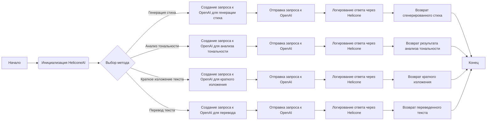

## Анализ кода `HeliconeAI`

### 1. <алгоритм>

**Блок-схема:**



**Примеры для каждого блока:**

*   **A (Начало):** Начало выполнения программы.
*   **B (Инициализация HeliconeAI):** Создается экземпляр класса `HeliconeAI`, инициализирующий `Helicone` и `OpenAI` клиенты.
    ```python
    helicone_ai = HeliconeAI()
    ```
*   **C (Выбор метода):** В зависимости от задачи выбирается метод класса `HeliconeAI`.
    *   **Пример генерации стиха:** `helicone_ai.generate_poem("Напиши мне стихотворение про кота.")`
    *   **Пример анализа тональности:** `helicone_ai.analyze_sentiment("Сегодня был отличный день!")`
    *   **Пример краткого изложения:** `helicone_ai.summarize_text("Длинный текст для изложения...")`
    *   **Пример перевода:** `helicone_ai.translate_text("Hello, how are you?", "русский")`
*   **D (Создание запроса к OpenAI для генерации стиха):** Формируется запрос для модели `gpt-3.5-turbo` для генерации стиха.
    ```python
    prompt = "Напиши мне стихотворение про кота."
    messages = [{"role": "user", "content": prompt}]
    ```
*   **E (Отправка запроса к OpenAI):** Отправляется запрос к OpenAI API.
    ```python
    response = self.client.chat.completions.create(model="gpt-3.5-turbo", messages=messages)
    ```
*   **F (Логирование ответа через Helicone):** Результат запроса логируется с помощью `helicone.log_completion()`.
    ```python
    self.helicone.log_completion(response)
    ```
*   **G (Возврат сгенерированного стиха):** Возвращается сгенерированное стихотворение.
    ```python
    return response.choices[0].message.content
    ```
*   **H (Создание запроса к OpenAI для анализа тональности):** Формируется запрос для модели `text-davinci-003` для анализа тональности.
    ```python
    prompt = f"Analyze the sentiment of the following text: {text}"
    ```
*   **I (Отправка запроса к OpenAI):** Отправляется запрос к OpenAI API.
    ```python
    response = self.client.completions.create(model="text-davinci-003", prompt=prompt, max_tokens=50)
    ```
*   **J (Логирование ответа через Helicone):** Результат запроса логируется с помощью `helicone.log_completion()`.
     ```python
    self.helicone.log_completion(response)
    ```
*   **K (Возврат результата анализа тональности):** Возвращается результат анализа тональности.
      ```python
    return response.choices[0].text.strip()
    ```
*   **L (Создание запроса к OpenAI для краткого изложения):** Формируется запрос для модели `text-davinci-003` для создания краткого изложения.
    ```python
    prompt = f"Summarize the following text: {text}"
    ```
*   **M (Отправка запроса к OpenAI):** Отправляется запрос к OpenAI API.
    ```python
      response = self.client.completions.create(model="text-davinci-003", prompt=prompt, max_tokens=100)
    ```
*  **N (Логирование ответа через Helicone):** Результат запроса логируется с помощью `helicone.log_completion()`.
     ```python
    self.helicone.log_completion(response)
    ```
*   **O (Возврат краткого изложения):** Возвращается краткое изложение текста.
     ```python
    return response.choices[0].text.strip()
    ```
*   **P (Создание запроса к OpenAI для перевода):** Формируется запрос для модели `text-davinci-003` для перевода текста.
    ```python
     prompt = f"Translate the following text to {target_language}: {text}"
    ```
*   **Q (Отправка запроса к OpenAI):** Отправляется запрос к OpenAI API.
    ```python
      response = self.client.completions.create(model="text-davinci-003", prompt=prompt, max_tokens=200)
    ```
*   **R (Логирование ответа через Helicone):** Результат запроса логируется с помощью `helicone.log_completion()`.
     ```python
    self.helicone.log_completion(response)
    ```
*   **S (Возврат переведенного текста):** Возвращается переведенный текст.
    ```python
    return response.choices[0].text.strip()
    ```
*   **T (Конец):** Завершение выполнения программы.

### 2. <mermaid>

```mermaid
graph LR
    HeliconeAI_instance(HeliconeAI)
    Helicone_instance(Helicone)
    OpenAI_client(OpenAI)

    HeliconeAI_instance -- использует --> Helicone_instance
    HeliconeAI_instance -- использует --> OpenAI_client

    subgraph Генерация Стиха
        generate_poem_method(generate_poem(prompt:str))
        OpenAI_chat_completions(client.chat.completions.create())
        log_completion_poem(helicone.log_completion(response))
        HeliconeAI_instance -- вызывает --> generate_poem_method
        generate_poem_method -- вызывает --> OpenAI_chat_completions
         OpenAI_chat_completions -- возвращает --> response_poem
        generate_poem_method -- использует --> response_poem
        generate_poem_method -- вызывает --> log_completion_poem
    end

    subgraph Анализ тональности
        analyze_sentiment_method(analyze_sentiment(text:str))
        OpenAI_completions_sentiment(client.completions.create())
        log_completion_sentiment(helicone.log_completion(response))
        HeliconeAI_instance -- вызывает --> analyze_sentiment_method
        analyze_sentiment_method -- вызывает --> OpenAI_completions_sentiment
        OpenAI_completions_sentiment -- возвращает --> response_sentiment
        analyze_sentiment_method -- использует --> response_sentiment
        analyze_sentiment_method -- вызывает --> log_completion_sentiment
    end

     subgraph Краткое изложение текста
        summarize_text_method(summarize_text(text:str))
        OpenAI_completions_summary(client.completions.create())
        log_completion_summary(helicone.log_completion(response))
        HeliconeAI_instance -- вызывает --> summarize_text_method
        summarize_text_method -- вызывает --> OpenAI_completions_summary
         OpenAI_completions_summary -- возвращает --> response_summary
        summarize_text_method -- использует --> response_summary
        summarize_text_method -- вызывает --> log_completion_summary
    end

    subgraph Перевод текста
        translate_text_method(translate_text(text:str, target_language:str))
        OpenAI_completions_translate(client.completions.create())
        log_completion_translate(helicone.log_completion(response))
       HeliconeAI_instance -- вызывает --> translate_text_method
       translate_text_method -- вызывает --> OpenAI_completions_translate
        OpenAI_completions_translate -- возвращает --> response_translate
        translate_text_method -- использует --> response_translate
        translate_text_method -- вызывает --> log_completion_translate
    end
```

**Объяснение зависимостей:**

*   `HeliconeAI_instance`: Экземпляр класса `HeliconeAI`, который управляет взаимодействием с Helicone и OpenAI.
*   `Helicone_instance`: Экземпляр класса `Helicone`, используемый для логирования завершений.
*   `OpenAI_client`: Экземпляр класса `OpenAI`, используемый для взаимодействия с API OpenAI.
*   `generate_poem_method`: Метод класса `HeliconeAI` для генерации стиха, принимает `prompt` как строку.
*   `OpenAI_chat_completions`: Метод клиента `OpenAI` для создания чат-завершений (используется для генерации стиха).
*   `log_completion_poem`: Метод `Helicone` для логирования завершений (вызывается в `generate_poem`).
*   `response_poem`: Результат запроса к OpenAI при генерации стиха.
*   `analyze_sentiment_method`: Метод класса `HeliconeAI` для анализа тональности, принимает `text` как строку.
*   `OpenAI_completions_sentiment`: Метод клиента `OpenAI` для создания завершений (используется для анализа тональности).
*   `log_completion_sentiment`: Метод `Helicone` для логирования завершений (вызывается в `analyze_sentiment`).
*   `response_sentiment`: Результат запроса к OpenAI при анализе тональности.
*   `summarize_text_method`: Метод класса `HeliconeAI` для создания краткого изложения, принимает `text` как строку.
*    `OpenAI_completions_summary`: Метод клиента `OpenAI` для создания завершений (используется для краткого изложения).
*   `log_completion_summary`: Метод `Helicone` для логирования завершений (вызывается в `summarize_text`).
*   `response_summary`: Результат запроса к OpenAI при создании краткого изложения.
*   `translate_text_method`: Метод класса `HeliconeAI` для перевода текста, принимает `text` и `target_language` как строки.
*   `OpenAI_completions_translate`: Метод клиента `OpenAI` для создания завершений (используется для перевода текста).
*   `log_completion_translate`: Метод `Helicone` для логирования завершений (вызывается в `translate_text`).
*   `response_translate`: Результат запроса к OpenAI при переводе текста.

### 3. <объяснение>

**Импорты:**

*   `from helicone import Helicone`: Импортирует класс `Helicone` из пакета `helicone`. Этот класс используется для логирования запросов к OpenAI и их ответов.
*   `from openai import OpenAI`: Импортирует класс `OpenAI` из пакета `openai`. Этот класс используется для взаимодействия с API OpenAI и выполнения запросов к моделям.

**Классы:**

*   `HeliconeAI`:
    *   **Роль:** Предоставляет интерфейс для взаимодействия с моделями OpenAI и логирования запросов с помощью Helicone.
    *   **Атрибуты:**
        *   `helicone`: Экземпляр класса `Helicone` для логирования.
        *   `client`: Экземпляр класса `OpenAI` для выполнения запросов.
    *   **Методы:**
        *   `__init__()`: Конструктор класса, инициализирует `helicone` и `client`.
        *   `generate_poem(self, prompt: str) -> str`: Генерирует стихотворение на основе заданного промпта. Использует модель `gpt-3.5-turbo`.
        *   `analyze_sentiment(self, text: str) -> str`: Анализирует тональность заданного текста. Использует модель `text-davinci-003`.
        *   `summarize_text(self, text: str) -> str`: Создает краткое изложение заданного текста. Использует модель `text-davinci-003`.
        *   `translate_text(self, text: str, target_language: str) -> str`: Переводит заданный текст на указанный целевой язык. Использует модель `text-davinci-003`.

**Функции:**

*   `generate_poem(self, prompt: str) -> str`:
    *   **Аргументы:** `prompt` (строка) - промпт для генерации стихотворения.
    *   **Возвращаемое значение:** Строка, содержащая сгенерированное стихотворение.
    *   **Назначение:** Отправляет запрос к OpenAI для генерации стихотворения, логирует ответ с помощью Helicone и возвращает результат.
    *   **Пример:**
        ```python
        poem = helicone_ai.generate_poem("Напиши мне стихотворение про кота.")
        print(poem) # Output: стихотворение про кота.
        ```
*   `analyze_sentiment(self, text: str) -> str`:
    *   **Аргументы:** `text` (строка) - текст для анализа тональности.
    *   **Возвращаемое значение:** Строка, содержащая результат анализа тональности.
    *   **Назначение:** Отправляет запрос к OpenAI для анализа тональности, логирует ответ с помощью Helicone и возвращает результат.
    *   **Пример:**
        ```python
        sentiment = helicone_ai.analyze_sentiment("Сегодня был отличный день!")
        print(sentiment) # Output: Положительный
        ```
*   `summarize_text(self, text: str) -> str`:
    *   **Аргументы:** `text` (строка) - текст для создания краткого изложения.
    *   **Возвращаемое значение:** Строка, содержащая краткое изложение текста.
    *   **Назначение:** Отправляет запрос к OpenAI для создания краткого изложения, логирует ответ с помощью Helicone и возвращает результат.
    *   **Пример:**
        ```python
        summary = helicone_ai.summarize_text("Длинный текст для изложения...")
        print(summary) # Output: Краткое изложение текста.
        ```
*   `translate_text(self, text: str, target_language: str) -> str`:
    *   **Аргументы:**
        *   `text` (строка) - текст для перевода.
        *   `target_language` (строка) - целевой язык перевода.
    *   **Возвращаемое значение:** Строка, содержащая переведенный текст.
    *   **Назначение:** Отправляет запрос к OpenAI для перевода текста, логирует ответ с помощью Helicone и возвращает результат.
    *   **Пример:**
        ```python
        translation = helicone_ai.translate_text("Hello, how are you?", "русский")
        print(translation) # Output: Привет, как дела?
        ```
*   `main()`:
    *   **Аргументы:** Нет.
    *   **Возвращаемое значение:** Нет.
    *   **Назначение:** Создает экземпляр `HeliconeAI`, вызывает различные методы для демонстрации их работы и выводит результаты.

**Переменные:**

*   `helicone_ai`: Экземпляр класса `HeliconeAI`.
*   `poem`: Строка, содержащая сгенерированное стихотворение.
*   `sentiment`: Строка, содержащая результат анализа тональности.
*   `summary`: Строка, содержащая краткое изложение текста.
*   `translation`: Строка, содержащая переведенный текст.

**Потенциальные ошибки и области для улучшения:**

*   **Обработка ошибок:** Код не включает обработку ошибок, связанных с API OpenAI или Helicone. Например, ошибки сети или ошибки API не обрабатываются, что может привести к сбоям программы.
*   **Конфигурация моделей:** Модели OpenAI жестко заданы в коде. Было бы лучше сделать их настраиваемыми через параметры класса или конфигурационный файл.
*   **Параметры запросов:** Параметры `max_tokens` также жестко заданы в коде и должны быть настраиваемыми.
*   **Логирование:** Логирование осуществляется только на уровне завершения запроса. Может быть полезно логировать также сам запрос, время выполнения и другие детали.
*   **Асинхронность:** Запросы к OpenAI выполняются синхронно. Для улучшения производительности можно использовать асинхронные запросы.

**Взаимосвязи с другими частями проекта:**

*   `src.ai.helicone.about.ru.md`: Файл с описанием HeliconeAI.
*   `LICENSE`: Файл с лицензией проекта.

**Цепочка взаимосвязей:**

1.  **Пользовательский интерфейс (UI)** или другой компонент инициирует вызов метода `HeliconeAI` (например, `generate_poem`).
2.  Метод `HeliconeAI` вызывает соответствующие методы `OpenAI` для выполнения запроса к модели.
3.  Результат запроса возвращается в метод `HeliconeAI`.
4.  Метод `HeliconeAI` использует `Helicone` для логирования завершения.
5.  Результат возвращается вызывающему компоненту.

Этот анализ предоставляет всестороннее понимание класса `HeliconeAI` и его взаимодействия с Helicone и OpenAI.