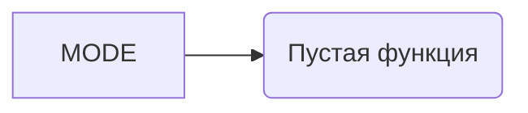

## <input code>

```python
## \file hypotez/src/ai/llama/model.py
# -*- coding: utf-8 -*-\
#! venv/Scripts/python.exe
#! venv/bin/python/python3.12

"""
.. module: src.ai.llama 
	:platform: Windows, Unix
	:synopsis:

"""
MODE = 'dev'

"""
	:platform: Windows, Unix
	:synopsis:

"""


"""
	:platform: Windows, Unix
	:synopsis:

"""


"""
  :platform: Windows, Unix

"""
"""
  :platform: Windows, Unix
  :platform: Windows, Unix
  :synopsis:
"""MODE = 'dev'
  
""" module: src.ai.llama """


```

## <algorithm>

Код не содержит алгоритма, так как он пустой.  Он содержит только документацию (docstrings) и переменную MODE.  Следовательно, блок-схема не может быть построена.


## <mermaid>



## <explanation>

**Импорты**:  Код не содержит импортов.  В данном случае отсутствуют зависимости от других модулей.

**Классы**:  Нет классов в коде.

**Функции**: Нет функций.

**Переменные**:  `MODE` - строковая переменная, имеющая значение 'dev'.  Скорее всего, эта переменная определяет режим работы (например, 'dev' для разработки, 'prod' для производства).  Она объявлена вне каких-либо функций, что делает ее доступной глобально.

**Возможные ошибки или области для улучшений**:

* **Недостаток функциональности**: Код пустой.  Необходимы классы и функции для выполнения каких-либо задач.
* **Неявное использование**:  Строки документации (`docstrings`) не используются, чтобы что-то было понятно, они просто присутствуют.  Необходимо заполнить код.

**Цепочка взаимосвязей с другими частями проекта**:  Данный файл скорее всего является частью проекта, связанного с обработкой больших языковых моделей (LLM), но из-за отсутствия кода трудно сказать, как именно.  `hypotez/src/ai/llama` предполагает, что это подмодуль для работы с моделями LLAMA.  Возможно, в других файлах этого проекта (внутри `hypotez/src/ai`)  существуют классы и функции, использующие  `MODE` для управления режимом работы.