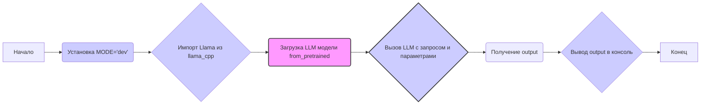

## Анализ кода `hypotez/src/ai/llama/model.py`

### 1. <алгоритм>

1.  **Инициализация переменных:**
    *   Устанавливается `MODE = 'dev'` - определяет режим работы (разработка в данном случае).

2.  **Импорт библиотеки `llama_cpp`:**
    *   Импортируется класс `Llama` из библиотеки `llama_cpp`, которая обеспечивает интерфейс для работы с моделями Llama.

3.  **Инициализация LLM:**
    *   Создаётся экземпляр модели `llm` класса `Llama` с помощью метода `from_pretrained()`:
        *   `repo_id="lmstudio-community/Meta-Llama-3.1-8B-Instruct-GGUF"` - идентификатор репозитория с моделью.
        *   `filename="Meta-Llama-3.1-8B-Instruct-IQ4_XS.gguf"` - имя файла с моделью (GGUF формат).
    *   Пример: Загружается модель `Meta-Llama-3.1-8B-Instruct-IQ4_XS.gguf` из репозитория `lmstudio-community/Meta-Llama-3.1-8B-Instruct-GGUF`.

4.  **Генерация текста:**
    *   Вызывается модель `llm` с входным запросом `"Once upon a time,"`.
    *   Задаётся максимальная длина сгенерированного текста `max_tokens=512`.
    *   Устанавливается `echo=True` - чтобы входная строка была частью вывода.
    *   Пример: Модель генерирует текст на основе запроса `"Once upon a time,"`, с ограничением в 512 токенов, включая начальную фразу в выводе.

5.  **Вывод результата:**
    *   Результат работы модели `output` выводится в консоль с помощью `print(output)`.
    *   Пример: В консоль будет выведен сгенерированный текст, включая исходную фразу `"Once upon a time,"`.

### 2. <mermaid>

**Описание диаграммы:**

*   `A[Начало]` - Начало программы.
*   `B(Установка MODE='dev')` - Установка переменной `MODE` в значение `'dev'`.
*   `C{Импорт Llama из llama_cpp}` - Импорт класса `Llama` из библиотеки `llama_cpp`.
*   `D(Загрузка LLM модели from_pretrained)` - Загрузка предварительно обученной модели с помощью метода `from_pretrained()`. Эта операция может занять некоторое время, так как модель загружается с диска.
*   `E{Вызов LLM с запросом и параметрами}` - Вызов модели `llm` с заданным входным запросом, максимальной длиной и параметром echo.
*   `F(Получение output)` - Получение результата работы модели, который включает в себя сгенерированный текст и другие метаданные.
*   `G{Вывод output в консоль}` - Вывод результата модели в консоль с помощью функции `print()`.
*   `H[Конец]` - Конец программы.

**Зависимости импорта в `mermaid`:**

*   `llama_cpp`: Импортируется библиотека `llama_cpp`, предоставляющая класс `Llama` для работы с моделями Llama.

### 3. <объяснение>

**Импорты:**

*   `from llama_cpp import Llama`: Импортирует класс `Llama` из библиотеки `llama_cpp`. Эта библиотека является Python-оберткой для C++ библиотеки `llama.cpp`, которая реализует модель Llama. Импорт необходим для создания и использования экземпляров модели Llama. Библиотека `llama_cpp` не является частью стандартной библиотеки Python и должна быть установлена отдельно.

**Классы:**

*   `Llama`: Класс из библиотеки `llama_cpp`, который представляет модель Llama.
    *   Метод `from_pretrained()`: Классовый метод, который загружает модель из репозитория или локального файла. Он принимает идентификатор репозитория (`repo_id`) и имя файла модели (`filename`). Возвращает экземпляр модели `Llama`.
    *   Метод `__call__()`: Метод, позволяющий вызвать экземпляр модели как функцию. Принимает на вход строку запроса и параметры генерации (например, `max_tokens` и `echo`). Возвращает словарь с результатами генерации.

**Функции:**

*   `print(output)`: Стандартная функция Python, которая выводит переданный ей аргумент в консоль. В данном случае, выводит результат работы модели, возвращаемый в переменной `output`.

**Переменные:**

*   `MODE`: Глобальная переменная, определяющая режим работы. В данном случае установлена в `'dev'`, что может указывать на то, что код предназначен для разработки и тестирования.
*   `llm`: Экземпляр класса `Llama`, представляющий загруженную модель.
*   `output`: Переменная, которая хранит результат работы модели в виде словаря. Содержит сгенерированный текст и метаданные.

**Потенциальные ошибки и области для улучшения:**

*   **Обработка ошибок:** Отсутствует явная обработка ошибок при загрузке модели или вызове модели.  Необходимо добавить try-except блоки, чтобы обрабатывать исключения, которые могут возникнуть при загрузке модели (например, отсутствие файла или проблемы с сетью) или генерации текста.
*   **Конфигурация параметров:** Параметры генерации заданы жестко (`max_tokens=512`, `echo=True`).  Следует сделать возможность конфигурировать эти параметры.
*   **Режим `MODE`:** Переменная `MODE` используется, но ее воздействие на работу кода не очевидно.  Необходимо либо конкретизировать её использование (например, с помощью условных операторов), либо убрать, если она не используется.
*   **Путь к файлу:** Имя файла модели `filename="Meta-Llama-3.1-8B-Instruct-IQ4_XS.gguf"` задано статично.  Лучше сделать путь до файла настраиваемым параметром, чтобы код был более гибким.
*    **Зависимость от `llama-cpp-python`:** Код сильно зависит от сторонней библиотеки `llama_cpp`.  Необходимо проверить наличие и совместимость этой библиотеки.
*   **Отсутствие описания:** Код не содержит описания назначения, что затрудняет его понимание.  Необходимо добавить документацию (docstring) для модуля и функций.

**Цепочка взаимосвязей с другими частями проекта:**

*   **`src.ai`:** Код находится в директории `src/ai`, что предполагает, что он является частью более крупного AI-модуля.
*   **`src.ai.llama`:** Является модулем для работы с моделью Llama. Этот модуль, вероятно, используется в других частях проекта, где требуется генерация текста с использованием модели Llama.

**Общее:**

Код представляет собой базовый пример использования модели Llama с библиотекой `llama_cpp`. Код требует дальнейшей доработки для корректной работы в реальном проекте, в частности добавления обработки ошибок, настройки параметров и более подробного описания.