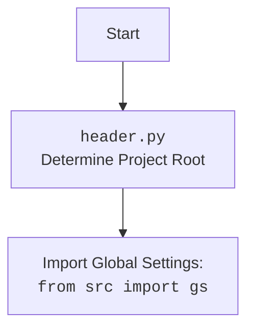

## АНАЛИЗ КОДА: `src/ai/gemini/header.py`

### 1. <алгоритм>

**Блок-схема:**

```
graph LR
    A[Начало] --> B{Определение корневой директории проекта};
    B --> C{Создание Path объекта из текущего файла};
    C --> D{Цикл по родительским директориям};
    D -- Найдена маркер-директория --> E{Установка корневой директории};
    D -- Маркер не найден --> F{Продолжение цикла};
    F -- Достигнут корень файловой системы --> G{Установка текущей директории как корневой};
    E --> H{Добавление корневой директории в sys.path};
    G --> H;
    H --> I{Загрузка конфигурации из config.json};
    I --> J{Загрузка документации из README.md};
    J --> K{Инициализация глобальных переменных};
     K --> L[Конец];
    
    subgraph "set_project_root()"
        C
        D
        E
        F
        G
    end
    
    subgraph "Загрузка config.json"
        I
    end
    
    subgraph "Загрузка README.md"
        J
    end
     
     subgraph "Инициализация переменных"
        K
     end
        
    style A fill:#f9f,stroke:#333,stroke-width:2px
    style L fill:#f9f,stroke:#333,stroke-width:2px
```

**Примеры:**

* **Определение корневой директории:**
    - Исходный путь файла: `/home/user/myproject/src/ai/gemini/header.py`
    - Маркерные файлы: `('__root__', '.git')`
    - Если `/home/user/myproject/.git` существует, то корневая директория будет `/home/user/myproject`.
    - Если ни один из маркеров не найден, корневой директорией будет `/home/user/myproject/src/ai/gemini/`

* **Загрузка конфигурации:**
    - Файл `config.json` расположен в `/home/user/myproject/src/config.json`.
    - Содержимое `config.json`: `{"project_name": "my_app", "version": "1.0.0"}`
    - Переменная `config` после загрузки: `{"project_name": "my_app", "version": "1.0.0"}`.
* **Загрузка документации:**
    - Файл `README.md` расположен в `/home/user/myproject/src/README.md`.
    - Содержимое `README.md`: `# My Project\nDescription`
    - Переменная `doc_str` после загрузки: `# My Project\nDescription`
* **Инициализация глобальных переменных:**
    - `__project_name__` будет `my_app` (из `config.json`).
    - `__version__` будет `1.0.0` (из `config.json`).
    - `__doc__` будет `# My Project\nDescription` (из `README.md`).
    - Если `config.json` или `README.md` не найдены, то берутся значения по умолчанию.

### 2. <mermaid>

```mermaid
flowchart TD
    Start --> FindRoot[<code>set_project_root()</code><br> Determine Project Root]
    FindRoot --> RootPath(Root Path: <code>__root__</code>)
    RootPath --> ImportGlobalSettings[Import Global Settings:<br> <code>from src import gs</code>]
     ImportGlobalSettings --> LoadConfig[Load Config:<br><code>config = json.load(...)</code>]
     LoadConfig --> LoadDoc[Load Documentation:<br><code>doc_str = settings_file.read()</code>]
     LoadDoc --> InitializeVariables[Initialize Global Variables<br><code>__project_name__</code>, <code>__version__</code>, <code>__doc__</code>, etc.]
    InitializeVariables --> End

     subgraph set_project_root
        FindRoot
        RootPath
    end
```

**Описание зависимостей:**

- `pathlib.Path`: Используется для работы с путями файлов и директорий, обеспечивая кроссплатформенность.
- `sys`: Модуль для работы с параметрами и функциями, специфичными для системы, в частности, для добавления путей в `sys.path`.
- `json`: Модуль для работы с данными в формате JSON, используется для загрузки файла конфигурации `config.json`.
- `packaging.version.Version`: Модуль для сравнения версий, в данном случае не используется, но импортирован.
- `src.gs`: Глобальные настройки проекта.



### 3. <объяснение>

**Импорты:**

* `sys`:
    *  Используется для добавления корневой директории проекта в `sys.path`. Это позволяет импортировать модули из проекта, независимо от того, где находится текущий исполняемый файл.
* `json`:
    *  Используется для загрузки данных из файла `config.json`, содержащего настройки проекта.
* `packaging.version.Version`:
    * Импортируется, но не используется. Вероятно, планировалось использовать для сравнения версий.
* `pathlib.Path`:
    *  Используется для работы с путями файлов и директорий. Обеспечивает более удобный и кросс-платформенный способ работы с файловой системой по сравнению со строками.
* `from src import gs`:
    * Импортирует глобальные настройки проекта, определенные в `src/gs.py`. В этом файле, вероятно, содержатся пути к важным директориям проекта, настройки окружения и т.д.

**Функции:**

* `set_project_root(marker_files: tuple = ('__root__', '.git')) -> Path`:
    * **Аргументы:**
        * `marker_files` (tuple, опционально): Список файлов или директорий, которые используются для определения корневой директории проекта. По умолчанию `('__root__', '.git')`.
    * **Возвращаемое значение:**
        * `Path`: Объект `Path` корневой директории проекта.
    * **Назначение:**
        * Определяет корневую директорию проекта, начиная с директории текущего файла и идя вверх по родительским директориям, пока не найдет одну из маркерных директорий или не достигнет корня файловой системы.
        * Добавляет найденную корневую директорию в `sys.path`, чтобы можно было импортировать модули из проекта.
    * **Примеры:**
        * Если файл находится в `/home/user/project/src/ai/gemini/header.py` и в `/home/user/project/` есть файл `.git`, то `set_project_root()` вернёт путь `/home/user/project/`.
        * Если маркеры не найдены, вернёт путь директории, в которой расположен файл `header.py`.

**Переменные:**

* `__root__`:
    *  Тип: `Path`.
    *  Использование: Хранит путь к корневой директории проекта, который определяется функцией `set_project_root()`.
* `config`:
    *  Тип: `dict`.
    *  Использование: Хранит загруженные данные из `config.json`, если файл существует и является валидным JSON.
* `doc_str`:
    * Тип: `str`.
    * Использование: Хранит содержимое файла `README.MD`, если файл существует.
* `__project_name__`:
    *  Тип: `str`.
    *  Использование: Имя проекта, загруженное из `config.json` или по умолчанию 'hypotez'.
* `__version__`:
    *  Тип: `str`.
    *  Использование: Версия проекта, загруженная из `config.json` или пустая строка по умолчанию.
* `__doc__`:
    *  Тип: `str`.
    * Использование: Содержание файла `README.md` или пустая строка, если файл не найден.
* `__details__`:
    *  Тип: `str`.
    *  Использование: Пустая строка.
* `__author__`:
    *  Тип: `str`.
    *  Использование: Автор проекта, загруженный из `config.json` или пустая строка по умолчанию.
* `__copyright__`:
    *  Тип: `str`.
    *  Использование: Информация о копирайте, загруженная из `config.json` или пустая строка по умолчанию.
* `__cofee__`:
    * Тип: `str`
    * Использование: Сообщение для мотивации разработчика, загруженное из настроек  или сообщение по умолчанию.

**Потенциальные ошибки и области для улучшения:**

*   **Обработка ошибок:**
    - Обработка ошибок при загрузке `config.json` и `README.md` достаточно простая (просто пропускается).
    -   Можно добавить более детальную обработку ошибок, логирование и возможность вывода предупреждений пользователю.
* **`settings` не определен**: 
    -   `__cofee__` берет значение из переменной `settings`, которая не объявлена в коде, скорее всего, нужно брать из  `config`.
*   **Неиспользуемый импорт `packaging.version.Version`**:
    -   Удалить этот импорт, если он не используется.
*   **Поиск config.json и README.md**:
    -  Предполагается, что config.json и README.md лежат в `src/` относительно корня проекта.

**Цепочка взаимосвязей с другими частями проекта:**

1.  `header.py` определяет корень проекта и добавляет его в `sys.path`. Это ключевой шаг, так как он позволяет всем другим модулям проекта импортировать друг друга.
2.  `header.py` загружает конфигурацию из `config.json` и документацию из `README.md`. Эти данные используются для настройки проекта, отображения информации о проекте, версионирования и т.д.
3.  `header.py` импортирует глобальные настройки проекта `src.gs`, которые могут содержать важные пути и параметры.
4.  Глобальные переменные, определенные в `header.py`, используются во многих других модулях проекта для получения информации о проекте.

Таким образом, `header.py` играет центральную роль в инициализации проекта, устанавливая пути и загружая базовые настройки.