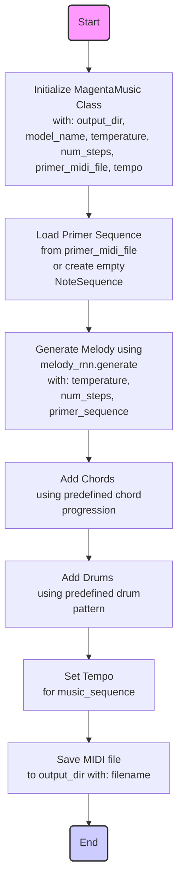

## ИНСТРУКЦИЯ:

Анализируй предоставленный код подробно и объясни его функциональность. Ответ должен включать три раздела:  

1.  **<алгоритм>**: Опиши рабочий процесс в виде пошаговой блок-схемы, включая примеры для каждого логического блока, и проиллюстрируй поток данных между функциями, классами или методами.  
2.  **<mermaid>**: Напиши код для диаграммы в формате `mermaid`, проанализируй и объясни все зависимости, 
    которые импортируются при создании диаграммы. 
    **ВАЖНО!** Убедитесь, что все имена переменных, используемые в диаграмме `mermaid`, 
    имеют осмысленные и описательные имена. Имена переменных вроде `A`, `B`, `C`, и т.д., не допускаются!  
    
    **Дополнительно**: Если в коде есть импорт `import header`, добавьте блок `mermaid` flowchart, объясняющий `header.py`:\
    ```mermaid
    flowchart TD
        Start --> Header[<code>header.py</code><br> Determine Project Root]
    
        Header --> import[Import Global Settings: <br><code>from src import gs</code>] 
    ```
3.  **<объяснение>**: Предоставьте подробные объяснения:  
    - **Импорты**: Их назначение и взаимосвязь с другими пакетами `src.`.  
    - **Классы**: Их роль, атрибуты, методы и взаимодействие с другими компонентами проекта.  
    - **Функции**: Их аргументы, возвращаемые значения, назначение и примеры.  
    - **Переменные**: Их типы и использование.  
    - Выделите потенциальные ошибки или области для улучшения.  

Дополнительно, постройте цепочку взаимосвязей с другими частями проекта (если применимо).  

Это обеспечивает всесторонний и структурированный анализ кода.
## Формат ответа: `.md` (markdown)
**КОНЕЦ ИНСТРУКЦИИ**

## <алгоритм>

1.  **Инициализация (конструктор `__init__`)**:
    *   Принимает параметры: `output_dir` (папка для сохранения MIDI), `model_name` (название модели), `temperature` (температура генерации), `num_steps` (количество шагов), `primer_midi_file` (MIDI файл затравки), `tempo` (темп).
    *   Создаёт выходную директорию, если её нет.
    *   Инициализирует атрибуты объекта.
    *   Создаёт экземпляр `melody_rnn_sequence_generator.MelodyRnnSequenceGenerator` с указанной моделью.
    *   Загружает MIDI-затравку с помощью `_load_primer_sequence`.
    *   **Пример:**
        ```python
        music_generator = MagentaMusic(output_dir='my_music', model_name='attention_rnn', temperature=1.1, num_steps=200, primer_midi_file='primer.mid', tempo=110)
        ```

2.  **Загрузка затравки (`_load_primer_sequence`)**:
    *   Проверяет наличие файла затравки `primer_midi_file`.
    *   Если файл существует:
        *   Загружает MIDI-файл в `NoteSequence` с помощью `mm.midi_file_to_sequence_proto`.
        *   Выводит сообщение о загрузке затравки.
        *   Возвращает загруженную `NoteSequence`.
    *   Если файл не существует:
        *   Выводит сообщение о том, что затравка не найдена.
        *   Создаёт и возвращает пустую `NoteSequence`.
    *   **Пример:**
        *   `primer.mid` существует: загрузка и вывод "Используем primer из primer.mid".
        *   `primer.mid` не существует: вывод "Не найдена primer, начинаем с пустой мелодии".

3.  **Генерация мелодии (`generate_melody`)**:
    *   Использует `self.melody_rnn.generate` для генерации мелодии.
    *   Передаёт параметры `temperature`, `steps`, и `primer_sequence`.
    *   Возвращает сгенерированную `NoteSequence`.
    *   **Пример:**
       ```python
       melody_sequence = music_generator.generate_melody()
       ```

4.  **Добавление аккордов (`add_chords`)**:
    *   Принимает на вход сгенерированную мелодию `melody_sequence`.
    *   Создаёт список аккордов, повторяющийся нужное количество раз.
    *   Преобразует список аккордов в `mm.ChordSequence`.
    *   Объединяет мелодию и аккорды с помощью `mm.sequences_lib.concatenate_sequences`.
    *   Возвращает `NoteSequence` с добавленными аккордами.
    *    **Пример:**
       ```python
       melody_with_chords_sequence = music_generator.add_chords(melody_sequence)
       ```

5.  **Добавление барабанов (`add_drums`)**:
    *   Принимает на вход `melody_with_chords_sequence`.
    *   Создаёт `mm.DrumTrack` с заданным ритмическим рисунком.
    *   Объединяет мелодию с аккордами и барабаны с помощью `mm.sequences_lib.concatenate_sequences`.
    *   Возвращает `NoteSequence` с добавленными барабанами.
    *   **Пример:**
        ```python
        music_sequence = music_generator.add_drums(melody_with_chords_sequence)
        ```

6.  **Установка темпа (`set_tempo`)**:
    *   Принимает на вход `music_sequence`.
    *   Устанавливает темп в `music_sequence.tempos[0].qpm` из атрибута `self.tempo`.
    *   Возвращает `NoteSequence` с установленным темпом.
     *   **Пример:**
        ```python
        music_sequence = music_generator.set_tempo(music_sequence)
        ```

7.  **Сохранение в MIDI (`save_midi`)**:
    *   Принимает на вход `music_sequence` и `filename`.
    *   Создаёт полный путь к MIDI файлу в выходной директории.
    *   Сохраняет `music_sequence` в MIDI файл с помощью `mm.sequence_proto_to_midi_file`.
    *   Выводит сообщение о сохранении файла.
     *   **Пример:**
        ```python
         music_generator.save_midi(music_sequence)
        ```

8.  **Генерация полной композиции (`generate_full_music`)**:
    *   Вызывает `generate_melody`, `add_chords`, `add_drums`, `set_tempo` и `save_midi` последовательно.
    *   Собирает все шаги в один вызов для удобства.
     *   **Пример:**
        ```python
        music_generator.generate_full_music()
        ```
9. **Основная часть (`if __name__ == '__main__'`)**:
    *   Создаёт два экземпляра класса `MagentaMusic` с разными параметрами.
    *   Вызывает `generate_full_music` для каждого экземпляра, генерируя две музыкальные композиции.
    *   **Пример:**
        ```python
        music_generator = MagentaMusic(output_dir='my_music', model_name='attention_rnn', temperature=1.1, num_steps=200, primer_midi_file='primer.mid', tempo=110)
        music_generator.generate_full_music()
        music_generator2 = MagentaMusic(output_dir='my_music2', model_name='basic_rnn', temperature=0.9, num_steps=150, primer_midi_file='primer2.mid', tempo=120)
        music_generator2.generate_full_music()
        ```

## <mermaid>



**Объяснение зависимостей `mermaid`:**

*   **`Start`**: Начало процесса генерации музыки.
*   **`Initialize`**: Инициализация класса `MagentaMusic`. Принимает параметры для настройки генерации, такие как имя выходной директории, используемая модель, температура, количество шагов, путь к файлу затравки и темп. Эти параметры определяют, как будет происходить генерация музыки.
*  **`LoadPrimer`**: Загрузка начальной последовательности MIDI. Проверяет наличие файла затравки и, если он есть, загружает его, иначе создается пустая последовательность нот. 
*   **`GenerateMelody`**: Генерация мелодии. Использует модель `melody_rnn` для создания новой мелодии, опираясь на заданные параметры и, возможно, начальную последовательность нот.
*   **`AddChords`**: Добавление аккордов к мелодии. Использует заранее определенную последовательность аккордов для добавления гармонии к сгенерированной мелодии.
*   **`AddDrums`**: Добавление барабанов. Использует заданный ритмический рисунок для добавления барабанных партий к композиции.
*  **`SetTempo`**: Установка темпа композиции. Задает скорость воспроизведения музыки.
*   **`SaveMidi`**: Сохранение сгенерированной композиции в виде MIDI-файла.

## <объяснение>

**Импорты:**

*   `import os`: Модуль `os` используется для работы с операционной системой, в данном случае для создания директорий (например, `os.makedirs` для создания выходной папки) и работы с путями к файлам (например, `os.path.join` для формирования полного пути к MIDI-файлу).

*   `import magenta.music as mm`: Пакет `magenta.music` является частью библиотеки Magenta от Google, используемой для генерации и обработки музыки. Импортируется как `mm` для краткости. В коде используются функции для работы с MIDI-файлами, создания музыкальных последовательностей (`NoteSequence`, `ChordSequence`, `DrumTrack`) и объединения различных музыкальных элементов (`sequences_lib.concatenate_sequences`).

*   `from magenta.models.melody_rnn import melody_rnn_sequence_generator`: Импортируется класс `melody_rnn_sequence_generator.MelodyRnnSequenceGenerator` из пакета `magenta`. Этот класс используется для генерации мелодий на основе обученной модели.

*    `import tensorflow as tf`: `TensorFlow` - библиотека для машинного обучения и нейросетей. В этом конкретном коде импорт `tensorflow` указан, но он напрямую не используется. Возможно, TensorFlow является зависимостью для `magenta` и его компонентов.

**Класс `MagentaMusic`:**

*   **Роль**: Класс `MagentaMusic` является контейнером для всех функций, связанных с генерацией музыки, используя библиотеку Magenta. Он инкапсулирует настройки генерации и методы для создания музыки.
*   **Атрибуты:**
    *   `output_dir`: (str) Путь к директории, где будут сохранены сгенерированные MIDI-файлы. По умолчанию 'generated_music_advanced'.
    *   `model_name`: (str) Название используемой модели генерации мелодий (например, 'attention_rnn' или 'basic_rnn'). По умолчанию 'attention_rnn'.
    *   `temperature`: (float) Параметр, определяющий "креативность" генерации (чем выше значение, тем более случайной будет мелодия). По умолчанию 1.2.
    *   `num_steps`: (int) Количество шагов (нот) в генерируемой мелодии. По умолчанию 256.
    *   `primer_midi_file`: (str) Путь к MIDI файлу, используемому в качестве затравки для генерации. По умолчанию 'primer.mid'.
    *   `tempo`: (int) Темп (скорость) композиции в ударах в минуту (BPM). По умолчанию 100.
    *   `melody_rnn`: (melody_rnn_sequence_generator.MelodyRnnSequenceGenerator) Экземпляр класса для генерации мелодий.
    *   `primer_sequence`: (mm.NoteSequence) Музыкальная последовательность затравки.

*   **Методы:**
    *   `__init__(self, ...)`: Конструктор класса. Инициализирует атрибуты и создает экземпляры `MelodyRnnSequenceGenerator`. Вызывает `_load_primer_sequence` для загрузки затравки.
    *   `_load_primer_sequence(self)`: Загружает MIDI-файл затравки или создает пустую `NoteSequence`, если файл не найден. Возвращает `NoteSequence`.
    *   `generate_melody(self)`: Генерирует мелодию, используя `self.melody_rnn.generate` и возвращает ее как `NoteSequence`.
    *   `add_chords(self, melody_sequence)`: Добавляет аккорды к мелодии, используя простую последовательность. Возвращает `NoteSequence` с аккордами.
    *   `add_drums(self, melody_with_chords_sequence)`: Добавляет барабаны к мелодии, используя простой ритмический рисунок. Возвращает `NoteSequence` с барабанами.
    *    `set_tempo(self, music_sequence)`: Устанавливает темп музыкальной последовательности. Возвращает `NoteSequence` с установленным темпом.
    *   `save_midi(self, music_sequence, filename='full_music_advanced.mid')`: Сохраняет `NoteSequence` в MIDI-файл.
    *   `generate_full_music(self)`: Вызывает все методы для создания полной композиции: генерацию мелодии, добавление аккордов и барабанов, установку темпа, сохранение в MIDI.

**Функции (методы класса):**

*   **`__init__`**:
    *   **Аргументы**:
        *   `output_dir` (str): Папка для сохранения сгенерированных MIDI-файлов.
        *   `model_name` (str): Имя используемой модели генерации.
        *   `temperature` (float): Параметр, влияющий на случайность генерации.
        *   `num_steps` (int): Количество шагов мелодии.
        *   `primer_midi_file` (str): Путь к MIDI-файлу затравки.
        *   `tempo` (int): Темп композиции (BPM).
    *   **Возвращаемое значение**: None.
    *   **Назначение**: Инициализация объекта класса, создание экземпляра генератора мелодий, загрузка затравки.
    *   **Пример**:
        ```python
        music_generator = MagentaMusic(output_dir='my_music', model_name='attention_rnn', temperature=1.1, num_steps=200, primer_midi_file='primer.mid', tempo=110)
        ```

*   **`_load_primer_sequence`**:
    *   **Аргументы**: None.
    *   **Возвращаемое значение**: `mm.NoteSequence`: Загруженная последовательность нот из MIDI файла или пустая `NoteSequence`.
    *   **Назначение**: Загрузка MIDI-затравки.
    *   **Пример**:
         *   Если `primer.mid` существует: `mm.NoteSequence` из файла.
         *   Если `primer.mid` не существует: пустая `mm.NoteSequence`.

*   **`generate_melody`**:
    *   **Аргументы**: None.
    *   **Возвращаемое значение**: `mm.NoteSequence`: Сгенерированная мелодия.
    *   **Назначение**: Генерация мелодии на основе настроек объекта.
    *   **Пример**:
        ```python
        melody = music_generator.generate_melody()
        ```

*   **`add_chords`**:
    *   **Аргументы**:
        *   `melody_sequence` (`mm.NoteSequence`): Мелодия, к которой нужно добавить аккорды.
    *   **Возвращаемое значение**: `mm.NoteSequence` : Мелодия с добавленными аккордами.
    *   **Назначение**: Добавление аккордов к мелодии.
    *   **Пример**:
        ```python
        melody_with_chords = music_generator.add_chords(melody)
        ```

*   **`add_drums`**:
    *   **Аргументы**:
        *   `melody_with_chords_sequence` (`mm.NoteSequence`): Мелодия с аккордами.
    *   **Возвращаемое значение**: `mm.NoteSequence` : Композиция с добавленными барабанами.
    *   **Назначение**: Добавление барабанов к мелодии с аккордами.
     *   **Пример**:
        ```python
         music_with_drums = music_generator.add_drums(melody_with_chords)
        ```
*   **`set_tempo`**:
    *   **Аргументы**:
       * `music_sequence` (`mm.NoteSequence`): Музыкальная последовательность.
    *   **Возвращаемое значение**: `mm.NoteSequence` :  Музыкальная последовательность с установленным темпом.
    *   **Назначение**: Установка темпа в `NoteSequence`.
    *   **Пример**:
         ```python
         music_with_tempo = music_generator.set_tempo(music_with_drums)
        ```

*   **`save_midi`**:
    *   **Аргументы**:
        *   `music_sequence` (`mm.NoteSequence`): Музыкальная последовательность для сохранения.
        *   `filename` (str, optional): Имя файла для сохранения. По умолчанию 'full_music_advanced.mid'.
    *   **Возвращаемое значение**: None.
    *   **Назначение**: Сохранение музыкальной последовательности в MIDI-файл.
    *   **Пример**:
        ```python
        music_generator.save_midi(music_with_tempo)
        ```

*   **`generate_full_music`**:
    *   **Аргументы**: None.
    *   **Возвращаемое значение**: None.
    *   **Назначение**: Запуск полной цепочки генерации музыки.
    *    **Пример**:
        ```python
        music_generator.generate_full_music()
        ```

**Переменные:**

*   Все переменные в коде имеют типы, указанные в описании атрибутов и параметров методов. Они используются для хранения настроек, музыкальных последовательностей и результатов промежуточных операций.

**Потенциальные ошибки и области для улучшения:**

*   **Жестко заданные аккорды и барабаны**: Последовательности аккордов и барабанных паттернов жестко закодированы, что ограничивает гибкость генерации музыки. Необходимо предусмотреть возможность для использования разных последовательностей.
*   **Отсутствие обработки ошибок**: Код не предусматривает обработку ошибок, например, если не удается создать выходную директорию или если MIDI-файл затравки поврежден. Следует добавить проверку ошибок.
*   **Упрощенная логика добавления аккордов и барабанов**: Метод добавления аккордов просто повторяет последовательность, а барабанные партии не зависят от мелодии. Это может привести к не очень гармоничному результату.
*   **Отсутствие параметров для настройки барабанов**: Класс `MagentaMusic` не дает возможности настраивать параметры барабанной партии, такие как количество ударов или инструменты.
*   **Неиспользуемый импорт TensorFlow**: Импорт `tensorflow` есть, но он не используется в коде. Это может быть убрано, или, в будущем, можно использовать `tensorflow` непосредственно.

**Взаимосвязь с другими частями проекта:**

*   Код напрямую не зависит от других частей проекта, но может быть интегрирован с другими модулями, например, для создания пользовательского интерфейса или для обучения моделей `melody_rnn`.

Этот анализ предоставляет полное представление о функциональности кода, его структуре, зависимостях и потенциальных возможностях для улучшения.