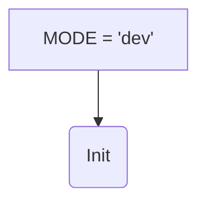
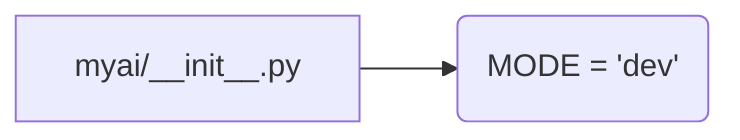

```MD
# <input code>

```python
## \file hypotez/src/ai/myai/__init__.py
# -*- coding: utf-8 -*-
#! venv/Scripts/python.exe
#! venv/bin/python/python3.12

"""
.. module: src.ai.myai 
	:platform: Windows, Unix
	:synopsis:

"""
MODE = 'dev'
```

# <algorithm>

Этот код представляет собой файл `__init__.py` для пакета `myai` внутри модуля `ai` в проекте `hypotez`.  Он не содержит функций или классов, а только устанавливает константу `MODE` со значением `'dev'`.  Блок-схема в данном случае тривиальна:



Пример:  Значение переменной `MODE` устанавливается в `'dev'`. Это, вероятно, используется для управления режимом работы системы (например, для отладки `dev` или для производства `prod`).


# <mermaid>



Этот код описывает переменную, определяющую режим работы, и не имеет зависимостей от других файлов в проекте.

# <explanation>

* **Импорты:**  Код не содержит импортов.  Это стандартный файл `__init__.py` для пакета Python.  Он не зависит от других пакетов, кроме непосредственно системы Python.

* **Классы:** Нет объявленных классов.

* **Функции:** Нет объявленных функций.

* **Переменные:**
    * `MODE`: Строковая переменная, имеющая значение `'dev'`. Вероятно, эта переменная используется для выбора различных режимов работы (разных конфигураций или вариантов поведения) приложения.

* **Возможные ошибки или области для улучшений:**
    * Нет явных ошибок.
    * Возможно, лучше было бы использовать константу с более информативными значениями, например `MODE_DEVELOPMENT` вместо просто `'dev'` для лучшей читаемости.
    * Возможно, целесообразно добавить возможность динамической загрузки режима работы или конфигурацию через отдельный файл.


**Цепочка взаимосвязей:**

Этот файл `__init__.py` является частью пакета `myai` и лежит в подпапке `ai` внутри проекта `hypotez`.  Он устанавливает контекст для модулей и классов внутри `myai`.  Дальнейшие модули в `myai` могут получить доступ к этой константе `MODE`.  Возможно, в других частях проекта есть код, который использует значение `MODE`, чтобы сделать разные вещи в зависимости от того, в каком режиме работает система.

**В заключение**:  Этот код является очень простым, но важным элементом структурирования проекта. Он определяет важный параметр (режим работы) для всего пакета, и он может служить основой для расширения в будущем.