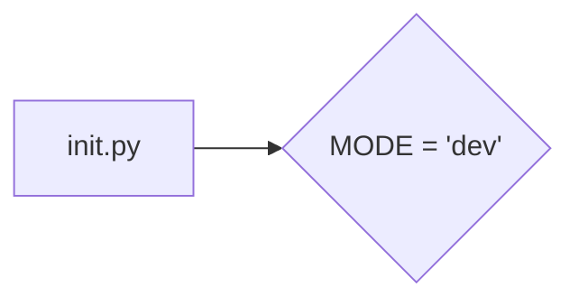

```MD
# <input code>

```python
## \file hypotez/src/ai/myai/__init__.py
# -*- coding: utf-8 -*-
#! venv/Scripts/python.exe
#! venv/bin/python/python3.12

"""
.. module: src.ai.myai 
	:platform: Windows, Unix
	:synopsis:

"""
MODE = 'dev'
```

# <algorithm>

Этот файл `__init__.py` является инициализатором модуля `myai` в пакете `ai` проекта `hypotez`.  Он содержит всего одну глобальную переменную.  Блок-схема очень проста:



В данном случае, переменная `MODE` определяет режим работы модуля `myai`. В этом простом примере нет  переменных, которые изменяются в процессе работы.


# <mermaid>


# <explanation>

* **Импорты:**  В этом файле нет импорта других модулей.  Это типичный пример файла `__init__.py`, который используется для инициализации пакета.  Если бы в этом файле были импорты, то они указывают на другие модули внутри пакета `src.ai` или в других подпаках проекта.


* **Классы:**  В файле нет классов.


* **Функции:**  Нет функций.


* **Переменные:**  `MODE = 'dev'`:  Эта глобальная переменная хранит строковое значение, определяющее режим работы.  В данном контексте, это скорее всего константа, которая указывает на режим разработки (`dev`).  В зависимости от проекта, `MODE` мог бы использоваться для выбора различных конфигураций, алгоритмов или источников данных. Значение этой переменной, вероятно, будет использоваться другими модулями внутри пакета `src.ai` или внешними вызовами.


* **Возможные ошибки или области для улучшений:**  Код очень прост и не содержит очевидных ошибок.  Однако, можно улучшить документацию, добавив более подробное описание переменной `MODE` и ее значения, например:
```python
MODE = 'dev'  # режим разработки
```
Или даже описать, какие еще режимы могут быть (`prod`, `test`) или какие параметры конфигурации  влияют на их выбор.


* **Взаимосвязи с другими частями проекта:**  Файл `__init__.py`  может быть точкой входа для запуска конкретных частей функциональности `myai`.  Например, вызов `from src.ai.myai import MODE` в другом модуле проекта `hypotez`  позволит получить доступ к определенному значению.  Без дополнительных деталей о проекте `hypotez`, сложно сказать, как `myai` используется дальше.