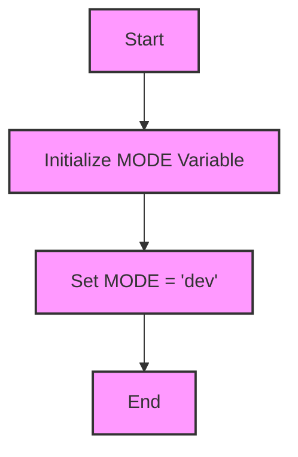

## Анализ кода `hypotez/src/ai/myai/__init__.py`

### 1. <алгоритм>

1.  **Начало**: Запуск скрипта `__init__.py`.
2.  **Определение режима**: Присваивание строкового значения `'dev'` переменной `MODE`.
3.  **Конец**: Завершение работы скрипта.

**Примеры:**

*   **Шаг 2**: `MODE` получает значение `'dev'`.
*   **Флоу данных**: Переменная `MODE` устанавливается на начальное значение, которая может быть использована в других частях проекта для определения режима работы.

### 2. <mermaid>

**Объяснение зависимостей**
В данном примере, `mermaid` диаграмма отображает простую последовательность действий: от начала (`Start`) к инициализации переменной `MODE`, присвоения ей значения `'dev'` и завершения работы (`End`). Нет явных зависимостей от других модулей, поэтому диаграмма показывает только внутреннюю логику.

### 3. <объяснение>

**Импорты:**
В данном коде нет импортов, что делает его автономным.

**Классы:**
В данном коде классы не используются.

**Функции:**
В данном коде функции не используются.

**Переменные:**
*   `MODE`:
    *   Тип: Строка.
    *   Назначение: Используется для определения режима работы приложения. В данном случае, он установлен в `'dev'`, что может означать режим разработки. Это значение может быть использовано другими модулями для переключения поведения в зависимости от режима.

**Потенциальные ошибки или области для улучшения:**

1.  **Жестко закодированное значение `MODE`**: Значение `MODE` жестко закодировано как `'dev'`. В реальном приложении это значение следует получать из конфигурационного файла или переменных окружения, чтобы можно было легко переключаться между режимами (например, `'prod'` для продакшна).
2.  **Отсутствие документации**: Документация модуля `src.ai.myai` выглядит неполной, в ней не указано назначение данного пакета.
3.  **Отсутствие импортов**: Отсутствие импортов может быть намеренным, но, скорее всего, в этом пакете будет больше логики, и он будет зависеть от других пакетов.

**Взаимосвязь с другими частями проекта:**
Переменная `MODE`  может использоваться в других модулях пакета `src.ai` или в других частях проекта для определения поведения приложения в зависимости от режима разработки или производства. Например, в режиме разработки может использоваться расширенное логирование, а в режиме продакшна может быть оптимизировано производительность.