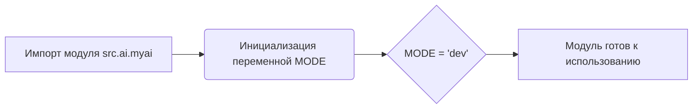

## Анализ кода `hypotez/src/ai/myai/__init__.py`

### <алгоритм>
1. **Инициализация модуля:**
    - Задается глобальная переменная `MODE` со значением `'dev'`.
    - Этот шаг выполняется при импорте модуля `src.ai.myai`.
    - **Пример**: Когда код в другом модуле выполняет `import src.ai.myai`, переменная `MODE` устанавливается в `'dev'`.

### <mermaid>

**Объяснение зависимостей в `mermaid`:**

- `A[Импорт модуля src.ai.myai]`:  Начальный этап, при котором другой модуль импортирует `src.ai.myai`.
- `B(Инициализация переменной MODE)`:  Происходит инициализация переменной `MODE` при загрузке модуля.
- `C{MODE = 'dev'}`: Переменная `MODE` устанавливается в строковое значение `'dev'`.
- `D[Модуль готов к использованию]`: После инициализации, модуль готов к дальнейшему использованию.

### <объяснение>

**Импорты**:
- В данном файле нет импортов. Это `__init__.py` файл, который используется для обозначения каталога `myai` как пакета Python. В данном случае, используется для инициализации.

**Классы**:
- В данном файле нет классов.

**Функции**:
- В данном файле нет функций.

**Переменные**:
- `MODE`: Глобальная переменная строкового типа, инициализирована значением `'dev'`.
  - **Назначение**: Вероятно, используется для определения режима работы модуля или приложения (например, режим разработки или производственный режим).
  - **Использование**: Может использоваться в других модулях проекта для настройки поведения на основе значения `MODE`.
  - **Пример**: Другой модуль может проверять `if src.ai.myai.MODE == 'dev':`, чтобы включить отладочные сообщения или отключить некоторые функции, предназначенные для продакшена.

**Потенциальные ошибки или области для улучшения**:
- **Магические строки**: Использование строки `'dev'` без явного перечисления возможных значений (например, через enum) может привести к ошибкам, если разработчик введет неправильное значение.
- **Отсутствие документации**: Отсутствие docstring для `MODE` затрудняет понимание её назначения.
- **Ограниченная функциональность**: Файл пока имеет только инициализацию переменной.

**Цепочка взаимосвязей с другими частями проекта**:
- Другие модули в пакете `src.ai` или в других частях проекта могут импортировать `src.ai.myai` и обращаться к переменной `MODE` для настройки своего поведения. Это создает зависимость от этого файла как от источника конфигурации.
- В более сложном приложении, значение `MODE` может считываться из файла конфигурации или передаваться через аргументы командной строки.