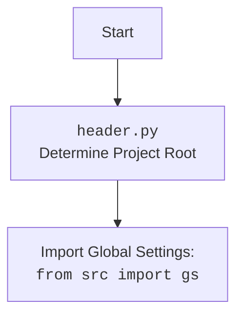

## АНАЛИЗ КОДА `hypotez/src/ai/myai/header.py`

### 1. <алгоритм>

**Пошаговая блок-схема:**

1.  **`MODE = 'dev'`**: Установка режима работы приложения в `dev` (разработка).
2.  **`import sys, json, Version, Path`**: Импорт необходимых модулей.
3.  **`def set_project_root(marker_files)`**:
    *   **Начало:** Функция получает список файлов/директорий (`marker_files`) для поиска корня проекта.
        *   *Пример: `marker_files = ('__root__',)`*.
    *   **Определение текущего каталога:** Определение текущего каталога скрипта.
        *   *Пример: Если скрипт находится в `/path/to/hypotez/src/ai/myai/`, то `current_path` будет `/path/to/hypotez/src/ai/myai/`.*
    *   **Поиск корня проекта:**
        *   Итерация по текущему и родительским каталогам.
        *   Проверка наличия любого из `marker_files` в текущем каталоге.
            *   *Пример: Проверка наличия файла `__root__` в каталоге.*
        *   Если найден, корень проекта установлен, прервать поиск.
    *   **Обновление `sys.path`**: Если корень проекта не в `sys.path`, добавить его.
        *   *Пример: Если корень проекта `/path/to/hypotez`, то `/path/to/hypotez` добавляется в `sys.path`.*
    *   **Возврат корня проекта:** Возвращает объект `Path` корня проекта.
4.  **`__root__ = set_project_root()`**: Вызов функции для определения корня проекта.
    *   *Пример: Если корень проекта найден как `/path/to/hypotez`, то `__root__` будет объект `Path('/path/to/hypotez')`.*
5.  **`from src import gs`**: Импорт глобальных настроек проекта.
6.  **Загрузка `settings.json`**:
    *   Попытка открыть и прочитать `settings.json`.
        *   *Пример пути: `/path/to/hypotez/src/settings.json`*
    *   При ошибке (файл не найден или JSON некорректен), пропустить.
7.  **Загрузка `README.MD`**:
    *   Попытка открыть и прочитать `README.MD`.
        *   *Пример пути: `/path/to/hypotez/src/README.MD`*
    *   При ошибке (файл не найден или чтение не удалось), пропустить.
8.  **Установка глобальных переменных**:
    *   `__project_name__`: Получает из `settings` или устанавливает по умолчанию `'hypotez'`.
    *   `__version__`: Получает из `settings` или устанавливает по умолчанию `''`.
    *   `__doc__`: Присваивает `doc_str` или пустую строку.
    *   `__details__`: Инициализируется пустой строкой.
    *   `__author__`: Получает из `settings` или устанавливает по умолчанию `''`.
    *   `__copyright__`: Получает из `settings` или устанавливает по умолчанию `''`.
    *   `__cofee__`: Получает из `settings` или устанавливает строку с предложением поддержки разработчика.

### 2. <mermaid>

```mermaid
flowchart TD
    Start --> FindRoot[<code>set_project_root()</code><br> Locate Project Root Dir]
    
    FindRoot --> GetCurrentDir[Get Current Script Dir: <br><code>Path(__file__).resolve().parent</code>]
    GetCurrentDir --> SearchParent[Search Parent Dirs for Marker Files]
    SearchParent -- Found Marker File --> SetRoot[Set Project Root Dir]
    SearchParent -- No Marker File --> UseCurrentDir[Use Script Dir as Project Root]
    SetRoot --> UpdateSysPath[Update <code>sys.path</code> if Needed]
    UseCurrentDir --> UpdateSysPath
    UpdateSysPath --> ReturnRoot[Return Project Root Dir <code>Path</code>]
    ReturnRoot --> ImportGS[Import Global Settings: <br><code>from src import gs</code>]
    ImportGS --> LoadSettings[Load <code>settings.json</code> from Project Root]
    LoadSettings -- Success --> LoadReadme[Load <code>README.MD</code> from Project Root]
    LoadSettings -- Failure --> SkipReadme[Skip Loading <code>README.MD</code>]
    LoadReadme -- Success --> SetGlobals[Set Global Variables]
    LoadReadme -- Failure --> SetGlobals
    SkipReadme --> SetGlobals
    SetGlobals --> End[End]
    
    style FindRoot fill:#f9f,stroke:#333,stroke-width:2px
     style ImportGS fill:#ccf,stroke:#333,stroke-width:2px

    style SetGlobals fill:#cfc,stroke:#333,stroke-width:2px
    
     
```

**Разбор зависимостей:**

*   **`Start`**: Начало выполнения скрипта.
*   **`FindRoot`**: Функция `set_project_root`, которая ищет корень проекта.
*   **`GetCurrentDir`**: Определение текущего каталога, где выполняется скрипт. Использует `__file__` и `Path`.
*    **`SearchParent`**: Ищет родительские каталоги на наличие файла-маркера (`__root__`).
*   **`SetRoot`**: Если маркер найден, устанавливает корень проекта.
*   **`UseCurrentDir`**: Если маркер не найден, устанавливает корень проекта как текущую директорию.
*   **`UpdateSysPath`**: Обновляет `sys.path`, добавляя корень проекта для правильной работы импортов.
*    **`ReturnRoot`**: Возвращает `Path` корень проекта.
*    **`ImportGS`**: Импортирует глобальные настройки проекта `gs` из `src`.
*   **`LoadSettings`**: Загружает `settings.json` из корня проекта, используя `gs.path.root`. Использует `json.load`.
*   **`LoadReadme`**: Загружает `README.MD` из корня проекта, используя `gs.path.root`.
*   **`SkipReadme`**: Пропускает загрузку README, если не удалось загрузить настройки.
*   **`SetGlobals`**: Устанавливает глобальные переменные (`__project_name__`, `__version__`, `__doc__`, `__details__`, `__author__`, `__copyright__`, `__cofee__`) из `settings` или задает значения по умолчанию.
*   **`End`**: Конец выполнения.



**Разбор зависимостей (header.py):**

*   **`Start`**: Начало выполнения.
*   **`Header`**: Обозначает выполнение скрипта `header.py`, главной задачей которого является определение корня проекта.
*   **`import`**:  Импортируется модуль `gs` (Global Settings) из пакета `src`.

### 3. <объяснение>

**Импорты:**

*   `sys`: Модуль `sys` используется для добавления пути к корневой директории проекта в `sys.path`, что позволяет правильно импортировать другие модули внутри проекта.
*   `json`: Модуль `json` используется для чтения данных из файла `settings.json`.
*   `packaging.version.Version`: Используется для работы с версиями пакетов (хотя в данном коде напрямую не используется).
*   `pathlib.Path`:  Класс `Path` используется для удобной работы с путями к файлам и каталогам.

**Функции:**

*   **`set_project_root(marker_files: tuple) -> Path`**:
    *   **Аргументы**:
        *   `marker_files` (tuple):  Кортеж с названиями файлов или каталогов, которые используются для идентификации корня проекта.
    *   **Возвращаемое значение**: `Path` - путь к корневой директории проекта.
    *   **Назначение**: Функция находит корень проекта, поднимаясь вверх по дереву каталогов от места, где находится файл скрипта. Она ищет файлы-маркеры, которые указывают на корень. Если файл маркер не найден, то возвращается директория, где находится скрипт. Функция также добавляет путь к корню проекта в `sys.path`, что позволяет правильно импортировать модули из проекта.
    *   **Пример:** `set_project_root(marker_files=('__root__',))` будет искать файл `__root__` в директории скрипта и вверх по дереву каталогов. Если файл найден, вернет объект `Path` к директории, где он находится.

**Переменные:**

*   **`MODE` (str):** Устанавливает режим работы приложения (в данном случае `'dev'` - разработка).
*   **`__root__` (Path):**  Содержит путь к корневой директории проекта, определенный функцией `set_project_root()`.
*   **`settings` (dict):** Содержит данные, загруженные из файла `settings.json` в виде словаря. Если файл не найден или не является корректным JSON, то `settings` будет `None`.
*   **`doc_str` (str):** Содержит строку, прочитанную из файла `README.MD`. Если файл не найден, то `doc_str` будет `None`.
*   `__project_name__` (str): Название проекта, полученное из файла `settings.json` или 'hypotez', если файла нет.
*   `__version__` (str): Версия проекта, полученная из файла `settings.json` или ''.
*   `__doc__` (str): Документация проекта,  из файла `README.MD`  или ''.
*   `__details__` (str): Детали проекта (по умолчанию пустая строка).
*   `__author__` (str): Автор проекта,  из файла `settings.json` или ''.
*   `__copyright__` (str): Информация об авторских правах проекта, из файла `settings.json` или ''.
*   `__cofee__` (str): Сообщение с предложением поддержки разработчика из файла `settings.json` или строка по умолчанию.

**Цепочка взаимосвязей с другими частями проекта:**

1.  **Определение корня проекта:** `set_project_root` определяет корень проекта, что позволяет всем остальным модулям корректно находить другие ресурсы (например, конфигурационные файлы, другие модули и т.д.).
2.  **Загрузка настроек:** Загрузка `settings.json` позволяет получить глобальные настройки проекта, включая имя проекта, версию, авторские права и т.д. Это влияет на другие модули, которым нужна эта информация.
3.  **Загрузка документации:** Загрузка `README.MD` позволяет получить текстовую документацию, которая может быть использована для отображения информации о проекте.
4.  **Импорт `src.gs`**: Импорт `src.gs` говорит о том что, скрипт зависит от `src.gs`  и использует его для доступа к общим настройкам и ресурсам проекта.
5.  **Глобальные переменные:** Глобальные переменные (`__project_name__`, `__version__`, `__doc__` и т.д.) используются для распространения информации о проекте на другие модули.

**Потенциальные ошибки и области для улучшения:**

1.  **Обработка ошибок при загрузке JSON**: Вместо простого `...` при ошибке загрузки JSON, стоит добавить логирование ошибки, чтобы было проще отслеживать проблемы.
2.  **Отсутствие проверки типов:** Можно добавить проверку типов для `settings`, чтобы убедиться, что ожидаемые ключи присутствуют и имеют правильные типы.
3.  **Использование `try-except`**: В `try-except` для загрузки файлов, хорошо бы явно указывать тип исключений `FileNotFoundError` и `json.JSONDecodeError`, чтобы не обрабатывать непредвиденные исключения.
4.  **Константы**: Использовать константы для ключей в `settings.json`, чтобы снизить риск ошибок в коде.
5.  **`cofee`** опечатка `copyrihgnt`, лучше исправить.
6. **Использование `logger`**: для логирования.

**Заключение**
Код `header.py` выполняет важную роль по определению корня проекта и загрузке общих настроек и документации. Он устанавливает важные глобальные переменные, которые используются в других модулях проекта.