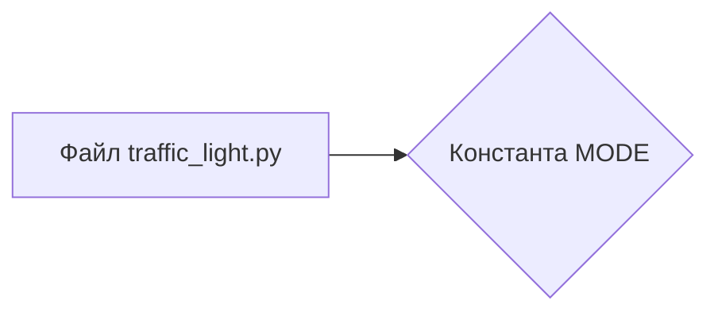

# <input code>

```python
## \file hypotez/src/ai/myai/traffic_light.py
# -*- coding: utf-8 -*-\n#! venv/Scripts/python.exe
#! venv/bin/python/python3.12

"""
.. module: src.ai.myai 
	:platform: Windows, Unix
	:synopsis:

"""
MODE = 'dev'

"""
	:platform: Windows, Unix
	:synopsis:

"""


"""
	:platform: Windows, Unix
	:synopsis:

"""


"""
  :platform: Windows, Unix

"""
"""
  :platform: Windows, Unix
  :platform: Windows, Unix
  :synopsis:
"""MODE = 'dev'
  
""" module: src.ai.myai """


""" HERE SHOULD BE A DESCRIPTION OF THE MODULE OPERATION ! 
https://habr.com/ru/articles/849414/
"""
```

# <algorithm>

К сожалению, предоставленный код не содержит алгоритма, а лишь комментарии и константу.  Блок-схема не может быть построена.  В нём отсутствуют какие-либо функции или классы, которые можно было бы изобразить в блок-схеме.


# <mermaid>



# <explanation>

**Импорты:**  Код не содержит импортов, поэтому нет зависимостей с другими пакетами проекта.

**Классы:** Нет определенных классов.

**Функции:** Нет определенных функций.

**Переменные:**

* `MODE`:  Строковая переменная, которая задаёт режим работы (`'dev'`).  Она используется для конфигурации, но без дополнительного контекста, её назначение не ясно.


**Возможные ошибки или области для улучшений:**

* **Отсутствие описания:**  В коде присутствуют многострочные комментарии, но нет явного описания, *как* эта константа `MODE` и модуль будут использоваться в других частях проекта. Необходимо добавить документацию о назначении константы `MODE`, о том, как она будет использоваться в коде и, в идеале, о том, как она влияет на поведение системы.
* **Непонятная структура:**  Код сильно комментирован, но в нём нет ни одной строки исполняемого кода. Подобная структура не подходит для полноценного Python-модуля. Необходимо определить задачи и реализовать их внутри функций или методов классов.
* **Неявное назначение:**  Константа `MODE` используется без контекста. Потребуется дополнительный код для того, чтобы эта переменная работала в каком-то приложении.

**Взаимосвязи с другими частями проекта:** Без кода функций и классов, сложно определить взаимосвязи с другими частями проекта. Поскольку код представляет собой лишь определение переменной, то связи будут незначительны.  Когда будет реализована функциональность, то станет ясна взаимосвязь с другими частями.

**Общее:**  Данный код представляет собой неполный, пустой файл Python, предназначенный для описания или использования в дальнейшей разработке.  Для анализа функциональности необходимо предоставить код с реализованными функциями и классами.