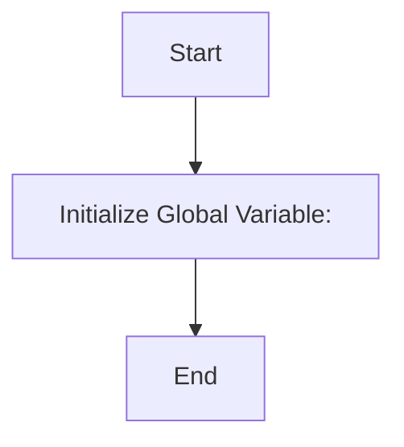

## Анализ кода `hypotez/src/ai/myai/traffic_light.py`

### 1. <алгоритм>

Представленный код не содержит сложной логики или алгоритмов. Он состоит из нескольких строчек комментариев и объявления переменной `MODE`. Фактически, он является скелетом модуля и не содержит исполняемого кода. Поэтому, блок-схему представить невозможно. 

### 2. <mermaid>

**Объяснение:**

Диаграмма описывает инициализацию глобальной переменной `MODE` со значением `'dev'`. Это единственная операция в коде.

### 3. <объяснение>

**Импорты**:

В данном файле нет импортов.

**Классы**:

В данном файле нет классов.

**Функции**:

В данном файле нет функций.

**Переменные**:

*   `MODE` (str): Глобальная переменная, установленная в значение `'dev'`. Вероятно, она предназначена для определения режима работы приложения (например, разработка или продакшн).

**Потенциальные ошибки и области для улучшения**:

*   **Недостаток функциональности**: Файл в текущем состоянии практически бесполезен. Он не реализует никакой логики, связанной с управлением светофором или какой-либо другой функциональности.
*   **Комментарии**: Многократное повторение комментариев, таких как  `"""\n.. module:: src.ai.myai \n\t:platform: Windows, Unix\n\t:synopsis:\n\n"""` и `"""\n  :platform: Windows, Unix\n\n"""`, избыточно и неинформативно.
*   **Недостаток описания**: Отсутствует описание предназначения модуля и его логики работы. Это делает код сложным для понимания и сопровождения.
*   **Магическая константа**: Использование литеральной строки `'dev'` для режима может быть улучшено путем введения константы или перечисления.

**Цепочка взаимосвязей с другими частями проекта**:

В текущем состоянии, без дополнительной информации о проекте, сложно сказать о взаимосвязях с другими частями. Однако, предполагается, что этот файл должен быть частью модуля `src.ai.myai`. Переменная `MODE` может быть использована в других частях проекта для определения поведения в зависимости от режима. Этот файл должен быть дополнен логикой управления светофором (или другой требуемой функциональностью) и, возможно, импортировать другие модули из проекта.

**Вывод:**

Этот файл является скорее заготовкой, чем полноценным модулем. Он содержит объявление переменной `MODE` и множество избыточных комментариев, но не имеет ни логики, ни функциональности. Он требует существенной доработки для выполнения своих задач.