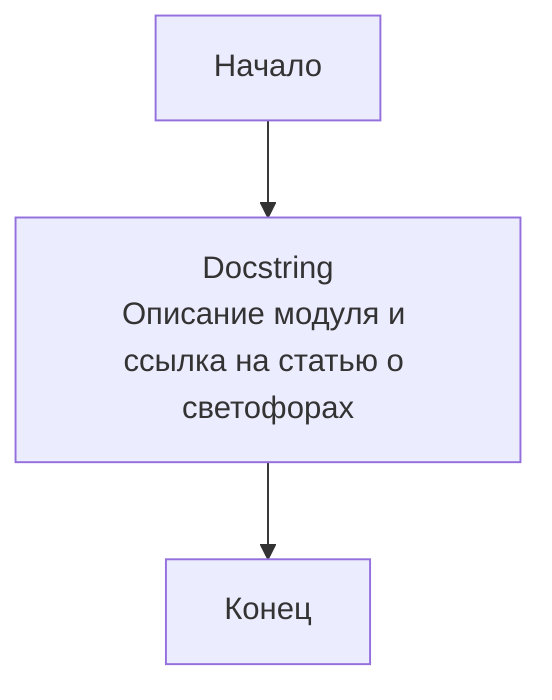

## ИНСТРУКЦИЯ:

Анализируй предоставленный код подробно и объясни его функциональность. Ответ должен включать три раздела:  

1. **<алгоритм>**: Опиши рабочий процесс в виде пошаговой блок-схемы, включая примеры для каждого логического блока, и проиллюстрируй поток данных между функциями, классами или методами.  
2. **<mermaid>**: Напиши код для диаграммы в формате `mermaid`, проанализируй и объясни все зависимости, 
    которые импортируются при создании диаграммы. 
    **ВАЖНО!** Убедитесь, что все имена переменных, используемые в диаграмме `mermaid`, 
    имеют осмысленные и описательные имена. Имена переменных вроде `A`, `B`, `C`, и т.д., не допускаются!  
    
    **Дополнительно**: Если в коде есть импорт `import header`, добавьте блок `mermaid` flowchart, объясняющий `header.py`:\
    ```mermaid
    flowchart TD
        Start --> Header[<code>header.py</code><br> Determine Project Root]
    
        Header --> import[Import Global Settings: <br><code>from src import gs</code>] 
    ```

3. **<объяснение>**: Предоставьте подробные объяснения:  
   - **Импорты**: Их назначение и взаимосвязь с другими пакетами `src.`.  
   - **Классы**: Их роль, атрибуты, методы и взаимодействие с другими компонентами проекта.  
   - **Функции**: Их аргументы, возвращаемые значения, назначение и примеры.  
   - **Переменные**: Их типы и использование.  
   - Выделите потенциальные ошибки или области для улучшения.  

Дополнительно, постройте цепочку взаимосвязей с другими частями проекта (если применимо).  

Это обеспечивает всесторонний и структурированный анализ кода.
## Формат ответа: `.md` (markdown)
**КОНЕЦ ИНСТРУКЦИИ**

## <алгоритм>

Поскольку предоставленный код представляет собой только docstring и не содержит исполняемого кода, алгоритм будет крайне простым:

1.  **Начало**: Модуль `traffic_light.py` запускается.
2.  **Описание**: Модуль содержит только docstring, который описывает назначение модуля `src.ai.myai` (предположительно управление светофором) и ссылается на статью о светофорах.
3.  **Конец**: Работа модуля завершается.

**Пример:**

Поскольку нет выполняемого кода, нет примеров работы логических блоков.

## <mermaid>


**Объяснение `mermaid`:**

-   `Start`: Узел, обозначающий начало выполнения модуля `traffic_light.py`.
-   `Docstring`: Узел, представляющий docstring, который содержит текстовое описание модуля и ссылку на статью.
-   `End`: Узел, обозначающий конец выполнения модуля.

В данном коде нет импортов и зависимостей, поэтому дополнительных блоков `mermaid` не требуется.

## <объяснение>
- **Импорты**:
    - В предоставленном коде нет никаких импортов. Это означает, что данный модуль, по крайней мере в текущем виде, не зависит от других частей проекта или сторонних библиотек. Это также может указывать на неполноту кода, то есть что это только шаблон для будущего модуля.

- **Классы**:
    - В предоставленном коде нет классов. Это подтверждает, что модуль в текущем виде не имеет объектно-ориентированной структуры.

- **Функции**:
    - В предоставленном коде нет функций. Модуль представляет собой пока только описание в docstring.

- **Переменные**:
    - В предоставленном коде нет переменных.

- **Потенциальные ошибки и области для улучшения:**
  - **Отсутствие кода**: Самой большой проблемой является отсутствие какого-либо исполняемого кода. Модуль представляет собой лишь docstring. Это делает модуль нефункциональным.
  - **Неопределенность**: Нет конкретики в описании, как именно модуль должен управлять светофором, или хотя бы какие данные будут использоваться. Ссылка на статью о светофорах дает контекст, но не объясняет, как этот модуль должен работать.
  - **Зависимости**: Отсутствие импортов может быть проблемой, если модуль должен взаимодействовать с другими частями проекта или внешними устройствами.

- **Цепочка взаимосвязей:**
  - Поскольку код не содержит функциональности, нет возможности проследить цепочку взаимосвязей с другими частями проекта. В будущем, при добавлении кода, необходимо будет проанализировать импорты и зависимости, чтобы понять связь с другими модулями. В данный момент есть только предположение что этот модуль будет частью пакета `src.ai` и будет работать с пакетом `myai`.

**Дополнительные замечания:**

-   **Заголовок файла:** Первая строка `## \\file /src/ai/myai/traffic_light.py` указывает на путь к файлу и является неформальным комментарием.
-   **Кодировка:** Строка `# -*- coding: utf-8 -*-` задает кодировку UTF-8 для обработки текста.
-   **Shebang:** Строка `#! venv/bin/python/python3.12` указывает интерпретатор Python и является неформальным комментарием.
-   **Docstring:** Строки в тройных кавычках `"""..."""` представляют собой docstring модуля, который предназначен для документирования функциональности модуля. В текущем варианте docstring в основном дублирует сам себя и содержит только общую информацию.

**Вывод:**

Предоставленный код представляет собой заготовку для модуля `traffic_light.py`. В текущем виде он не выполняет никаких функций, кроме как содержит docstring. Чтобы модуль стал полезным, необходимо добавить классы, функции и импорты, которые будут выполнять логику управления светофором. Кроме того, стоит пересмотреть содержание docstring, сделав его более точным и информативным.