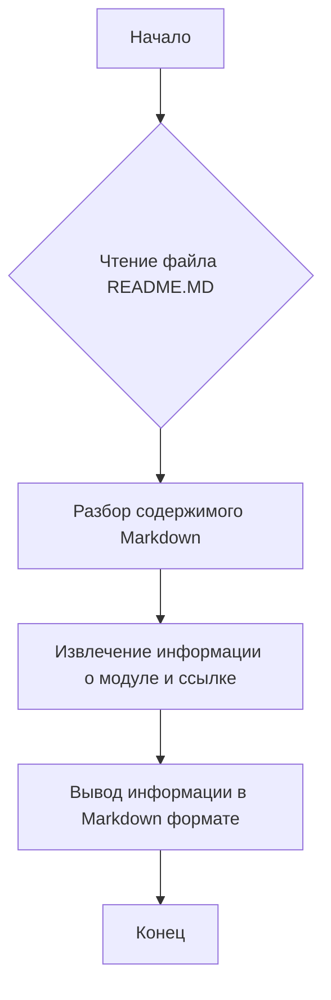

## Анализ кода `hypotez/src/ai/openai/README.MD`

### <алгоритм>
1. **Чтение файла**: Файл `README.MD` читается.
2. **Разбор содержимого**: Содержимое файла интерпретируется как Markdown-текст.
3. **Извлечение данных**: Из текста извлекается информация о модуле и ссылка на другую версию README на другом языке.
4. **Вывод**: Информация выводится в формате Markdown.

### <mermaid>

### <объяснение>

**Импорты:**
В предоставленном фрагменте кода нет импортов. Файл является текстовым файлом в формате Markdown, который обычно используется для документации. 

**Классы:**
В этом файле нет классов.

**Функции:**
В этом файле нет функций.

**Переменные:**
В данном файле переменные не используются в программном смысле. В тексте Markdown могут присутствовать переменные, но они являются частью текста и не обрабатываются как переменные в программировании. 

**Подробное объяснение:**

Файл `README.MD` предназначен для описания содержимого модуля `src.ai.openai`.

1.  `.. module:: src.ai.openai`: Эта строка в reStructuredText (rst) указывает, что текущий файл относится к модулю `src.ai.openai`. Это позволяет инструментам документации, таким как Sphinx, правильно обрабатывать этот файл.

2.  `[Русский](https://github.com/hypo69/hypo/blob/master/src/аи/readme.ru.md)`: Эта строка содержит Markdown-ссылку. Она указывает на другую версию README-файла, написанную на русском языке, и расположенную в репозитории GitHub. Эта ссылка помогает пользователям, говорящим на русском, получить информацию о модуле `src.ai.openai` на понятном им языке.

**Потенциальные ошибки и области для улучшения:**
   - В данном файле нет ошибок, так как он является обычным файлом README.MD.
   - Данный README является минимальным и может быть расширен для предоставления более подробной информации о модуле `src.ai.openai`, включая его функциональность, использование, примеры, конфигурацию, и т.д.

**Цепочка взаимосвязей:**

Данный файл `README.MD` является частью документации модуля `src.ai.openai`. Он связан с другими частями проекта через:
   - Другие файлы в модуле `src.ai.openai`, которые могут содержать код, реализующий функциональность, описанную в этом файле.
   - Другие файлы документации, такие как `readme.ru.md`, которые могут предоставлять информацию на других языках.
   - Другие модули проекта, которые могут зависеть от функциональности `src.ai.openai` или использовать её.

В заключение, `README.MD` является важной частью проекта, предоставляя вводную информацию о модуле `src.ai.openai` и направляя пользователей к дополнительным ресурсам, таким как русскоязычная версия документации.