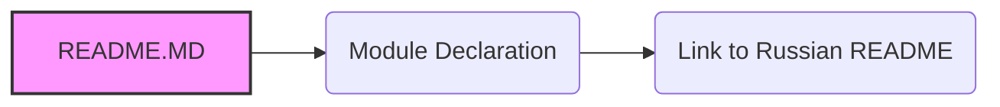

# Анализ кода `hypotez/src/ai/openai/README.MD`

## 1. <алгоритм>

Файл `README.MD` в директории `src/ai/openai` не содержит исполняемого кода, а представляет собой текстовый файл в формате Markdown, который служит для документации и предоставления информации о модуле `src.ai.openai`.

Вот пошаговое описание структуры и содержимого:

1. **Начало файла:**
   - Файл начинается с объявления модуля: `.. module:: src.ai.openai`. Это инструкция для системы документации Sphinx, указывающая, что данный файл описывает модуль `src.ai.openai`.
   - Пример: Это мета-информация, которая не влияет на исполнение кода, но важна для генерации документации.

2. **Ссылка на русский README:**
   - Далее идет ссылка на русскоязычную версию README: `[Русский](https://github.com/hypo69/hypo/blob/master/src/аи/readme.ru.md)`. 
   - Пример: Пользователи могут переключиться на версию README на русском языке по предоставленной ссылке.

3. **Конец файла:**
   - Файл заканчивается.

## 2. <mermaid>

**Анализ `mermaid` диаграммы:**

-   **A (README.MD):** Представляет сам файл `README.MD`, который является отправной точкой для диаграммы.
-   **B (Module Declaration):** Указывает на первую строку файла, где объявляется модуль `src.ai.openai` с помощью директивы Sphinx `.. module::`. Это декларативная часть, которая служит для документации, а не для выполнения кода.
-   **C (Link to Russian README):** Описывает наличие ссылки на русскоязычную версию файла `readme.ru.md`, которая находится по указанному URL.

Диаграмма показывает, что `README.MD` содержит декларацию модуля и ссылку на русскоязычную версию README.

## 3. <объяснение>

**Импорты:**

- В данном файле нет импортов, так как это Markdown файл, а не файл с кодом Python. Директива `.. module:: src.ai.openai`  - это не импорт, а часть синтаксиса Sphinx для документации.

**Классы:**

- В файле `README.MD` нет определения классов, поскольку это файл документации, а не исходный код.

**Функции:**

- В файле `README.MD` нет определения функций, поскольку это файл документации, а не исходный код.

**Переменные:**

- В файле `README.MD` нет переменных.

**Потенциальные ошибки и области для улучшения:**

1.  **Содержание README**: На данный момент, README.MD содержит только декларацию модуля и ссылку на русскоязычный файл. Для более полезной документации, необходимо добавить более подробное описание модуля `src.ai.openai`, его функциональности, способов использования, примеров кода и т.д.
2.  **Актуальность ссылки**: Следует убедиться, что ссылка на русскоязычный README всегда актуальна и ведет на правильную страницу.

**Взаимосвязь с другими частями проекта:**

- Файл `README.MD` является частью документации модуля `src.ai.openai`. Он призван предоставить общее понимание назначения этого модуля, хотя в данном случае он не содержит подробного описания.
- Он связан с русскоязычным README (если таковой существует) через предоставленную ссылку, обеспечивая возможность переключения между разными языковыми версиями документации.
- Модуль `src.ai.openai`, который упоминается в файле, предполагает наличие соответствующих исходных файлов Python, реализующих функциональность, связанную с OpenAI. Этот файл вносит вклад в общее понимание модуля.