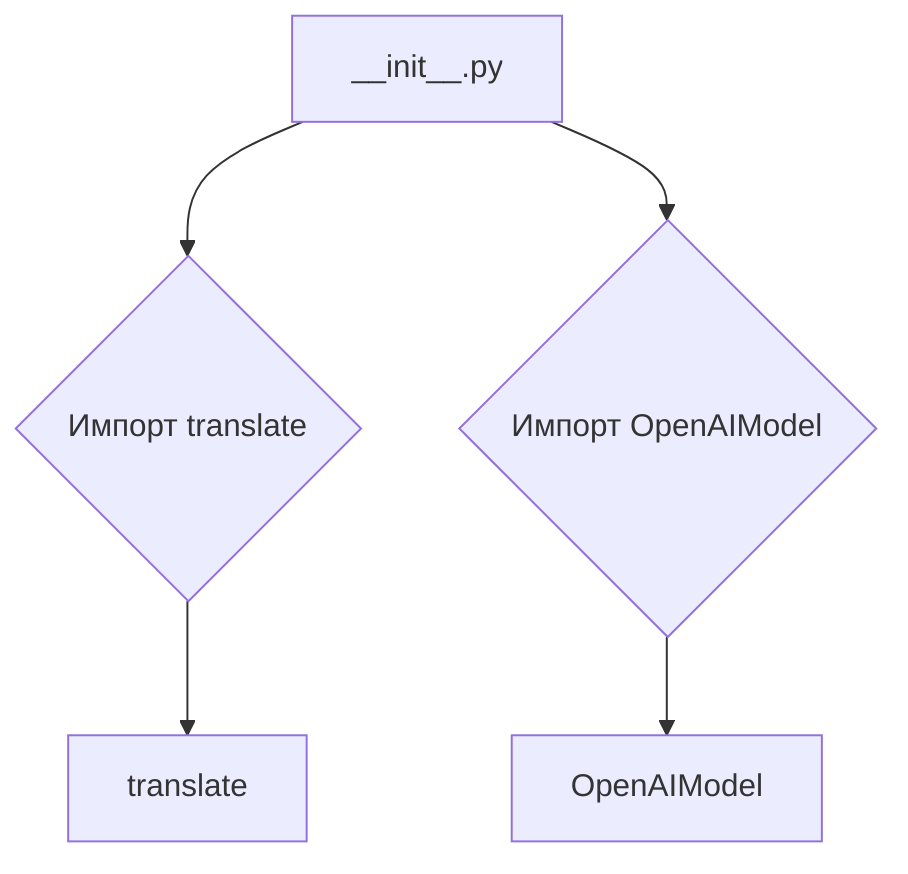
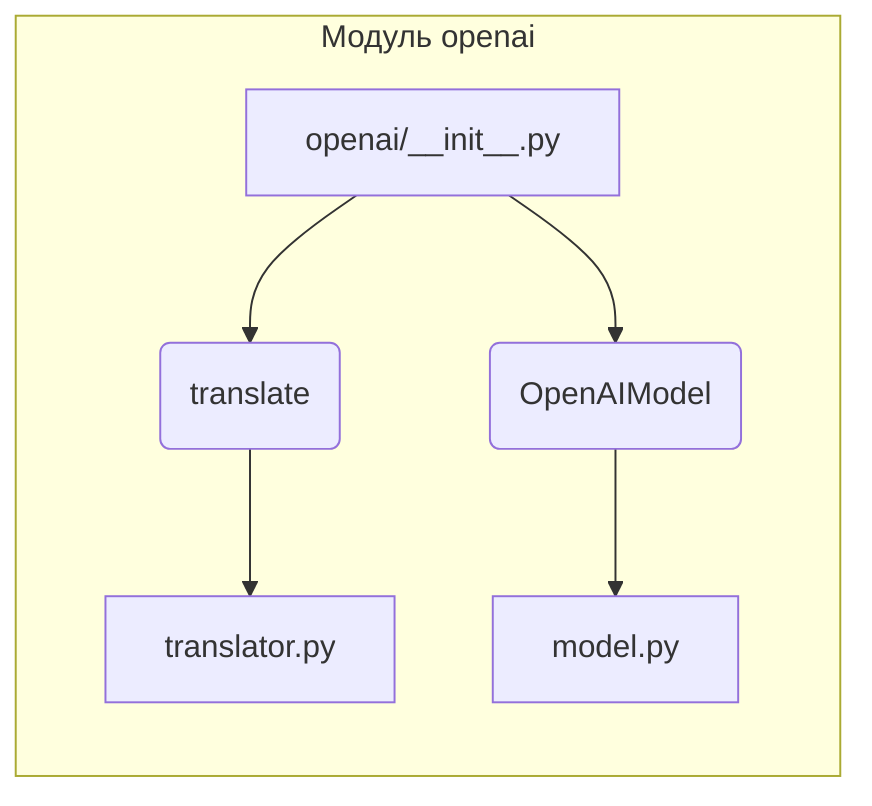

# <input code>

```python
## \file hypotez/src/ai/openai/__init__.py
# -*- coding: utf-8 -*-
#! venv/Scripts/python.exe
#! venv/bin/python/python3.12

"""
.. module: src.ai.openai 
	:platform: Windows, Unix
	:synopsis: Модуль модели `openai`

"""
MODE = 'dev'

from .translator import translate
from .model import OpenAIModel
```

# <algorithm>

Этот код представляет собой модуль `__init__.py` для пакета `openai` в структуре проекта `hypotez`.  Он выполняет инициализацию и импорт подмодулей.

Блок-схема:



Пример данных:

-  `translate`  и `OpenAIModel` — это объекты (возможно, классы), определённые в `translator.py` и `model.py` соответственно.  Модуль `__init__.py` просто импортирует эти объекты для использования в других частях проекта.

# <mermaid>




# <explanation>

- **Импорты**:
    - `from .translator import translate`: Импортирует функцию `translate` из модуля `translator.py`, который, вероятно, находится в той же директории (`./translator.py`).  Это означает, что функция `translate` будет доступна в `__init__.py` и других файлах текущего пакета.
    - `from .model import OpenAIModel`: Импортирует класс `OpenAIModel` из модуля `model.py` в той же директории.  Это позволяет использовать класс `OpenAIModel` внутри модуля `__init__.py` и в других частях проекта.

- **Переменные**:
    - `MODE = 'dev'`:  Это константа, которая, вероятно, определяет режим работы (например, 'dev' - для разработки, 'prod' - для производства).  Эта информация может быть использована в других частях проекта для настройки поведения. Значение не используется явно в этом `__init__`.


- **Функции и классы**:
    - Этот файл не содержит ни функций, ни методов, кроме импортов.
    - Он лишь подготавливает доступ к функциям и классам, определенным в `translator.py` и `model.py`, что позволит использовать их в других частях проекта.


- **Взаимосвязь с другими частями проекта**:
    -  Модуль `openai` является частью проекта `hypotez`.
    - `translator.py` и `model.py` содержат реализации, которые предоставляют логику для `translate` и `OpenAIModel`.
    -  Без `translator.py` и `model.py`, `__init__.py` не сможет предоставлять функциональность модели `openai`.

- **Возможные ошибки или улучшения**:
    - Нет явных ошибок, но было бы полезно добавить проверку импортов. Например, если модули `translator.py` или `model.py` отсутствуют, код выдаст ошибку, что затруднит отладку.  Можно добавить `try...except` для таких проверок.

**Вывод:** Этот файл `__init__.py` является ключевым для организации модуля `openai` и обеспечивает доступ к его функциональности, импортируя необходимые классы и функции. Он четко определяет зависимости от других файлов в пакете.