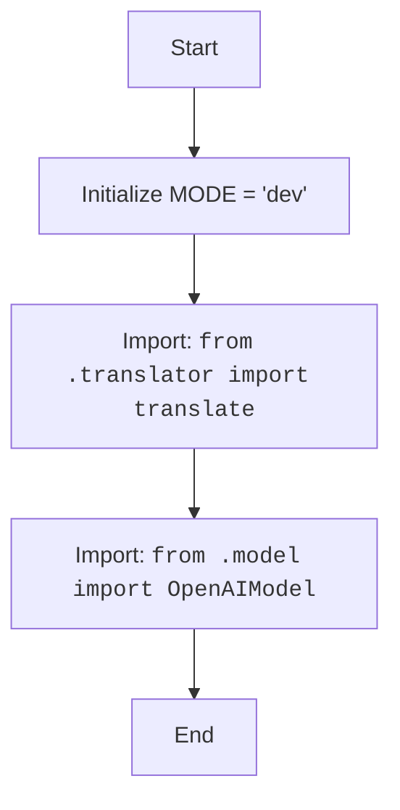

## Анализ кода `hypotez/src/ai/openai/__init__.py`

### 1. <алгоритм>
1. **Инициализация:**
   - Задается глобальная переменная `MODE` со значением `'dev'`. Это может указывать на режим разработки.
   
   *Пример:* `MODE = 'dev'`

2. **Импорт:**
   - Импортируется функция `translate` из модуля `translator.py`. Эта функция, вероятно, отвечает за перевод текста.
   
   *Пример:*  `from .translator import translate`

3. **Импорт:**
   - Импортируется класс `OpenAIModel` из модуля `model.py`. Этот класс, вероятно, является оберткой для работы с моделями OpenAI.
   
    *Пример:*  `from .model import OpenAIModel`

### 2. <mermaid>

### 3. <объяснение>

**Импорты:**
- `from .translator import translate`:
   - Импортирует функцию `translate` из модуля `translator.py`, находящегося в той же директории, что и `__init__.py`.
   - Назначение: Функция `translate` предназначена для выполнения операций перевода текста. Предполагается, что в этом модуле будет реализован перевод на основе API OpenAI.
   - Взаимосвязь с другими пакетами:  `translator.py` вероятно зависит от API OpenAI и возможно использует другие модули для обработки текста.
- `from .model import OpenAIModel`:
   - Импортирует класс `OpenAIModel` из модуля `model.py`, также находящегося в той же директории.
   - Назначение: Класс `OpenAIModel` предоставляет абстракцию для работы с моделями OpenAI, включая их инициализацию и выполнение запросов.
   - Взаимосвязь с другими пакетами:  `model.py` зависит от API OpenAI и, возможно, от `translator.py` и других модулей для обработки текста.

**Классы:**
- `OpenAIModel`:
  - Роль: Класс, инкапсулирующий логику взаимодействия с API OpenAI.
  - Атрибуты и методы:  Атрибуты могут включать ключи API, настройки моделей, а методы – вызовы API для генерации текста, перевода и других операций. Подробности находятся в `model.py`.
  - Взаимодействие с другими компонентами:  Используется совместно с функцией `translate` для выполнения сложных задач, таких как перевод текста с использованием моделей OpenAI.

**Функции:**
- `translate`:
    - Аргументы:  Ожидается строка текста для перевода и, возможно, параметры перевода (например, целевой язык).
    - Возвращаемое значение: Переведенная строка или ошибка.
    - Назначение: Выполняет перевод текста, используя API OpenAI.
    - Пример:  `translated_text = translate("Hello", "fr")` для перевода "Hello" на французский.

**Переменные:**
- `MODE`:
    - Тип: Строка.
    - Использование: Указывает режим работы модуля, в данном случае `'dev'`. Может использоваться для управления поведением модуля в разных средах (например, тестирование или производство).

**Потенциальные ошибки и области для улучшения:**
1. **Нет обработки ошибок**: Код не показывает обработку ошибок, которые могут возникнуть при работе с API OpenAI, например, ошибки авторизации или сетевые проблемы.
2. **Зависимость от API OpenAI**: Привязка к конкретному API может сделать систему менее гибкой. Рекомендуется использовать абстракции.
3. **Управление `MODE`**:  Может потребоваться более гибкий механизм для управления режимом работы, а не только статическая переменная. Например, конфигурационный файл.
4. **Документация**: Необходима более подробная документация о работе `translate` и `OpenAIModel`, особенно об используемых параметрах и возможных исключениях.

**Цепочка взаимосвязей:**
- `src.ai.openai` -> `src.ai.openai.translator`
- `src.ai.openai` -> `src.ai.openai.model`
- `src.ai.openai.model` -> `API OpenAI`
- `src.ai.openai.translator` -> `API OpenAI`

В целом, данный `__init__.py` выступает в качестве точки входа в пакет `src.ai.openai`, предоставляя интерфейс для работы с моделями OpenAI через функции `translate` и класс `OpenAIModel`. Он устанавливает режим работы (`MODE`) и импортирует необходимые компоненты для дальнейшего использования.