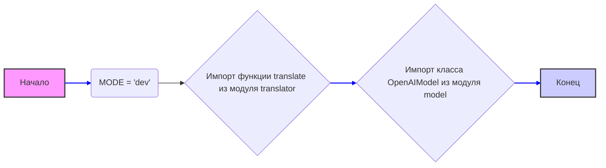

## Анализ кода `hypotez/src/ai/openai/__init__.py`

### <алгоритм>

1.  **Инициализация переменной `MODE`:**
    *   Присваивается значение `'dev'`.
    *   Пример: `MODE = 'dev'`
2.  **Импорт функции `translate`:**
    *   Импортируется из модуля `hypotez.src.ai.openai.translator`.
    *   Предполагается, что функция `translate` предназначена для перевода текста.
    *   Пример:  `from .translator import translate`
3.  **Импорт класса `OpenAIModel`:**
    *   Импортируется из модуля `hypotez.src.ai.openai.model`.
    *   Предполагается, что класс `OpenAIModel` представляет модель OpenAI.
    *   Пример: `from .model import OpenAIModel`
4.  **Конец выполнения:**
    *   Модуль инициализирован, переменные и импорты доступны для использования.
   
### <mermaid>

**Анализ зависимостей `mermaid`:**

*   **`A` (Начало)**:  Начальная точка выполнения модуля.
*   **`B` (MODE = 'dev')**:  Инициализация глобальной переменной `MODE` со значением `'dev'`.
*   **`C` (Импорт функции translate из модуля translator)**: Импорт функции `translate` из модуля `translator`. Это устанавливает зависимость от этого модуля.
*   **`D` (Импорт класса OpenAIModel из модуля model)**: Импорт класса `OpenAIModel` из модуля `model`. Это устанавливает зависимость от этого модуля.
*   **`E` (Конец)**: Конечная точка выполнения модуля.

### <объяснение>

**Импорты:**

*   `from .translator import translate`:
    *   Назначение: Импортирует функцию `translate` из модуля `translator`, находящегося в том же пакете `src.ai.openai`.
    *   Взаимосвязь: Предположительно, эта функция используется для перевода текста с использованием моделей OpenAI, возможно, она использует класс `OpenAIModel` или работает независимо от него.
    *   Пример использования: `translated_text = translate(text, source_lang, target_lang)`.
*   `from .model import OpenAIModel`:
    *   Назначение: Импортирует класс `OpenAIModel` из модуля `model`, находящегося в том же пакете `src.ai.openai`.
    *   Взаимосвязь: Этот класс, вероятно, инкапсулирует взаимодействие с API OpenAI. Он может быть использован для получения ответов, генерации текста и выполнения других связанных задач.
    *   Пример использования: `model = OpenAIModel(api_key='your_api_key')`.

**Классы:**

*   `OpenAIModel`:
    *   Роль: Представляет абстракцию для работы с API OpenAI.
    *   Атрибуты: Скорее всего, содержит атрибуты для конфигурации, такие как `api_key`, `model_name`, и другие параметры, специфичные для OpenAI.
    *   Методы: Вероятно, содержит методы для генерации текста, перевода, запросов к чату и других операций, предоставляемых API OpenAI.
    *   Взаимодействие: Может использоваться в других модулях проекта для доступа к функционалу OpenAI.

**Функции:**

*   `translate`:
    *   Аргументы: Ожидается, что принимает как минимум три аргумента: текст для перевода, язык оригинала и язык перевода.
    *   Возвращаемое значение: Возвращает переведенный текст.
    *   Назначение:  Выполняет перевод текста с одного языка на другой, предположительно используя API OpenAI.
    *   Пример: `translated_text = translate("Hello", "en", "ru")`.

**Переменные:**

*   `MODE`:
    *   Тип: `str`
    *   Использование: Устанавливает режим работы модуля (`'dev'` для разработки). Может использоваться для определения различных настроек и поведения в зависимости от текущего режима.

**Потенциальные ошибки и области для улучшения:**

*   **Отсутствие документации:** Отсутствуют docstrings для модулей, классов и функций, что затрудняет понимание их назначения и использования.
*   **Жестко заданный режим (`MODE`)**: Режим `dev` может быть жестко закодирован и может не быть гибким для различных сред развертывания (например, `prod`, `test`). Возможно, потребуется использование переменных окружения или конфигурационных файлов для управления режимом.
*   **Недостаток обработки исключений:** В модуле нет обработки возможных исключений, таких как ошибки API OpenAI или проблемы с сетью. Требуется добавить обработку ошибок для устойчивости.
*   **Отсутствие версионирования**: Модуль не содержит информации о версии, что может затруднить отслеживание изменений и совместимость.

**Цепочка взаимосвязей с другими частями проекта:**

1.  **`hypotez.src.ai`**: Модуль `openai` является частью пакета `ai`, который вероятно содержит другие модули, связанные с искусственным интеллектом.
2.  **`hypotez.src`**: Пакет `src`  может представлять собой основной исходный код проекта, и `ai` - это подмодуль, специализирующийся на ИИ.
3. **Другие модули**:  `translate` и `OpenAIModel` могут использоваться в других модулях для выполнения AI-задач. Например, модуль `hypotez.src.core`  может использовать `translate` для обработки пользовательского ввода на разных языках или `OpenAIModel` для анализа текста.