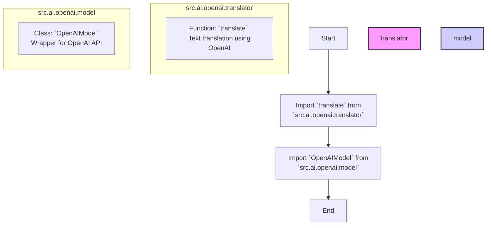

## Анализ кода `src/ai/openai/__init__.py`

### <алгоритм>

1. **Импорт модуля `translator`:** 
    * `from .translator import translate`: Импортируется функция `translate` из модуля `translator`, расположенного в том же каталоге (`src/ai/openai`). Эта функция, вероятно, отвечает за перевод текста с использованием API OpenAI. 
    * Пример использования: `translated_text = translate("Hello world!", target_language="ru")`

2. **Импорт класса `OpenAIModel`:**
    * `from .model import OpenAIModel`: Импортируется класс `OpenAIModel` из модуля `model`, расположенного в том же каталоге (`src/ai/openai`). Этот класс, вероятно, является оберткой вокруг API OpenAI и предоставляет методы для взаимодействия с ним (например, для генерации текста, завершения кода и т.д.).
    * Пример использования: 
    ```python
    model = OpenAIModel(api_key="YOUR_API_KEY")
    response = model.generate_text("What is the capital of France?")
    ```
3. **Использование импортированных компонентов:**
    * После импорта `translate` и `OpenAIModel`, они могут быть использованы в других частях проекта для выполнения соответствующих задач. 
    * Например, `translate` может использоваться для перевода текста, а `OpenAIModel` для взаимодействия с моделями OpenAI.
    * Поток данных: Вызов функции `translate` передает текст в эту функцию, которая может взаимодействовать с API OpenAI.  Аналогично,  `OpenAIModel` создается с ключом API и используется для запросов к моделям OpenAI.

### <mermaid>


### <объяснение>

**Импорты:**
   - `from .translator import translate`: Импортирует функцию `translate` из модуля `translator.py`, который находится в той же директории (`src/ai/openai/`). Точка `.` в начале указывает на относительный импорт из текущего пакета. Функция `translate`, вероятно, использует API OpenAI для перевода текста.
   - `from .model import OpenAIModel`: Импортирует класс `OpenAIModel` из модуля `model.py`, находящегося в той же директории. Класс `OpenAIModel`, вероятно, представляет собой обертку (wrapper) для API OpenAI, предоставляя методы для взаимодействия с ним.

**Классы:**
   - `OpenAIModel`:
      - **Роль:** Представляет собой класс-обертку вокруг API OpenAI. Он, вероятно, инкапсулирует детали взаимодействия с API, предоставляя более удобный интерфейс для выполнения задач, таких как генерация текста, завершение кода и т.д. 
      - **Атрибуты:** Скорее всего, будет содержать атрибуты, необходимые для работы с API OpenAI, такие как ключ API, URL API и другие настройки.
      - **Методы:** Включает методы, такие как `generate_text()`, `complete_code()`, или другие методы для отправки запросов к API OpenAI и получения ответов.
      - **Взаимодействие:** Взаимодействует с API OpenAI, отправляя запросы и получая ответы. Вероятно, используется другими частями проекта для доступа к возможностям OpenAI.

**Функции:**
   - `translate`:
       - **Аргументы:**  Вероятно, принимает как минимум один аргумент — текст для перевода, а также целевой язык перевода.
       - **Возвращаемое значение:**  Возвращает переведенный текст.
       - **Назначение:** Использует API OpenAI для перевода текста.
       - **Пример:** `translated_text = translate("Hello", "ru")`

**Переменные:**
    - В данном файле явно не определены переменные. Однако, импортированные `translate` и `OpenAIModel` могут быть присвоены переменным для дальнейшего использования в других частях проекта.

**Потенциальные ошибки и области для улучшения:**
  - **Обработка ошибок:** Код не показывает, как обрабатываются ошибки API OpenAI, например, при недоступности сервера или неверном API ключе. Следует добавить обработку исключений, чтобы сделать код более надежным.
  - **Логирование:** Было бы полезно добавить логирование для отслеживания запросов к API OpenAI и для диагностики проблем.
  - **Конфигурация:**  Ключ API OpenAI может быть жестко закодирован, что небезопасно. Можно рассмотреть возможность загрузки его из конфигурационного файла или переменной среды.

**Цепочка взаимосвязей:**
- Файл `__init__.py` служит точкой входа для пакета `openai`.  Он импортирует модули  `translator` и `model`, делая их доступными для использования другими частями проекта, которые импортируют пакет `openai`. Это обеспечивает централизованное место для доступа к основным функциональным возможностям OpenAI.
-  `src.ai.openai`  является частью более крупного пакета  `src.ai`  и  `src`, то есть `translate` и  `OpenAIModel`  являются строительными блоками более крупной системы искусственного интеллекта.