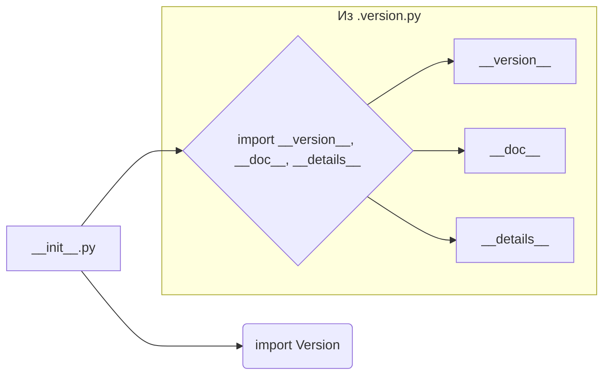

```MD
1. **<input code>**:

```python
## \file hypotez/src/ai/openai/_examples/__init__.py
# -*- coding: utf-8 -*-
#! venv/Scripts/python.exe
#! venv/bin/python/python3.12

"""
.. module: src.ai.openai._examples 
	:platform: Windows, Unix
	:synopsis:

"""
MODE = 'dev'

"""
	:platform: Windows, Unix
	:synopsis:

"""


"""
	:platform: Windows, Unix
	:synopsis:

"""


"""
  :platform: Windows, Unix

"""
"""
  :platform: Windows, Unix
  :platform: Windows, Unix
  :synopsis:
"""MODE = 'dev'
  
""" module: src.ai.openai._examples """


from packaging.version import Version
from .version import __version__, __doc__, __details__
```

2. **<algorithm>**:

Этот файл `__init__.py` служит инициализатором для пакета `_examples` внутри модуля `openai` в проекте `hypotez`.  Алгоритм работы состоит из импортов и определения констант.  В данном случае это простая инициализация, без сложной логики или циклов. 

- Шаг 1:  Импорт `Version` из пакета `packaging`.  Это используется для работы с версиями пакетов.
- Шаг 2: Импорт `__version__`, `__doc__`, и `__details__` из модуля `version.py` в текущем подкаталоге.  Эти переменные, скорее всего, содержат метаданные о версии, документе и дополнительных деталях модуля.


3. **<mermaid>**:



4. **<explanation>**:

- **Импорты**:
    - `from packaging.version import Version`: Этот импорт необходим для работы с версиями пакетов. Пакет `packaging` предоставляет инструменты для управления и сравнения версий.  Это позволяет, например, проверять совместимость с другими пакетами или модулями.  Связь с `src` - косвенная, так как `packaging` - это внешняя зависимость, скорее всего, установленная через менеджер пакетов.
    - `from .version import __version__, __doc__, __details__`:  Этот импорт подключает переменные `__version__`, `__doc__`, и `__details__` из файла `version.py` внутри папки `_examples`.  Такой синтаксис `from .version import ...` указывает на поиск файла `version.py` в текущем подкаталоге. Это показывает, что файлы `version.py` и `__init__.py` предназначены для работы вместе,  связанные внутри пакета `_examples`.  Файл `version.py` определяет данные о версии, документации и других деталях для данного модуля. 


- **Классы**: Нет классов в данном файле.  

- **Функции**: Нет функций в данном файле.

- **Переменные**:
    - `MODE = 'dev'`: Это глобальная переменная, которая, скорее всего, определяет режим работы модуля (`dev`, `prod`, и т.д.).  Значение `'dev'` указывает на режим разработки.  

- **Возможные ошибки/улучшения**:
    - Нет критических ошибок.  Однако, было бы полезно добавить документацию (docstrings) к переменной `MODE` для лучшего понимания ее назначения.
    - Лучше использовать более говорящее имя для переменной `MODE`, например, `operation_mode`.
    - В `version.py` должны быть docstrings и описание для переменных `__version__`, `__doc__`, и `__details__` для лучшей документированности.

**Цепочка взаимосвязей с другими частями проекта**:

Файл `__init__.py` в `_examples` служит точкой входа для использования примеров (модулей) из этой папки.  Он импортирует  зависимости из `version.py` внутри `_examples` и, по умолчанию, использует `__version__` и т.д. для управления информацией о версии, которая может использоваться в других модулях `hypotez`. Таким образом, этот файл инициализирует возможности папки `_examples` в более широком контексте проекта.