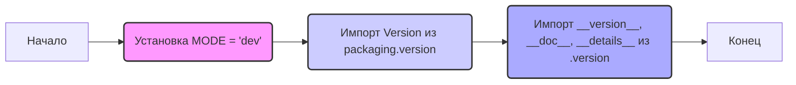

## Анализ кода `hypotez/src/ai/openai/_examples/__init__.py`

### <алгоритм>

1. **Инициализация:**
    - Устанавливается переменная `MODE` в значение `'dev'`. Это может указывать на то, что данный код предназначен для использования в среде разработки.
    - Импортируются модули из `packaging.version` и `.version`.
2. **Импорт версионной информации:**
    - Из модуля `.version` импортируются переменные `__version__`, `__doc__` и `__details__`. Эти переменные предположительно содержат информацию о версии текущего пакета, его документацию и дополнительные детали.
3. **Конец:**
    - Код заканчивается.

**Примеры:**
- `MODE = 'dev'` - указывает на режим разработки.
- `from packaging.version import Version` - импорт класса для сравнения версий.
- `from .version import __version__, __doc__, __details__` - импорт информации о версии.

### <mermaid>

**Анализ зависимостей `mermaid`:**

- `graph LR`: Определение типа диаграммы (направленный граф слева направо).
- `A[Начало]`: Начальная точка процесса.
- `B(Установка MODE = 'dev')`: Блок, представляющий установку переменной `MODE`.
- `C(Импорт Version из packaging.version)`: Блок, представляющий импорт класса `Version` из библиотеки `packaging.version`.
- `D(Импорт __version__, __doc__, __details__ из .version)`: Блок, представляющий импорт переменных из модуля `.version`.
- `E[Конец]`: Конечная точка процесса.
- `style` :  визуальный стиль блоков
- `classDef` :  визуальный стиль для класса блоков
- `class`: применение стиля

### <объяснение>

**Импорты:**

-   `from packaging.version import Version`:
    -   **Назначение**: Импортирует класс `Version` из библиотеки `packaging.version`. Этот класс предназначен для работы с версиями программного обеспечения, позволяя сравнивать и анализировать их.
    -   **Взаимосвязь с `src`**: Библиотека `packaging.version` не является частью пакета `src`. Она является внешней зависимостью, используемой для управления версиями.

-   `from .version import __version__, __doc__, __details__`:
    -   **Назначение**: Импортирует переменные `__version__`, `__doc__` и `__details__` из модуля `version.py`, расположенного в той же директории, что и `__init__.py`.
    -   **Взаимосвязь с `src`**: Этот импорт связывает текущий модуль (`__init__.py`) с модулем `version.py`, который, вероятно, содержит информацию о версии текущего пакета.

**Переменные:**

-   `MODE = 'dev'`:
    -   **Тип**: Строка.
    -   **Использование**: Определяет режим работы пакета (в данном случае - режим разработки). Возможно, в зависимости от значения этой переменной, код может вести себя по-разному.

-   `__version__`, `__doc__`, `__details__`:
    -   **Тип**: Строка или иной тип, определенный в `version.py`.
    -   **Использование**: Содержат информацию о версии, документацию и дополнительные детали текущего пакета, соответственно. Используются для метаданных пакета.

**Функции**:
- В данном коде отсутствуют явно определенные функции.
   Код служит для инициализации пакета, устанавливая переменную `MODE` и импортируя информацию о версии.

**Классы:**

- Классов в данном коде нет.

**Потенциальные ошибки и области для улучшения:**

-   **Отсутствие явного определения переменных**:
    -   Переменные `__version__`, `__doc__`, `__details__` импортируются, но не указано, где они определены (предположительно в модуле `version.py`). Стоит проверить наличие модуля `version.py` и его содержимое, чтобы убедиться в правильности импорта и типов этих переменных.
-   **Режим `'dev'`**:
    -   Использование режима `'dev'` без обработки других режимов (`'prod'`, `'test'`) может ограничить функциональность кода в различных условиях. Возможно, потребуется добавить обработку разных режимов работы.
-   **Документация**:
    -   Присутствует базовая документация в виде docstring, но может потребоваться более детальное описание назначения и функциональности данного пакета.
-   **Отсутствие функционального кода**:
    -   Файл `__init__.py` в основном предназначен для инициализации пакета. Однако, если есть необходимость добавлять в него какой-либо код, нужно учитывать, что он будет выполняться при каждом импорте пакета, поэтому следует избегать тяжелых вычислений или операций ввода-вывода.

**Цепочка взаимосвязей с другими частями проекта:**

1.  **`src.ai.openai`**: Этот модуль, вероятно, является частью более крупного пакета `src.ai.openai`, связанного с искусственным интеллектом и использованием OpenAI. `__init__.py` в подпакете `_examples` может служить для настройки примеров или тестовых сценариев для этого пакета.

2.  **`version.py`**: Файл `version.py` определяет информацию о версии, которая используется в этом `__init__.py`. Он связывает данный модуль с метаданными пакета, обеспечивая правильную идентификацию версии.

3.  **`packaging.version`**: Зависимость от внешней библиотеки `packaging.version` показывает, что данный пакет может использовать сравнение версий для каких-либо целей.