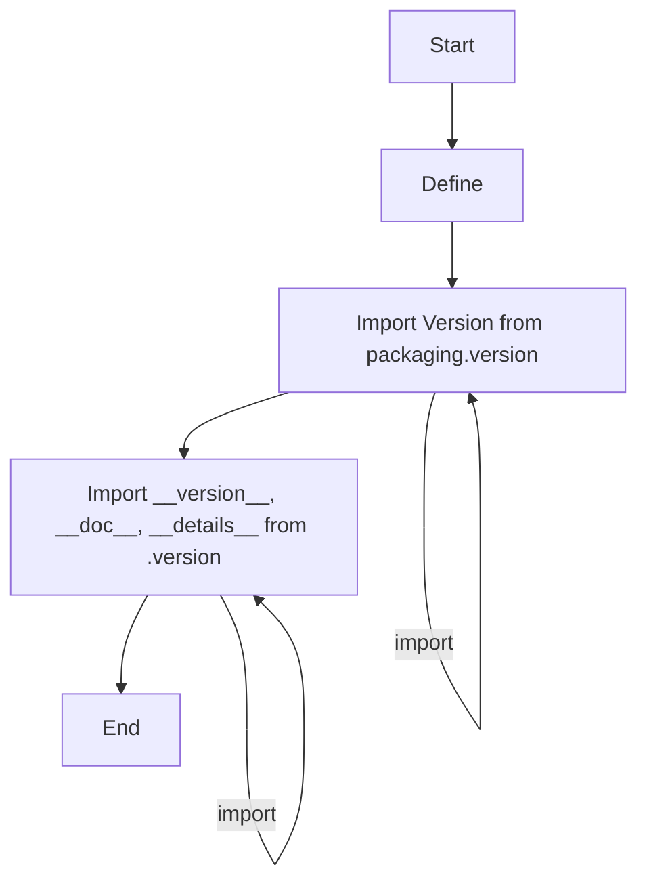

## Анализ кода `hypotez/src/ai/openai/_examples/__init__.py`

### 1. <алгоритм>

1.  **Начало:** Исполнение скрипта начинается с определения режима `MODE` как 'dev'.
    *   Пример: ``
2.  **Импорт версий**: Импортируется класс `Version` из библиотеки `packaging.version`.
    *   Пример: `from packaging.version import Version`
3.  **Импорт переменных из `version.py`**: Импортируются переменные `__version__`, `__doc__`, `__details__` из модуля `version.py`.
    *   Пример: `from .version import __version__, __doc__, __details__`
4.  **Конец:** Скрипт завершает работу.

### 2. <mermaid>

**Объяснение:**

-   Диаграмма показывает последовательность операций в файле `__init__.py`.
-   `Start`: Начало выполнения скрипта.
-   `DefineMode`: Установка переменной `MODE` в значение `dev`.
-   `ImportVersionClass`: Импортирование класса `Version` из библиотеки `packaging.version`. Это позволяет работать с версиями программного обеспечения.
-   `ImportVersionData`: Импортирование переменных `__version__`, `__doc__`, и `__details__` из модуля `version.py`, который, как правило, содержит информацию о версии и документации проекта.
-   `End`: Завершение выполнения скрипта.
-   `classDef import fill:#f9f,stroke:#333,stroke-width:2px` - определяет стиль для блоков импорта.

### 3. <объяснение>

#### Импорты:

*   `from packaging.version import Version`:
    *   **Назначение**: Импортирует класс `Version` из библиотеки `packaging.version`, которая предназначена для работы с версиями программного обеспечения. Этот класс позволяет сравнивать и обрабатывать версии в соответствии со спецификацией PEP 440.
    *   **Взаимосвязь**:  Используется для контроля версий.

*   `from .version import __version__, __doc__, __details__`:
    *   **Назначение**: Импортирует переменные `__version__` (строка, представляющая текущую версию пакета), `__doc__` (строка документации), и `__details__` (дополнительная информация о версии или пакете) из файла `version.py`, который расположен в том же каталоге.
    *   **Взаимосвязь**:  `__version__` - основная версия, `__doc__` - описание пакета, `__details__` - детали версии, это часть системы версионирования, используемой в проекте.
    
#### Переменные:
    * ``:
        - **Назначение**: Задает режим работы приложения или библиотеки. В данном случае, указывает на режим разработки ('dev').  Это обычная практика для переключения между режимом разработки и продакшн.
        - **Тип**: `str` (строка)
        - **Использование**: Может использоваться для управления поведением приложения, например, включение отладочных сообщений или использование тестовых данных.

#### Общее:
   - Файл `__init__.py` в Python используется для инициализации пакета (папки). Этот файл делает папку `_examples` пакетом, позволяя импортировать модули из нее.

#### Потенциальные ошибки и улучшения:

1.  **Непоследовательность документации**: В коде есть много пустых комментариев `""" ... """`  которые не несут никакой информации. Это можно исправить, добавив полезную информацию.
2.  **Отсутствие использования импортированных данных**: Импортированные значения `__version__`, `__doc__`, `__details__` не используются в файле `__init__.py`. Это можно исправить, добавив их использование или удалив импорт.
3.  **Избыточное определение переменной**: Переменная `` была объявлена дважды, это ошибка. Необходимо удалить первое объявление.
4.  **Зависимость от `version.py`**: Файл `__init__.py` зависит от существования и правильного наполнения файла `version.py`, что может привести к ошибкам, если файл отсутствует или его структура изменена.
5.  **Отсутствие комментариев**: Код практически не содержит комментариев. Необходимо добавить комментарии, особенно в сложные моменты.

**Цепочка взаимосвязей:**

*   `__init__.py` используется для инициализации пакета `_examples`.
*   Зависит от `version.py` для информации о версии.
*   Может зависеть от других модулей внутри пакета `_examples` (не видно из текущего кода).
*   Импорт класса `Version` из `packaging.version` показывает, что проект придерживается стандартов по управлению версиями.