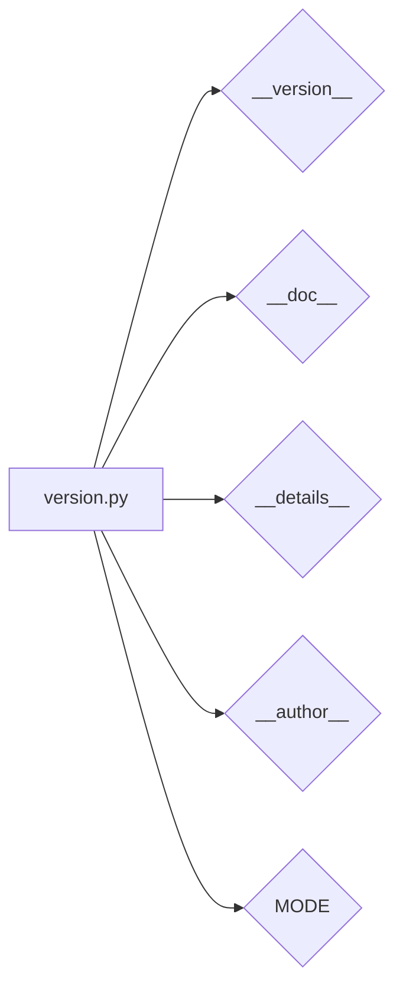

# <input code>

```python
## \file hypotez/src/ai/openai/_examples/version.py
# -*- coding: utf-8 -*-
#! venv/Scripts/python.exe
#! venv/bin/python/python3.12

"""
.. module: src.ai.openai._examples 
	:platform: Windows, Unix
	:synopsis:

"""
MODE = 'dev'

"""
	:platform: Windows, Unix
	:synopsis:

"""


"""
	:platform: Windows, Unix
	:synopsis:

"""


"""
  :platform: Windows, Unix

"""
"""
  :platform: Windows, Unix
  :platform: Windows, Unix
  :synopsis:
"""MODE = 'dev'
  
""" module: src.ai.openai._examples """


""" @namespace src.ai._examples """


"""
- `__version__`: This variable holds the version of the module or package.
- `__name__`: Contains the name of the module. If the script is being run directly, the value will be `"__main__"`.
- `__doc__`: The module's documentation string.
- `__details__`: This variable likely contains additional details about the module, but the exact purpose depends on the specific module or package.
- `__annotations__`: Contains type annotations for variables and functions in the module.
- `__author__`: The name(s) of the author(s) of the module.
"""
__name__:str
__version__="3.12.0.0.0.4"
__doc__:str
__details__:str="Details about version for module or class"
__annotations__

__author__='hypotez '
```

# <algorithm>

Этот код определяет модуль `version.py`, который, по всей видимости, служит для хранения метаданных, таких как версия, имя и описание.  Алгоритм не предполагает какого-либо вычисления или обработки данных. Он просто определяет константы и строковые литералы, которые могут быть использованы другими частями проекта.

**Пошаговая блок-схема:**

1. **Определение констант:**  Определяется переменная `MODE` со значением 'dev'.  Это, вероятно,  флаг режима работы (например, разработка, производство).
2. **Определение метаданных:** Задаются переменные `__version__`, `__doc__`, `__details__`, `__author__`, хранящие информацию о модуле.


# <mermaid>



# <explanation>

Этот файл `version.py` содержит метаданные о модуле или пакете. Он используется для хранения версии, документации и других важных сведений.

**Импорты:**

Файл не содержит импортов, он полностью самодостаточен.

**Классы:**

Нет определенных классов в данном файле.


**Функции:**

Нет определенных функций.


**Переменные:**

- `MODE`: Строковая переменная, вероятно, определяющая режим работы.
- `__version__`: Строковая переменная, содержащая версию модуля.
- `__doc__`: Строковая переменная, содержащая строку документации модуля.
- `__details__`: Строковая переменная, содержащая дополнительные детали о модуле.
- `__author__`: Строковая переменная, содержащая имя автора модуля.
- `__annotations__`:  Пустая переменная.  Вероятно, она предназначена для будущих аннотаций типов (PEP 484), но не содержит значений в этом конкретном файле.
- `__name__`:  Это специальная переменная, доступная в каждом модуле.  Её значение — имя модуля.

**Возможные ошибки или области для улучшений:**

- **Комментарии**: Многие комментарии являются просто повторяющимися строками документации.  Их можно сократить, оставив более существенные пояснения.
- **Консистентность:** Неясно, почему переменная `MODE` определена несколько раз. Это может быть ошибкой, и необходимо проанализировать логику программы, чтобы понять, почему это нужно.
- **Типы данных**:  Хотя `__name__` объявлена как строка, в коде нет явной проверки типа для других переменных.  В Python это не обязательно, но может улучшить читабельность и помочь в обнаружении ошибок.
- **Оптимизация**: Так как этот файл содержит только константы, никаких дополнительных оптимизаций не требуется.

**Взаимосвязи с другими частями проекта:**

Этот файл, скорее всего, используется другими частями проекта для получения информации о версии, авторстве и других метаданных. Он является частью проекта `hypotez`, и, судя по имени директории `ai/openai/_examples`, это примерный код, который может использоваться для демонстрации или тестирования.  Информация о версии, вероятно, используется для управления версиями, логирования и документации.