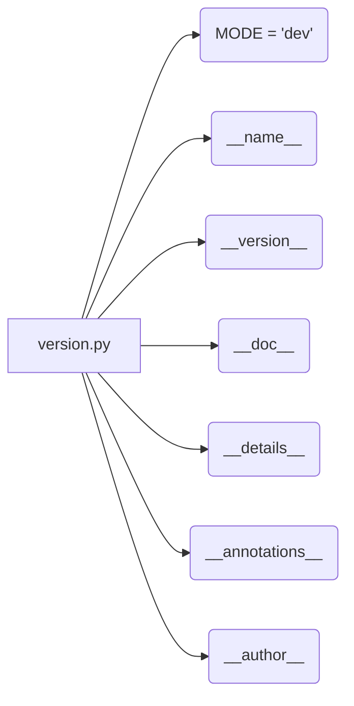

# <input code>

```python
## \file hypotez/src/ai/openai/_examples/version.py
# -*- coding: utf-8 -*-\n#! venv/Scripts/python.exe
#! venv/bin/python/python3.12

"""
.. module: src.ai.openai._examples 
	:platform: Windows, Unix
	:synopsis:

"""
MODE = 'dev'

"""
	:platform: Windows, Unix
	:synopsis:

"""


"""
	:platform: Windows, Unix
	:synopsis:

"""


"""
  :platform: Windows, Unix

"""
"""
  :platform: Windows, Unix
  :platform: Windows, Unix
  :synopsis:
"""MODE = 'dev'
  
""" module: src.ai.openai._examples """


""" @namespace src.ai._examples """


"""
- `__version__`: This variable holds the version of the module or package.
- `__name__`: Contains the name of the module. If the script is being run directly, the value will be `"__main__"`.
- `__doc__`: The module's documentation string.
- `__details__`: This variable likely contains additional details about the module, but the exact purpose depends on the specific module or package.
- `__annotations__`: Contains type annotations for variables and functions in the module.
- `__author__`: The name(s) of the author(s) of the module.
"""
__name__:str
__version__="3.12.0.0.0.4"
__doc__:str
__details__:str="Details about version for module or class"
__annotations__

__author__='hypotez '
```

# <algorithm>

The code snippet is a Python module definition, specifically focused on declaring metadata (version, author, documentation, etc.) for a module likely part of a larger project.  No substantial logic or processing is performed.

There's no step-by-step algorithm. The code just assigns values to variables.

# <mermaid>



This mermaid graph illustrates the assignment of variable values within the `version.py` file. There are no function calls, object instantiations, or other complex logical paths.


# <explanation>

This Python file defines metadata for a module or package, likely `hypotez/src/ai/openai/_examples/`.  It doesn't contain any executable code to be run directly.  Instead, it sets up the module's identity and description.

* **Imports:** There are no imports.  This module is self-contained, relying on standard Python features.

* **Classes:**  There are no classes defined in this snippet.


* **Functions:** There are no functions defined. This is a module-level definition.


* **Variables:**
    * `MODE`: A string variable likely defining an operational mode (e.g., 'dev', 'prod').
    * `__version__`: A string representing the version number of the module.
    * `__name__`: A string variable holding the name of the module (e.g. `__main__` if run directly, but here it's assigned as `str`).
    * `__doc__`: A multiline string containing the module's documentation.
    * `__details__`:  A string intended to hold further details about the module or version, but without specific content here.
    * `__annotations__`:  A variable, likely used for type hints but not initialized.
    * `__author__`:  A string variable holding the author's name.

* **Error/Improvement:** The file includes excessive docstrings and comments (e.g., multiple ":synopsis:" and ":platform:"). While helpful for documentation, excessive repetition might be considered a minor style issue.


**Project Context:**
This `version.py` file is crucial for managing versioning within a project structure (likely using a build system or package management tools).  Version information is essential for tracking updates, dependencies, and ensuring compatibility.  The specific way `version.py` is used depends on how the project manages modules and packages.

**Overall:** The code is very simple but crucial to the larger Python project structure. It's effectively defining metadata for a specific module. The excessive docstrings while not wrong are unnecessary and should be trimmed. It's good practice to define `__version__` and `__author__` within Python modules.