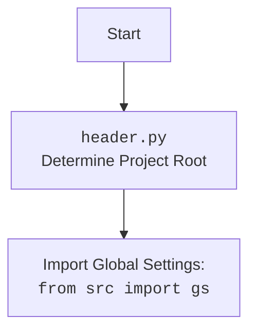

# Анализ кода `hypotez/src/ai/openai/bully.py`

## <алгоритм>
1. **Инициализация:**
   - Устанавливается глобальная переменная `MODE` в значение `'dev'`.
   - Импортируются модули `os` и `src.ai.openai`.
   - Устанавливается API-ключ OpenAI: `openai.API_KEY = "YOUR_API_KEYS_OPENAI"`. **Примечание:** в реальном коде этот ключ должен быть заменен на валидный.
   - Определяется переменная `system_prompt`, содержащая строковое описание для модели, чтобы она отвечала как "эксперт по языку ненависти" с конкретным заданием.
2. **Функция `bully`:**
   - Функция принимает два аргумента:
     - `user_message` (строка, по умолчанию "Hello!") — сообщение пользователя.
     - `messages` (список словарей, по умолчанию `[{"system": "user", "content": system_prompt}]`) — список сообщений для чат-модели. Первый элемент в списке - это системный промпт, который описывает роль и цель модели.
   - Добавляет сообщение пользователя в список `messages`. Пример: если `user_message` = "Ты дурак!", то `messages` станет `[..., {"role": "user", "content": "Ты дурак!"}]`.
   - Вызывает API OpenAI `openai.ChatCompletion.create` для создания ответа модели.
     - Используется модель "gpt-3.5-turbo".
     - В качестве `messages` передается обновленный список сообщений.
   - Получает ответ от модели, добавляет его в список `messages`, а именно, append `{"role": "user", "content": completion.choices[0].message}`. **Примечание:** В коде есть ошибка - вместо добавления сообщения с `role:assistant` - добавляется с `role:user`.
   - Возвращает список `messages` (с ошибкой в написании имени переменной `messagess` вместо `messages`).

## <mermaid>

```mermaid
flowchart TD
    Start[Start] --> Initialize[Initialize Global Settings:  MODE = 'dev', API-KEY]
    Initialize --> ImportModules[Import Modules: os, src.ai.openai]
    ImportModules --> SetSystemPrompt[Set System Prompt for Model]
    SetSystemPrompt --> BullyFunction[Function: bully(user_message, messages)]
    BullyFunction --> AddUserMessage[Append User Message to messages]
    AddUserMessage --> CreateChatCompletion[Create OpenAI Chat Completion]
    CreateChatCompletion --> GetModelResponse[Get Model Response]
    GetModelResponse --> AppendModelResponse[Append Model Response to messages]
    AppendModelResponse --> ReturnMessages[Return Updated messages]
    ReturnMessages --> End[End]

    classDef code fill:#f9f,stroke:#333,stroke-width:2px
    class Initialize, ImportModules, SetSystemPrompt, BullyFunction, AddUserMessage, CreateChatCompletion, GetModelResponse, AppendModelResponse, ReturnMessages code
```



## <объяснение>

### Импорты:
   - `import os`: Используется для взаимодействия с операционной системой, но в данном коде не используется. Это может быть потенциальным местом для оптимизации, если этот модуль не нужен.
   - `import src.ai.openai`: Импортирует пакет `openai` из `src.ai`. Этот пакет, вероятно, содержит код для взаимодействия с API OpenAI.

### Переменные:
   - `MODE`: Глобальная переменная, установленная в `'dev'`. Указывает на режим работы (разработка).
   - `openai.API_KEY`: API ключ для доступа к сервисам OpenAI. **Внимание**: его нужно заменить реальным API ключом.
   - `system_prompt`: Строка с инструкциями для модели, задающая ей роль "эксперта по языку ненависти". Она используется для получения ответов в стиле буллинга.
   - `user_message`: Аргумент функции `bully`, содержащий сообщение от пользователя.
   - `messages`: Список словарей, передаваемый в OpenAI API, для отслеживания диалога.
   - `completion`: Объект, содержащий ответ от OpenAI API.

### Классы:
   - Классов нет.

### Функции:
   - `bully(user_message="Hello!", messages=[{"system": "user", "content": system_prompt}])`:
     - **Аргументы:**
       - `user_message`: Сообщение пользователя (по умолчанию "Hello!").
       - `messages`: Список словарей, содержащий системные инструкции и историю сообщений (по умолчанию список с системным сообщением `system_prompt`).
     - **Назначение:**  Отправляет пользовательское сообщение в модель OpenAI, и получает сгенерированный ответ, который далее сохраняется в `messages`.
     - **Возвращаемое значение:** Обновленный список `messages`, содержащий пользовательское сообщение, и ответ от модели.
     - **Пример:**  Если вызвать `bully(user_message="Ты тупой!")`, то функция добавит сообщение в список, отправит его в API, добавит ответ API в список и вернет его.

### Проблемы и улучшения:
   - **Ошибка в именовании переменной**: `messagess` в строке возврата функции `bully` должно быть `messages`.
   - **Использование API ключа в коде**: API ключ `openai.API_KEY` должен храниться вне кода, например, в переменных окружения или конфигурационных файлах.
   - **Неправильная роль в сообщении**: Ответ от OpenAI добавляется в `messages` с ролью `user`, в то время как должно быть `assistant`.
   - **Отсутствие обработки ошибок**: Нет обработки возможных ошибок при обращении к API OpenAI.
   - **Неиспользуемый импорт `os`**: Удалить импорт `os`, если он не используется.
   - **Безопасность**: Данный код может быть использован для генерации оскорбительных сообщений.  Нужно помнить о этических последствиях.

### Взаимосвязи с другими частями проекта:
   - Данный код взаимодействует с модулем `src.ai.openai`, который, вероятно, отвечает за взаимодействие с API OpenAI.
   - Данный код может использоваться другими модулями проекта для генерации текстов.
   - Взаимосвязь с `header.py` пока не ясна без его содержимого, но возможно, он содержит общие настройки проекта и определения переменных окружения, которые могут быть использованы для настройки API ключа.