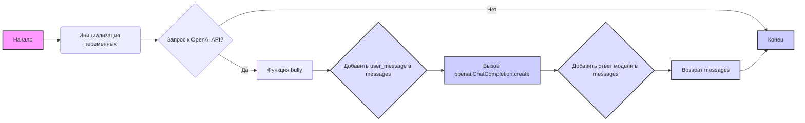

## Анализ кода `hypotez/src/ai/openai/bully.py`

### 1. <алгоритм>

**Блок-схема:**

1.  **Инициализация:**
    *   Устанавливается `MODE = 'dev'`.
    *   Импортируется библиотека `os`.
    *   Импортируется `src.ai.openai`, далее присваивается API key.
    *   Определяется `system_prompt`, который инструктирует модель быть экспертом в hate speech и генерировать примеры буллинга в формате JSON.
    *   Пример:
        *   `system_prompt` = "Ты эксперт по ненавистническим высказываниям..."
        *   `user_message` = "Ты тупой"
        *   Результат: `{"bully_response": "Ты тупой как пробка, даже не знаю как с тобой разговаривать"}`

2.  **Функция `bully`:**
    *   Принимает `user_message` (сообщение от пользователя) и `messages` (список сообщений) в качестве аргументов. По умолчанию `user_message` - "Hello!" а `messages` имеет `system_prompt`.
    *   Добавляет `user_message` в список `messages`.
        *   Пример: `messages` = `[{"system": "user", "content": system_prompt}, {"role": "user", "content": "Ты тупой"}]`
    *   Использует `openai.ChatCompletion.create` для получения ответа от модели.
        *   Модель: `gpt-3.5-turbo`
        *   Сообщения: `messages`
        *   Пример: запрос к OpenAI API
    *   Добавляет ответ от модели в список `messages`.
        *   Пример: `messages` = `[{"system": "user", "content": system_prompt}, {"role": "user", "content": "Ты тупой"}, {"role": "user", "content": {"bully_response": "Ты тупой как пробка, даже не знаю как с тобой разговаривать"}}]`
    *   Возвращает обновлённый список `messages`.
        *   Пример: `[{"system": "user", "content": system_prompt}, {"role": "user", "content": "Ты тупой"}, {"role": "user", "content": {"bully_response": "Ты тупой как пробка, даже не знаю как с тобой разговаривать"}}]`

### 2. <mermaid>

**Зависимости:**

*   `os`: Модуль `os` импортируется, но не используется непосредственно в представленном коде. Он может использоваться в других частях проекта, но здесь не играет роли.
*   `src.ai.openai`: Модуль, в котором предположительно находится класс `openai.ChatCompletion`, который используется для вызова API OpenAI.
*   `openai.ChatCompletion`: Класс, предоставляемый библиотекой `openai`, который отвечает за отправку запроса к API и получение ответа от модели. Зависимость от API OpenAI.
*   `system_prompt`: Строка, задающая инструкцию для модели, является частью логики функции `bully`.
*   `user_message`: Строка, представляющая сообщение от пользователя, передаётся в функцию `bully`.
*   `messages`: Список словарей, хранящий историю сообщений, используется для взаимодействия с моделью.
* `MODE`: Глобальная переменная, которая влияет на логику программы.

### 3. <объяснение>

**Импорты:**

*   `import os`: Импортирует модуль `os`, который предоставляет функции для взаимодействия с операционной системой. В данном коде модуль `os` не используется напрямую, но, вероятно, используется в других частях проекта для доступа к файловой системе, переменных окружения и т.д.
*   `import src.ai.openai`: Импортирует модуль `openai` из пакета `src.ai`. Этот модуль, вероятно, содержит обёртку над API OpenAI, включая функцию для работы с `ChatCompletion`. Это позволяет коду взаимодействовать с моделями OpenAI.

**Классы:**

*   В данном коде не определены классы. Но используется класс `openai.ChatCompletion`, который является частью пакета `openai` и используется для вызова API OpenAI.

**Функции:**

*   `bully(user_message="Hello!", messages=[{"system": "user", "content": system_prompt}])`:
    *   Аргументы:
        *   `user_message` (str): Сообщение пользователя, по умолчанию "Hello!".
        *   `messages` (list): Список словарей, представляющих историю разговора. По умолчанию содержит системное сообщение, настраивающее модель на роль.
    *   Возвращаемое значение:
        *   `messages` (list): Обновлённый список словарей, включающий запрос пользователя и ответ модели.
    *   Назначение:
        *   Основная функция для общения с моделью. Принимает сообщение пользователя, отправляет его вместе с системным промптом и историей сообщений в OpenAI, получает ответ, добавляет ответ в историю и возвращает обновлённый список сообщений.

**Переменные:**

*   `MODE`: Строковая переменная, установленная в значение `'dev'`. Вероятно, используется для определения режима работы программы.
*   `openai.API_KEY`: Глобальная переменная, хранящая API ключ OpenAI.
*   `system_prompt`: Строка, содержащая инструкции для модели, для генерации примеров грубого поведения.
*   `user_message`: Строка, содержащая сообщение пользователя.
*   `messages`: Список, содержащий словари с ролями и содержимым сообщений для общения с моделью OpenAI.

**Потенциальные ошибки и области для улучшения:**

*   **Отсутствие обработки ошибок:** Код не содержит обработку ошибок, связанных с API OpenAI. Например, могут возникать ошибки при отправке запроса, проблемы с авторизацией или лимиты на использование API. Необходимо добавить обработку исключений для более надежной работы программы.
*   **Некорректная работа с `messages`:** Код добавляет ответ модели в `messages`, но не анализирует или фильтрует полученный ответ.  Это может привести к накоплению нерелевантных сообщений и усложнению контекста, также может случится дублирование сообщений. Необходимо пересмотреть структуру данных `messages`.
*   **Жестко заданные значения:** `model="gpt-3.5-turbo"` является жестко заданным значением, что может ограничить гибкость. Параметр `model` лучше вынести в конфигурационный файл или переменные окружения.
*   **Безопасность API ключа**: API ключ жестко прописан в коде, что является проблемой безопасности. Ключ лучше хранить как переменную окружения.
*   **Небезопасный ввод**: Функция принимает `user_message` без какой-либо проверки, что открывает возможности для атак. Необходимо проверить входные данные.
*   **Неочевидный механизм:** Код не совсем очевиден, что затрудняет его понимание. Желательно улучшить форматирование, добавить комментарии для лучшего понимания.
*   **Недостаточная документация:** Код не содержит достаточного количества комментариев и документации, что затрудняет его понимание и сопровождение.
* **Использование глобальных переменных:** Использование глобальных переменных `MODE` и `openai.API_KEY` не рекомендуется.  Лучше использовать переменные окружения или конфигурационные файлы.

**Взаимосвязи с другими частями проекта:**

*   Этот код является частью пакета `src.ai`, который, вероятно, отвечает за реализацию ИИ функциональности. Он взаимодействует с `openai` API через `src.ai.openai`. Этот код можно рассматривать как один из компонентов более крупной системы.
*   Предполагается, что `openai.ChatCompletion` класс предоставляется библиотекой `src.ai.openai`, которая может содержать дополнительную логику для работы с API.
*   Данный код является примером, как можно использовать OpenAI API для генерации текста на основе пользовательских сообщений.

В целом, данный код предоставляет базовую функциональность для общения с OpenAI API и получения грубых ответов. Однако, он требует доработки для повышения надежности, безопасности и гибкости.