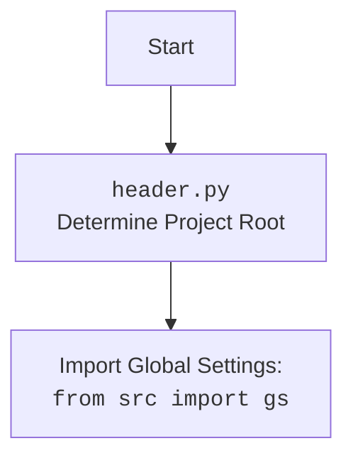

# Анализ кода `src/logger/header.py`

## <алгоритм>

1.  **Начало**:
    -   Скрипт начинает выполнение с импорта необходимых модулей (`sys`, `json`, `Version`, `Path`).
2.  **`set_project_root`**:
    -   Определяется текущий путь к файлу (`__file__`).
    -   Инициализируется переменная `__root__` текущим путем.
    -   Создается список `parents`, содержащий текущий путь и все его родительские директории.
    -   Перебираются пути в списке `parents`:
        -   Для каждого пути проверяется, существует ли в нем какой-либо из файлов или директорий, указанных в `marker_files`.
        -   Если один из маркеров найден, `__root__` устанавливается в этот путь, и цикл завершается.
        -   Пример: Если `marker_files` это `('.git', '__root__')`, и текущий путь это `/home/user/project/src/logger`, то поиск начнется с `/home/user/project/src/logger`, затем `/home/user/project/src`, `/home/user/project`, и т.д. до тех пор, пока не будет найден файл `.git` или `__root__`.
    -   Если путь `__root__` не находится в списке путей Python (`sys.path`), он добавляется в начало.
    -   Функция возвращает путь `__root__`.
3.  **Установка `__root__`**:
    -   Вызывается функция `set_project_root()` для определения корневого пути проекта, результат присваивается глобальной переменной `__root__`.
4.  **Импорт глобальных настроек**:
    -   Из модуля `src` импортируется `gs`.
5.  **Загрузка настроек из `settings.json`**:
    -   Попытка открыть файл `settings.json` относительно корневого пути.
    -   Если файл найден, его содержимое загружается как `dict` в переменную `settings`.
    -   Если файл не найден или возникают ошибки при декодировании JSON, ошибки игнорируются.
6. **Загрузка README.MD**:
   - Попытка открыть файл `README.MD` относительно корневого пути.
   - Если файл найден, его содержимое загружается как `str` в переменную `doc_str`.
   - Если файл не найден или возникают ошибки при декодировании JSON, ошибки игнорируются.
7.  **Инициализация глобальных переменных**:
    -   Инициализируются глобальные переменные `__project_name__`, `__version__`, `__doc__`, `__details__`, `__author__`, `__copyright__`, `__cofee__` из словаря `settings`, если он загружен. В противном случае устанавливаются значения по умолчанию.

## <mermaid>

```mermaid
flowchart TD
    Start --> FindRoot[<code>set_project_root()</code> <br> Find project root dir];
    FindRoot --> CheckMarkers[Check for marker files <br> ('.git', '__root__') in parent dirs]
    CheckMarkers -- Marker found --> SetRoot[Set __root__]
    CheckMarkers -- No marker found --> UseCurrentDir[Set __root__ as current dir];
    SetRoot --> AddToSysPath[Add __root__ to <code>sys.path</code>]
    UseCurrentDir --> AddToSysPath
    AddToSysPath --> ReturnRoot[Return __root__]
    ReturnRoot --> ImportSettings[Import <code>src.gs</code>]
    ImportSettings --> LoadSettingsJson[Load settings from <br> <code>settings.json</code>]
    LoadSettingsJson --> LoadReadmeMD[Load doc from  <br><code>README.MD</code>]
     LoadReadmeMD --> InitGlobalVars[Init Global Variables <br>(__project_name__, __version__, etc.)]
    InitGlobalVars --> End
```
### Анализ зависимостей `mermaid`

*   `flowchart TD`:  Объявляет тип диаграммы как блок-схему.
*   `Start`: Начало процесса, блок без входящих связей.
*   `FindRoot`: Функция `set_project_root`, определяет корневой каталог проекта.
*   `CheckMarkers`: Проверяет наличие маркерных файлов (`.git`, `__root__`) в родительских каталогах.
*   `SetRoot`: Устанавливает переменную `__root__` в найденный родительский каталог с маркерным файлом.
*   `UseCurrentDir`: Если маркерный файл не найден, устанавливает текущий каталог как корневой.
*   `AddToSysPath`: Добавляет корень проекта в список путей `sys.path`, чтобы другие модули могли быть импортированы.
*   `ReturnRoot`: Возвращает найденный корень проекта.
*   `ImportSettings`: Импортирует модуль `src.gs` для доступа к глобальным настройкам.
*   `LoadSettingsJson`: Загружает данные из файла `settings.json`.
*   `LoadReadmeMD`: Загружает данные из файла `README.MD`.
*   `InitGlobalVars`: Инициализирует глобальные переменные на основе загруженных настроек или значений по умолчанию.
*   `End`: Конец процесса, блок без исходящих связей.


### Анализ зависимостей `mermaid` (для импорта `header`)
*   `flowchart TD`:  Объявляет тип диаграммы как блок-схему.
*   `Start`: Начало процесса импорта.
*   `Header`: Указывает на файл `header.py`, который отвечает за определение корневого каталога проекта.
*   `import`:  Показывает зависимость от импорта глобальных настроек  из `from src import gs`.

## <объяснение>

### Импорты

*   `sys`: Модуль, предоставляющий доступ к некоторым переменным и функциям, взаимодействующим с интерпретатором Python. Используется для модификации `sys.path` путем добавления корневого каталога проекта, что позволяет импортировать модули из проекта.
*   `json`: Модуль, используется для работы с JSON данными, в частности, для загрузки настроек из файла `settings.json`.
*    `packaging.version`: Модуль используется для работы с версиями. (Не используется в коде)
*   `pathlib.Path`: Модуль для работы с путями к файлам и директориям в кроссплатформенном виде. Используется для поиска корня проекта и формирования путей к файлам настроек.
*    `src`: Пакет, содержащий исходный код проекта. `src.gs` - импортируются глобальные настройки проекта.

### Функции

*   `set_project_root(marker_files=('.git', '__root__')) -> Path`:
    *   **Аргументы**:
        *   `marker_files` (tuple): Кортеж строк, содержащий имена файлов или директорий, которые используются для идентификации корневой директории проекта. По умолчанию `('.git', '__root__')`.
    *   **Возвращаемое значение**: `Path` - объект, представляющий путь к корневой директории проекта. Если корневая директория не найдена, возвращается путь к текущей директории.
    *   **Назначение**: Функция находит корень проекта, начиная с директории, где находится скрипт. Поиск идет вверх по дереву каталогов, пока не будет найден каталог, содержащий один из `marker_files`.
    *   **Пример**:
        ```python
        project_root = set_project_root()
        print(project_root)
        ```
        Если скрипт расположен в `/home/user/project/src/logger`, а корневой каталог проекта `/home/user/project` содержит файл `.git`, то `project_root` будет равен `/home/user/project`.

### Переменные

*   `__root__`:  `Path` - глобальная переменная, хранящая путь к корневому каталогу проекта, вычисленному с помощью `set_project_root()`.
*   `settings`: `dict` - хранит настройки, загруженные из файла `settings.json`.
*   `doc_str`: `str` - хранит текст из файла `README.MD`.
*   `__project_name__`, `__version__`, `__doc__`, `__details__`, `__author__`, `__copyright__`, `__cofee__`:  `str` - глобальные переменные, содержащие информацию о проекте, берутся из `settings`, если они присутствуют, или используются значения по умолчанию.

### Цепочка взаимосвязей

*   Файл `header.py` является отправной точкой для определения корневого каталога проекта, обеспечивая правильную работу с путями и импортами в рамках всего проекта.
*   Загрузка настроек из `settings.json` и `README.MD` позволяет централизованно хранить и управлять информацией о проекте.
*   Импорт `src.gs` связывает модуль `header.py` с глобальными настройками проекта.
*   Все остальные модули, которые импортируют `header` могут использовать общие переменные, например `__root__` и `settings`
*   Глобальные переменные  `__project_name__`, `__version__`, `__doc__`, `__details__`, `__author__`, `__copyright__`, `__cofee__` могут быть использованы в других модулях для представления информации о проекте.
*   Код обеспечивает возможность использования относительных импортов в рамках проекта, путем добавления корневого каталога проекта в `sys.path`.

### Потенциальные ошибки и области для улучшения

*   Обработка ошибок:
    *   Обработка ошибок при загрузке `settings.json` и `README.MD` реализована как `...`, что означает, что любые ошибки просто игнорируются.
    *   Стоит добавить логгирование ошибок, чтобы было легче отслеживать проблемы.
    *   Если `settings.json` не найден, приложение будет использовать значения по умолчанию, но пользователя об этом никак не уведомят.
*   `marker_files`:
    *   Возможно, стоит сделать `marker_files` конфигурируемым параметром или проверять наличие файла `.git` только в начале поиска.
*   Разделение ответственности:
    *   Функция `set_project_root` и загрузка настроек имеют разную ответственность, возможно, стоит их разделить на отдельные функции.
*    Зависимости:
    *   Не используется `packaging.version`
*   Обновление настроек:
    *   Модуль загружает настройки при запуске, не отслеживая их изменения. Возможно, стоит добавить возможность автоматического обновления настроек при их изменении.
*   Зависимость от `src`:
    *   Если `src` не будет существовать, или будет перемещён, это вызовет ошибку.

Этот анализ обеспечивает полное понимание функциональности кода, его зависимостей, а также предлагает потенциальные улучшения.