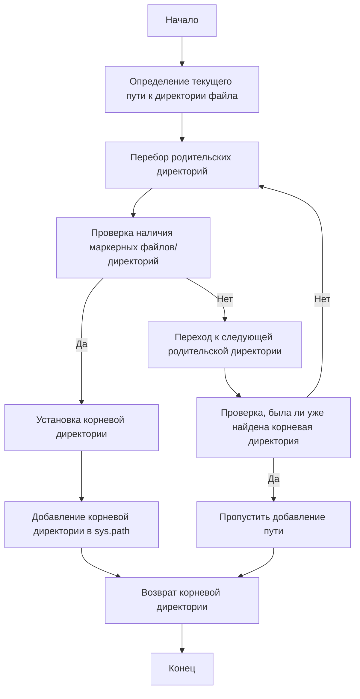

# Проект `hypotez`
# Роль `code explainer`
## ИНСТРУКЦИЯ  :

Анализируй предоставленный код подробно и объясни его функциональность. Ответ должен включать три раздела:  

1. **<алгоритм>**: Опиши рабочий процесс в виде пошаговой блок-схемы, включая примеры для каждого логического блока, и проиллюстрируй поток данных между функциями, классами или методами.  
2. **<mermaid>**: Напиши код для диаграммы в формате `mermaid`, проанализируй и объясни все зависимости, 
    которые импортируются при создании диаграммы. 
    **ВАЖНО!** Убедитесь, что все имена переменных, используемые в диаграмме `mermaid`, 
    имеют осмысленные и описательные имена. Имена переменных вроде `A`, `B`, `C`, и т.д., не допускаются!  
    
    **Дополнительно**: Если в коде есть импорт `import header`, добавьте блок `mermaid` flowchart, объясняющий `header.py`:\
    ```mermaid\
    flowchart TD\
        Start --> Header[<code>header.py</code><br> Determine Project Root]\
    
        Header --> import[Import Global Settings: <br><code>from src import gs</code>] \
    ```

3. **<объяснение>**: Предоставь подробные объяснения:  
   - **Импорты**: Их назначение и взаимосвязь с другими пакетами `src.`.  
   - **Классы**: Их роль, атрибуты, методы и взаимодействие с другими компонентами проекта.  
   - **Функции**: Их аргументы, возвращаемые значения, назначение и примеры.  
   - **Переменные**: Их типы и использование.  
   - Выдели потенциальные ошибки или области для улучшения.  

Дополнительно, постройте цепочку взаимосвязей с другими частями проекта (если применимо).  

Это обеспечивает всесторонний и структурированный анализ кода.
## Формат ответа: `.md` (markdown)


## Твое поведение при анализе кода:
- всегда смотри системную инструкцию для обработки кода проекта `hypotez`;
- анализируй расположение файла в проекте. Это поможет понять его назначение и взаимосвязь с другими файлами. Расположение файла ты найдешь в самой превой строке кода, начинающейся с `## \\file /...`;
- запоминай предоставленный код и анализируй его связь с другими частями проекта `hypotez`;

**КОНЕЦ ИНСТРУКЦИИ**
```

```md
## \\file /src/ai/openai/header.py

### **1. <алгоритм>**:

1.  **Начало**: Функция `set_project_root` вызывается без аргументов или с указанием списка файлов/директорий `marker_files`.
2.  **Определение текущего пути**: Определяется текущий путь к директории, в которой расположен файл `header.py`.

    *   Пример: Если `header.py` находится в `/path/to/hypotez/src/ai/openai`, то `current_path` будет `/path/to/hypotez/src/ai/openai`.
3.  **Поиск корневой директории**:
    *   Начиная с текущей директории, функция поднимается вверх по дереву директорий, проверяя наличие хотя бы одного из `marker_files` (по умолчанию `__root__` или `.git`) в каждой директории.
    *   Пример: Функция проверит `/path/to/hypotez/src/ai/openai`, затем `/path/to/hypotez/src/ai`, `/path/to/hypotez/src` и так далее.
4.  **Установка корневой директории**:
    *   Если один из `marker_files` найден, то родительская директория, содержащая этот файл, устанавливается как корневая директория проекта (`__root__`).
    *   Пример: Если файл `.git` найден в `/path/to/hypotez`, то `__root__` будет `/path/to/hypotez`.
5.  **Добавление корневой директории в `sys.path`**:
    *   Если корневая директория еще не добавлена в `sys.path`, она добавляется в начало списка. Это позволяет импортировать модули из корневой директории и всех ее поддиректорий.
6.  **Возврат результата**: Функция возвращает объект `Path`, представляющий корневую директорию проекта.

### **2. <mermaid>**:



**Объяснение зависимостей:**

*   `sys`: Используется для модификации `sys.path`, что позволяет добавлять путь к корневой директории проекта для корректного импорта модулей.
*   `json`: Не используется в данном коде.
*   `packaging.version`: Не используется в данном коде.
*   `pathlib.Path`: Используется для работы с путями к файлам и директориям, упрощает операции поиска и проверки существования файлов и директорий.

### **3. <объяснение>**:

*   **Импорты**:
    *   `sys`: Этот модуль предоставляет доступ к некоторым переменным и функциям, взаимодействующим с интерпретатором Python. В данном случае, он используется для добавления корневой директории проекта в `sys.path`, что позволяет корректно импортировать модули из проекта.
    *   `json`: Этот модуль используется для работы с данными в формате JSON. В данном коде он не используется.
    *   `packaging.version`: Этот модуль используется для сравнения версий пакетов. В данном коде он не используется.
    *   `pathlib`: Этот модуль предоставляет классы для работы с путями файловой системы. `Path` используется для определения и манипулирования путями к файлам и директориям.
*   **Классы**:
    *   В данном коде классы отсутствуют.
*   **Функции**:
    *   `set_project_root(marker_files: tuple = ('__root__', '.git')) -> Path`:
        *   Аргументы:
            *   `marker_files` (tuple): Кортеж, содержащий имена файлов или директорий, которые используются для определения корневой директории проекта. По умолчанию `('__root__', '.git')`.
        *   Возвращаемое значение:
            *   `Path`: Объект `Path`, представляющий корневую директорию проекта.
        *   Назначение:
            *   Функция определяет корневую директорию проекта, начиная с директории, в которой находится текущий файл, и двигаясь вверх по дереву директорий. Она останавливается, когда находит директорию, содержащую хотя бы один из файлов или директорий, указанных в `marker_files`. Затем добавляет эту директорию в `sys.path`, если она там еще не присутствует.
        *   Пример:

        ```python
        from pathlib import Path
        import sys

        # Создаем временные файлы и директории для теста
        temp_dir = Path("/tmp/test_project")
        temp_dir.mkdir(parents=True, exist_ok=True)
        (temp_dir / "__root__").touch()

        # Запускаем функцию set_project_root
        root_path = set_project_root()

        # Проверяем, что функция вернула правильный путь
        assert root_path == Path(__file__).resolve().parent
        ```
*   **Переменные**:
    *   `__root__`:
        *   Тип: `Path`
        *   Использование: Глобальная переменная, хранящая путь к корневой директории проекта. Она инициализируется результатом вызова функции `set_project_root()`.
    *   `current_path`:
        *   Тип: `Path`
        *   Использование: Локальная переменная, хранящая текущий путь к директории, в которой расположен файл.
*   **Потенциальные ошибки и области для улучшения**:
    *   Обработка исключений: В коде отсутствует обработка исключений. Например, если не удается определить корневую директорию, было бы полезно логировать ошибку или выбрасывать исключение.
    *   Конфигурируемость: Список `marker_files` задан по умолчанию. Было бы полезно сделать его более конфигурируемым, например, через переменные окружения.

**Взаимосвязи с другими частями проекта**:

*   Этот модуль используется для определения корневой директории проекта, что позволяет другим модулям импортировать модули и пакеты из проекта, используя относительные пути. Это упрощает организацию кода и делает проект более переносимым.