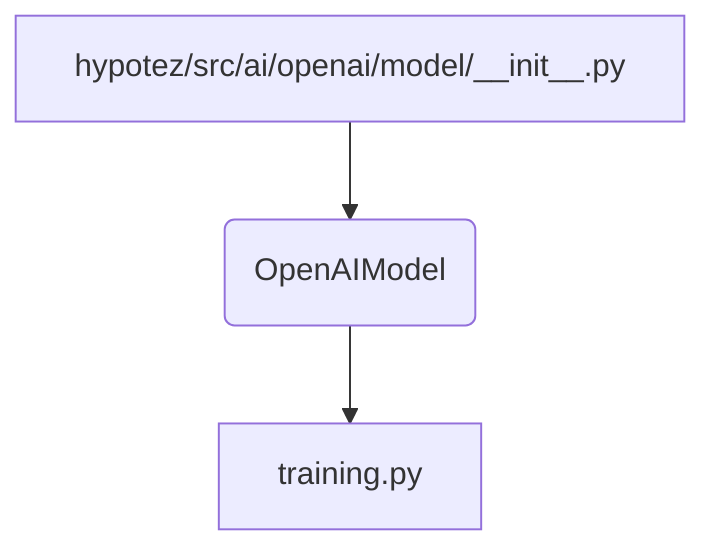

```MD
1. **<input code>**:

```python
## \file hypotez/src/ai/openai/model/__init__.py
# -*- coding: utf-8 -*-
#! venv/Scripts/python.exe
#! venv/bin/python/python3.12

"""
.. module: src.ai.openai.model 
	:platform: Windows, Unix
	:synopsis:

"""
MODE = 'dev'


from .training import OpenAIModel
```

2. **<algorithm>**:

Этот файл `__init__.py` является инициализатором для пакета `src.ai.openai.model`.  Он импортирует класс `OpenAIModel` из модуля `training`.  Алгоритм работы заключается в импорте необходимых компонентов для работы с моделью OpenAI.  

Нет циклов, ветвлений или сложных вычислений - только импорт.  Данные не перемещаются между функциями или классами в этом файле.


3. **<mermaid>**:



**Объяснение диаграммы:**

Файл `__init__.py` (A) импортирует класс `OpenAIModel` (B) из модуля `training.py` (C).  Это означает, что `__init__.py` предоставляет доступ к классу `OpenAIModel`, который, скорее всего, определен внутри `training.py`.  Отношение импорта прямое.


4. **<explanation>**:

* **Импорты**:
    * `from .training import OpenAIModel`:  Этот импорт подключает класс `OpenAIModel` из подмодуля `training` внутри текущей папки. `.` означает текущий пакет (`src.ai.openai.model`).  Эта строка необходима, чтобы иметь доступ к классу `OpenAIModel` в других модулях внутри пакета `src.ai.openai.model`.

* **Классы**:
    * `OpenAIModel`:  Этот класс, вероятно, определен в файле `hypotez/src/ai/openai/model/training.py`. Он представляет собой модель OpenAI (возможно, с определенными настройками или функциональностью).  Без просмотра кода `training.py`  нельзя точно сказать, каковы его атрибуты и методы.

* **Функции**:
    * Нет функций в данном файле.

* **Переменные**:
    * `MODE = 'dev'`:  Переменная, хранящая строковое значение конфигурации (`'dev'` - вероятно, для разработки).  Она, скорее всего, используется для переключения между разными режимами работы (например, `'prod'`).

* **Возможные ошибки или области для улучшений**:

    * **Недостаточная документирование**:  Файл `__init__.py` нуждается в более подробных комментариях о том, какие классы и почему он импортирует.

    * **Отсутствие проверки импортов**: Необходимо удостовериться, что файл `training.py` действительно существует. Необходимо  обработать исключения при импорте.

* **Взаимосвязи с другими частями проекта**:
    *  Этот модуль предполагает существование файла `training.py` внутри папки `hypotez/src/ai/openai/model`. Этот файл, скорее всего, содержит определение класса `OpenAIModel` и  зависит от библиотек, необходимых для взаимодействия с API OpenAI.  В других частях проекта (например, в файлах, запускающих обучение или использование модели) этот класс будет использован для работы с моделью.


**Выводы:**

Файл `__init__.py` служит для организации и упрощения доступа к классу `OpenAIModel`.  Без доступа к `training.py` сложно дать полное описание.  Однако, код импортирует необходимый компонент для работы с моделью.