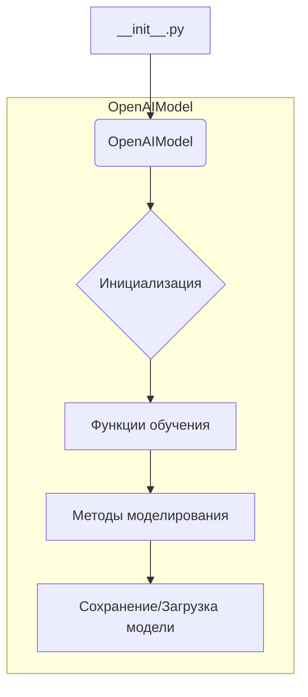
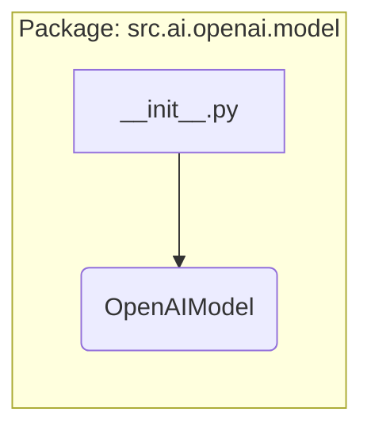

# <input code>

```python
## \file hypotez/src/ai/openai/model/__init__.py
# -*- coding: utf-8 -*-\
#! venv/Scripts/python.exe
#! venv/bin/python/python3.12

"""
.. module: src.ai.openai.model 
	:platform: Windows, Unix
	:synopsis:

"""
MODE = 'dev'


from .training import OpenAIModel
```

# <algorithm>



Этот код является модулем инициализации для пакета `src.ai.openai.model`. Алгоритм прост: он импортирует класс `OpenAIModel` из подмодуля `training`.  В этом случае алгоритм работы сводится к импорту, без каких-либо дополнительных действий или обработки.  Данные в данном случае не передаются, так как импорт - это статическая операция.


# <mermaid>



Диаграмма показывает, что файл `__init__.py` импортирует класс `OpenAIModel` из модуля `training`.  Зависимости - это `OpenAIModel` в папке `training` внутри пакета `src.ai.openai.model`.

# <explanation>

- **Импорты**: Файл `__init__.py` отвечает за инициализацию пакета `src.ai.openai.model`.  Строка `from .training import OpenAIModel` импортирует класс `OpenAIModel` из модуля `training`, который, предположительно, находится в том же каталоге (или вложенном подкаталоге).  Символ `.` в импорте указывает на то, что поиск модуля `training` необходимо проводить относительно текущего файла.  Это типичная практика для организации кода в Python, где `__init__.py` файлов используется для импорта необходимых компонентов пакета.

- **Классы**:  `OpenAIModel` - это ключевой класс, который, скорее всего, содержит методы для работы с моделями OpenAI.  Подробная информация о методах и атрибутах класса должна быть доступна в файле `training.py` (или другом файле, указанном в импорте).

- **Функции**: В данном `__init__.py` нет определенных функций.  Функциональность будет реализована в классах и модулях, которые импортируются.

- **Переменные**: `MODE = 'dev'` - это константа, вероятно, используемая для настройки режима работы приложения (разработка, производство).  Тип - строка.

- **Возможные ошибки или области для улучшений**:  Код достаточно прост и не содержит очевидных ошибок.  Однако, для лучшей читаемости, можно было бы добавить документацию (docstrings) к классу `OpenAIModel` в файле `training.py`. Также, полезно было бы указать, какую именно версию OpenAI API предполагается использовать, и какие параметры конфигурации могут быть настроены в данном пакете.

**Цепочка взаимосвязей с другими частями проекта**:

Файл `__init__.py` в папке `src.ai.openai.model`  является точкой входа для доступа к классу `OpenAIModel`.  Дальнейшее использование этого класса (например, для создания и тренировки моделей) будет определено в других модулях и файлах проекта.  Например, предположительно,  есть файлы, где `OpenAIModel` будет инициализирован, и его методы будут использованы.


В целом, код представляет собой стандартную структуру модуля Python, организованную для лучшей модульности и повторного использования.