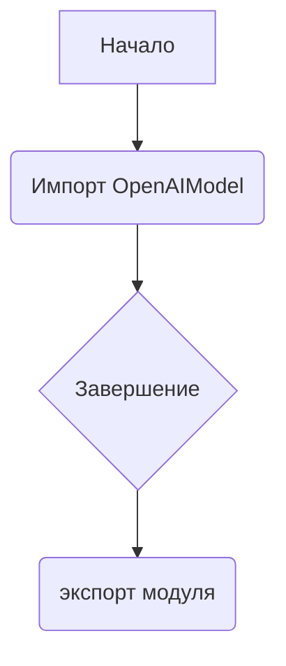
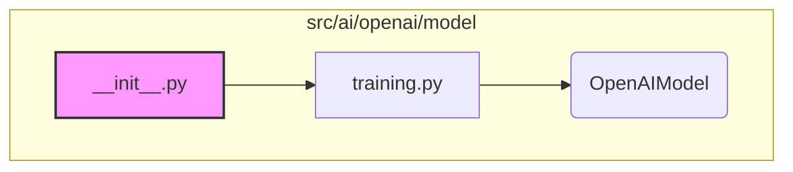

## АНАЛИЗ КОДА: `src/ai/openai/model/__init__.py`

### 1. <алгоритм>

**Блок-схема:**

**Пример:**

1.  **Начало:** Происходит начало выполнения файла `__init__.py`.
2.  **Импорт `OpenAIModel`:** Из файла `training.py` (в той же директории) импортируется класс `OpenAIModel`.
3.  **Завершение:** Процесс импорта завершен.
4.  **Экспорт модуля**: Модуль `src.ai.openai.model` доступен для импорта.
    
### 2. <mermaid>

**Объяснение зависимостей `mermaid`:**

1.  **`__init__.py`**: Представляет текущий файл `__init__.py`.
2.  **`training.py`**: Это файл, из которого импортируется класс `OpenAIModel`. Этот файл находится в той же директории, что и `__init__.py`.
3.  **`OpenAIModel`**: Это класс, который импортируется из файла `training.py` и предоставляется через модуль `src.ai.openai.model`.
4.  **`subgraph`**: Показывает, что все компоненты, связанные с файлом `__init__.py`, находятся в `src/ai/openai/model`

### 3. <объяснение>

**Импорты:**

*   `from .training import OpenAIModel`:
    *   Импортирует класс `OpenAIModel` из файла `training.py`, который находится в той же директории (`.`) как текущий файл `__init__.py`.
    *   Этот импорт позволяет использовать `OpenAIModel` как часть пакета `src.ai.openai.model`, делая его доступным при импорте модуля.

**Классы:**

*   `OpenAIModel`:
    *   Класс, который, как предполагается, определен в файле `training.py`.
    *   Вероятно, представляет собой модель, использующую API OpenAI, или какой-либо связанный с OpenAI функционал.
    *   Фактическая реализация класса находится в `training.py`, но через этот `__init__.py`, его можно будет вызывать так `from src.ai.openai.model import OpenAIModel`

**Функции:**

*   В предоставленном коде нет функций.

**Переменные:**

*   В предоставленном коде нет явных переменных, кроме стандартных переменных окружения Python.

**Объяснение:**

*   Файл `__init__.py` выполняет роль точки входа в пакет `src.ai.openai.model`.
*   Импортируя `OpenAIModel` из `training.py`, он делает этот класс доступным для использования при импорте пакета `src.ai.openai.model`.
*   Этот шаблон обычен для пакетов Python: файл `__init__.py` управляет тем, что экспортируется из пакета.
*   `# -*- coding: utf-8 -*-` - устанавливает кодировку файла
*   `#! venv/bin/python/python3.12` - указывает интерпретатор python который должен быть использован.

**Потенциальные ошибки и области для улучшения:**

*   В текущем виде код не содержит ошибок.
*   Улучшения могут быть внесены в документации `__init__.py` ( docstring ).
*   Дальнейшее развитие пакета может включать импорт других классов или функций в `__init__.py`, чтобы сделать их доступными как часть пакета `src.ai.openai.model`.

**Взаимосвязи с другими частями проекта:**

*   Предполагается, что `src.ai.openai.model` будет использоваться другими частями проекта, которые хотят использовать функциональность, связанную с моделями OpenAI, через `OpenAIModel` class, или другие компоненты в дальнейшем.
*   Другие модули в `src` могут импортировать `OpenAIModel` из этого пакета, используя `from src.ai.openai.model import OpenAIModel`.
*   Модуль `src.ai.openai.model` скорее всего, будет частью более крупной системы, которая использует этот пакет для интеграции функциональности OpenAI.