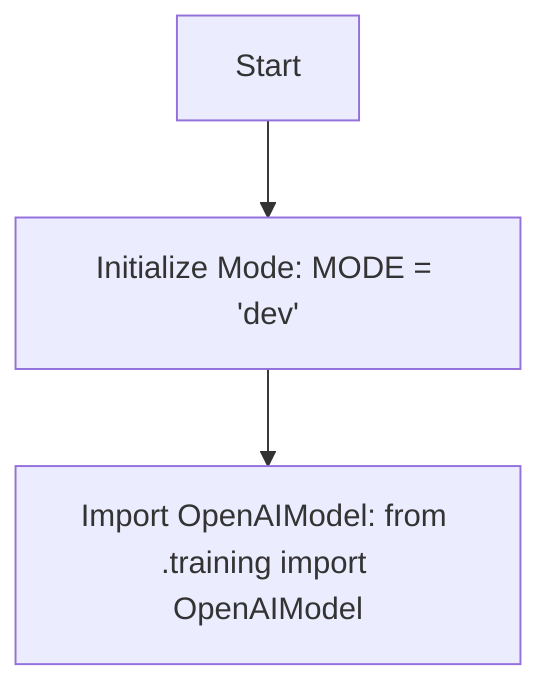

# Анализ кода `hypotez/src/ai/openai/model/__init__.py`

## <алгоритм>

1. **Инициализация режима:**
   - Устанавливается переменная `MODE` в значение `'dev'`. Это, вероятно, указывает на режим разработки.
   - **Пример:** `MODE = 'dev'`.

2. **Импорт класса `OpenAIModel`:**
   - Из файла `training.py`, находящегося в текущей директории, импортируется класс `OpenAIModel`. Это предполагает, что класс `OpenAIModel` используется для работы с моделями OpenAI.
   - **Пример:** `from .training import OpenAIModel`.

## <mermaid>

## <объяснение>

### Импорты

-   `from .training import OpenAIModel`:
    -   Этот импорт означает, что из модуля `training.py`, находящегося в той же директории (обозначено `.` перед `training`), импортируется класс `OpenAIModel`.
    -   Этот класс, вероятно, отвечает за конкретную логику работы с моделями OpenAI, например, их обучение или использование.
    -   Использование относительного импорта `.` подразумевает, что `training.py` является частью того же пакета `src.ai.openai.model`.

### Переменные

-   `MODE`:
    -   Это глобальная переменная, инициализированная строкой `'dev'`. Она используется для определения текущего режима работы приложения.
    -   Наличие такой переменной обычно указывает на то, что код может иметь разное поведение в зависимости от значения `MODE`, например, `'prod'` (production) для производственного режима.
    -   Тип: `str`.
    -   Использование: Возможно, используется для условной компиляции, переключения между разными наборами настроек или для журналирования.

### Общее

-   **Роль модуля**:
    -   Файл `__init__.py` в Python превращает директорию `model` в пакет.
    -   Это позволяет импортировать модули из `model` и использовать их как часть пакета `src.ai.openai.model`.
    -   В данном случае, он инициализирует режим работы и делает доступным класс `OpenAIModel` из модуля `training.py` для использования в других частях проекта.

-   **Цепочка взаимосвязей**:
    -   Этот модуль является частью пакета `src.ai.openai.model`.
    -   Использует класс `OpenAIModel` из модуля `training`, который, вероятно, содержит логику взаимодействия с API OpenAI.
    -   Другие части проекта, импортируя `src.ai.openai.model` и используя `OpenAIModel`, могут использовать функции и методы, связанные с моделями OpenAI.

-   **Потенциальные улучшения**:
    -   Возможно, в будущем понадобится расширить список доступных классов и переменных.
    -   Можно рассмотреть возможность использования переменных окружения для установки `MODE` вместо жесткого кодирования значения `'dev'` в коде. Это сделало бы настройку режима более гибкой.
    -   Необходимо проверить наличие других модулей в проекте, которые также используют `MODE`, чтобы обеспечить согласованность поведения.