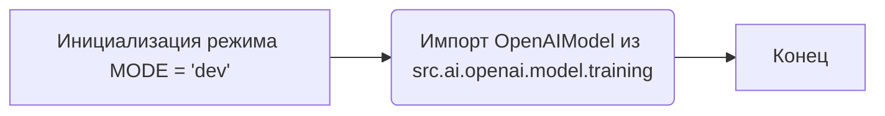

## Анализ кода `hypotez/src/ai/openai/model/__init__.py`

### <алгоритм>

1. **Инициализация режима (`MODE = 'dev'`)**:
   - Устанавливается переменная `MODE` в значение `'dev'`. Это может использоваться для определения, в каком режиме (разработка, тестирование, продакшн) выполняется код, влияя на поведение других частей программы.
   - _Пример_:  `if MODE == 'dev': print("Режим разработки")`

2. **Импорт класса `OpenAIModel`**:
   - Импортируется класс `OpenAIModel` из модуля `src.ai.openai.model.training`. Этот класс, вероятно, содержит логику для взаимодействия с моделями OpenAI.
   - _Пример_: `model = OpenAIModel(api_key="your_api_key")` (предполагая, что `OpenAIModel` имеет такой конструктор).

### <mermaid>

**Объяснение зависимостей в `mermaid`**:

- `A`: Начало процесса, где устанавливается глобальная переменная `MODE`.
- `B`: Импортируется класс `OpenAIModel` из модуля `training`, расположенного в том же пакете, что указывает на зависимость между модулями.
- `C`: Завершение процесса импорта и инициализации.

### <объяснение>

**Импорты:**

- `from .training import OpenAIModel`:
    - **Назначение**: Импортирует класс `OpenAIModel` из модуля `training`, который находится в той же директории (`.`). Это означает, что `training.py` является частью того же пакета `src.ai.openai.model`.
    - **Взаимосвязь с другими пакетами `src`**:  Этот импорт устанавливает зависимость модуля `__init__.py` от модуля `training.py`.  Это позволяет использовать функциональность, реализованную в классе `OpenAIModel`, в других частях проекта, импортировав данный модуль `src.ai.openai.model`.

**Переменные:**

- `MODE = 'dev'`:
    - **Тип**: Строка (`str`).
    - **Использование**: Устанавливает режим работы приложения. Обычно используется для разделения настроек и логики между режимами разработки (`'dev'`), тестирования (`'test'`) и продакшна (`'prod'`). В данном случае, по умолчанию установлен режим разработки. Значение переменной `MODE` может влиять на логику программы, например, включать или отключать логирование, дебаг-информацию, или использовать различные наборы данных и конфигурации.

**Классы:**

- `OpenAIModel`:
    - **Роль**: Исходя из контекста, этот класс, вероятно, предоставляет интерфейс для взаимодействия с моделями OpenAI. Он может содержать методы для отправки запросов к API OpenAI, обработки ответов и управления моделью.
    - **Атрибуты и методы**: Атрибуты и методы определены в модуле `training.py`, поэтому они не видны в `__init__.py`.  Предположительно, могут быть атрибуты для хранения API ключа и методы для отправки запросов к OpenAI, обработки ответов и т.д.
    - **Взаимодействие**: `OpenAIModel` будет использоваться в других частях проекта для взаимодействия с моделями OpenAI.

**Функции**:

- В данном файле нет функций.

**Потенциальные ошибки и области для улучшения:**

- **Отсутствие обработки `MODE`**: Код просто устанавливает значение переменной, но нигде его не использует. Необходимо внедрить логику, которая будет зависеть от значения `MODE`, например, изменять конфигурации или поведение в зависимости от режима.
- **Предполагаемая структура `OpenAIModel`**:  Без просмотра кода `training.py` можно только предполагать функционал класса.
- **Отсутствие документации**: Модуль не содержит подробных docstring для класса `OpenAIModel` в `training.py`, что затрудняет понимание его работы.

**Цепочка взаимосвязей с другими частями проекта:**

- Данный модуль `src.ai.openai.model` предоставляет интерфейс для работы с моделями OpenAI. Его предполагается использовать в других частях проекта, таких как сервисы или другие модули, которые будут непосредственно использовать модели OpenAI.
- Например,  другой модуль в `src.ai` может импортировать `OpenAIModel` и использовать его методы для выполнения задач, таких как генерация текста или классификация.