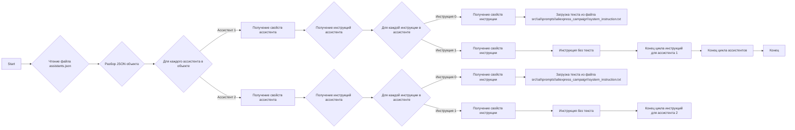
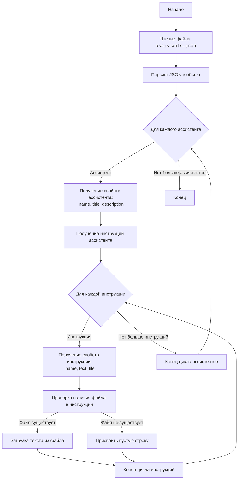

## Анализ кода `assistants.json`

### 1. `<алгоритм>`:

Файл `assistants.json` представляет собой JSON-объект, содержащий конфигурацию для двух ассистентов. 

**Блок-схема:**

**Примеры:**

- **Чтение файла:** Загрузка содержимого файла `assistants.json`.
- **Разбор JSON:** Преобразование текстового содержимого в объект JSON, представленный в Python как словарь.
- **Для каждого ассистента:** Перебор ключей верхнего уровня словаря (в данном случае "asst_dr5AgQnhhhnef5OSMzQ9zdk9" и "asst_uDr5aVY3qRByRwt5qFiMDk43").
- **Получение свойств ассистента:** Извлечение значений ключей "name", "title", "description".
- **Получение инструкций ассистента:** Извлечение значения ключа "instructions", которое является словарем инструкций.
- **Для каждой инструкции в ассистенте:** Перебор ключей словаря "instructions".
- **Получение свойств инструкции:** Извлечение значений ключей "name", "text", "file".
- **Загрузка текста из файла:**  Чтение содержимого файла, указанного в ключе `file`, если таковой имеется.
- **Инструкция без текста:** Если в инструкции отсутствует ключ `file` или `text` , то пропускается шаг загрузки текста и используется пустая строка.
- **Конец цикла инструкций для ассистента:** Окончание перебора инструкций для текущего ассистента.
- **Конец цикла ассистентов:** Завершение перебора всех ассистентов.
- **Конец:** Завершение обработки файла `assistants.json`.

### 2. `<mermaid>`:

**Объяснение зависимостей `mermaid`:**

- `flowchart TD`: Указывает, что это блок-схема, и направление потока сверху вниз.
- `Start`, `ReadFile`, `ParseJSON`, `LoopAssistants`, `GetAssistantProperties`, `GetInstructions`, `LoopInstructions`, `GetInstructionProperties`, `CheckFile`,`LoadTextFromFile`,`SetEmptyText`,`EndInstructionLoop`,`EndAssistantLoop`, `End`: Это узлы диаграммы, представляющие шаги или состояния в процессе.
- `-->`: Обозначает поток управления между узлами.
- `{}`: Используется для условий.
- `[ ]`: Используется для отображения конкретных шагов.
- ` `: Разрыв строки для многострочного текста.

### 3. `<объяснение>`:

**Импорты:**

- В этом файле нет импортов, так как это конфигурационный файл в формате JSON, а не код Python.

**Классы:**

- В этом файле нет классов, так как это файл данных в формате JSON.

**Функции:**

- В этом файле нет функций, так как это файл данных в формате JSON.

**Переменные:**

- `"asst_dr5AgQnhhhnef5OSMzQ9zdk9"` и `"asst_uDr5aVY3qRByRwt5qFiMDk43"`: Ключи верхнего уровня JSON-объекта, представляющие уникальные идентификаторы ассистентов.
- `"name"`: Название ассистента.
- `"title"`: Заголовок ассистента (в данном случае пустая строка).
- `"description"`: Описание назначения ассистента.
- `"instructions"`: Словарь с инструкциями для ассистента.
- `"0"` и `"1"`: Ключи словаря "instructions", представляющие порядковый номер инструкций.
- `"text"`: Текст инструкции (в данном случае пустая строка).
- `"file"`: Путь к файлу с текстом инструкции.

**Объяснение:**

Файл `assistants.json` содержит конфигурацию для ассистентов, используемых в системе. Каждый ассистент имеет имя, описание и набор инструкций. Инструкции могут содержать текст, который либо напрямую задан, либо загружается из файла.

**Ассистент `asst_dr5AgQnhhhnef5OSMzQ9zdk9`:**
- **name**: "create promo: product_names->categories- titles, description"
- **description**: "Create a JSON with name and description for product titles list"
- **Инструкции:**
    - Инструкция `0`: загружает текст из файла `src/ai/prompts/aliexpress_campaign/system_instruction.txt`.
    - Инструкция `1`: не содержит текста.

**Ассистент `asst_uDr5aVY3qRByRwt5qFiMDk43`:**
- **name**: "developer for hypo code"
- **description**: "Create a JSON with name and description for product titles list"
- **Инструкции:**
    - Инструкция `0`: загружает текст из файла `src/ai/prompts/aliexpress_campaign/system_instruction.txt`.
    - Инструкция `1`: не содержит текста.

**Цепочка взаимосвязей:**

Файл `assistants.json` используется в модуле `src.ai` для определения конфигурации ассистентов, которые, вероятно, используются для генерации текста или выполнения других задач, связанных с искусственным интеллектом. Файл `src/ai/prompts/aliexpress_campaign/system_instruction.txt` содержит системные инструкции для этих ассистентов, которые являются частью контекста для их работы. 

**Потенциальные ошибки и области для улучшения:**

- **Отсутствие проверки на существование файла:** Код, использующий этот файл, должен проверять, существует ли файл, указанный в поле `"file"`.
- **Отсутствие обработки ошибок загрузки файла:**  В случае ошибки загрузки файла следует предусмотреть обработку ошибок, например, ведение журнала или возврат значения по умолчанию.
- **Отсутствие валидации данных:** Не помешает добавить валидацию данных, чтобы убедиться, что поля содержат правильные значения.
- **Дублирование кода:** Описание и инструкции для обоих ассистентов похожи.  Можно рассмотреть возможность использования шаблонов или общих конфигураций для уменьшения дублирования.

**Заключение:**

Файл `assistants.json` содержит конфигурацию для ассистентов, которая используется в проекте.  Он определяет имена, описания и инструкции для каждого ассистента. Код, который обрабатывает этот файл, должен учитывать потенциальные ошибки и возможности для улучшения, указанные выше.