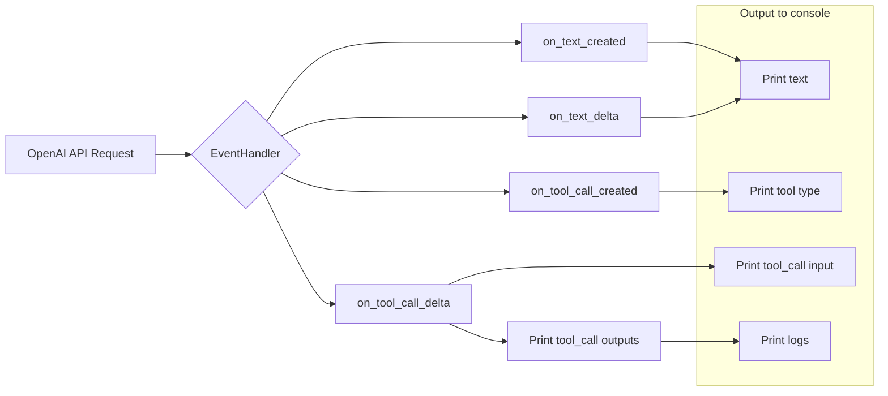

# <input code>

```python
## \file hypotez/src/ai/openai/model/event_handler.py
# -*- coding: utf-8 -*-\
#! venv/Scripts/python.exe
#! venv/bin/python/python3.12

"""
.. module: src.ai.openai.model 
	:platform: Windows, Unix
	:synopsis:

"""
MODE = 'dev'


""" https://github.com/openai/openai-python/blob/main/helpers.md#assistant-events """

from typing_extensions import override
from openai import AssistantEventHandler, OpenAI
from openai.types.beta.threads import Text, TextDelta
from openai.types.beta.threads.runs import ToolCall, ToolCallDelta


# First, we create a EventHandler class to define
# how we want to handle the events in the response stream.

class EventHandler(AssistantEventHandler):
  """ """

  @override
  def on_text_created(self, text: Text) -> None:
    print(f"\\nassistant > ", end="", flush=True)

  @override
  def on_text_delta(self, delta: TextDelta, snapshot: Text):
    print(delta.value, end="", flush=True)

  @override
  def on_tool_call_created(self, tool_call: ToolCall):
    print(f"\\nassistant > {tool_call.type}\\n", flush=True)

  @override
  def on_tool_call_delta(self, delta: ToolCallDelta, snapshot: ToolCall):
    if delta.type == "code_interpreter" and delta.code_interpreter:
      if delta.code_interpreter.input:
        print(delta.code_interpreter.input, end="", flush=True)
      if delta.code_interpreter.outputs:
        print(f"\\n\\noutput >", flush=True)
        for output in delta.code_interpreter.outputs:
          if output.type == "logs":
            print(f"\\n{output.logs}", flush=True)

# Then, we use the `stream` SDK helper
# with the `EventHandler` class to create the Run
# and stream the response.
```

# <algorithm>

**Шаг 1:** Импортируются необходимые модули.
**Пример:** `from openai import AssistantEventHandler, OpenAI`.  Эти импорты дают доступ к классам и функциям из библиотеки `openai`.

**Шаг 2:** Определяется класс `EventHandler`, наследующий от `AssistantEventHandler`.
**Пример:** `class EventHandler(AssistantEventHandler)`.  Этот класс предназначен для обработки событий, возникающих при взаимодействии с API OpenAI.

**Шаг 3:** Определяются методы для обработки событий.
**Пример:** `on_text_created`, `on_text_delta`, `on_tool_call_created`, `on_tool_call_delta`. Каждый метод отвечает за обработку определенного события. Эти методы получают данные о событии как аргументы.

**Шаг 4:** Методы `on_tool_call_delta` обрабатывает события  `tool_call`.
**Пример:**  Если тип инструмента `code_interpreter`, он выводит входные данные инструмента, а затем все выходные данные, включая логи, если таковые имеются.  Данные передаются через аргументы  `delta` и `snapshot` , содержащие информацию о текущем состоянии и изменениях события.

**Шаг 5:** Результат работы этих обработчиков событий (например, вывод в консоль) отображается в реальном времени, как поток данных.

**Пример потока данных**:
1. Запрос отправляется в OpenAI.
2. OpenAI возвращает события (text, tool_calls) по частям.
3. Обработчик событий `EventHandler` получает эти события.
4. Обработчики событий `on_text_created`, `on_text_delta` отображают текст в консоли.
5. Обработчик событий `on_tool_call_delta` выводит ввод и вывод вызова инструмента (если это `code_interpreter`).

# <mermaid>



# <explanation>

**Импорты:**

* `from typing_extensions import override`: Используется для аннотаций типов, особенно для переопределения методов в базовом классе. Связь с другими пакетами:  `typing_extensions` часть стандартных библиотек Python для типов данных.
* `from openai import AssistantEventHandler, OpenAI`:  Импортирует классы `AssistantEventHandler` и `OpenAI` из библиотеки `openai`.  Связь с другими пакетами:  `openai` - внешняя библиотека, предоставляющая интерфейс для API OpenAI.
* `from openai.types.beta.threads import Text, TextDelta`: Импортирует типы данных `Text` и `TextDelta` из модуля `openai.types.beta.threads`, которые представляют текстовые данные и изменения. Связь с другими пакетами: `openai.types` содержат типы данных для API OpenAI.
* `from openai.types.beta.threads.runs import ToolCall, ToolCallDelta`: Импортирует типы данных `ToolCall` и `ToolCallDelta` для обработки вызовов инструментов.  Связь с другими пакетами:  `openai.types.beta.threads.runs` содержат типы данных, относящиеся к запускам (runs) в API OpenAI.

**Классы:**

* `EventHandler`:  Этот класс служит для обработки событий, возвращаемых API OpenAI при выполнении запроса. Он переопределяет методы обработки различных событий, например, текстовых сообщений и вызовов инструментов.

**Функции:**

* `on_text_created`, `on_text_delta`, `on_tool_call_created`, `on_tool_call_delta`:  Эти методы (переопределения) обрабатывают события, поступающие из API OpenAI.  Они предназначены для вывода информации в консоль в реальном времени.  Аргументы - типы данных, полученные из OpenAI, возвращаемое значение `None`.


**Переменные:**

* `MODE`: Переменная, хранящая строку 'dev'.  Очевидно,  используется для управления режимами работы, но её значение здесь не используется.


**Возможные ошибки и улучшения:**

* **Обработка ошибок:**  Код не содержит обработку ошибок, которые могут возникнуть при взаимодействии с API OpenAI.  Важно добавить механизмы проверки ответа, например, проверять `http` статус, чтобы предотвратить внезапное завершение программы.
* **Логирование:** Вместо `print`, следует использовать `logging` для записи событий в файл.  Это обеспечит  детализированный лог и сделает код более гибким для отладки и дальнейшего использования.
* **Обработка исключений:**  Необходимо добавить обработку возможных исключений (например, исключений `openai`).
* **Добавление аннотаций:** Добавьте аннотации типов для переменных, чтобы повысить читаемость и корректность кода.
* **Константы:**  Можно создать константы для значений, которые используются несколько раз.


**Взаимосвязи с другими частями проекта:**

Этот код, скорее всего, используется в более широком контексте приложения, где происходит взаимодействие с API OpenAI.   Он обрабатывает потоковое получение данных от OpenAI (напр., ответы на вопросы, результаты работы с инструментами).  Следующим шагом может быть обработка этих данных или использование их в других частях приложения.