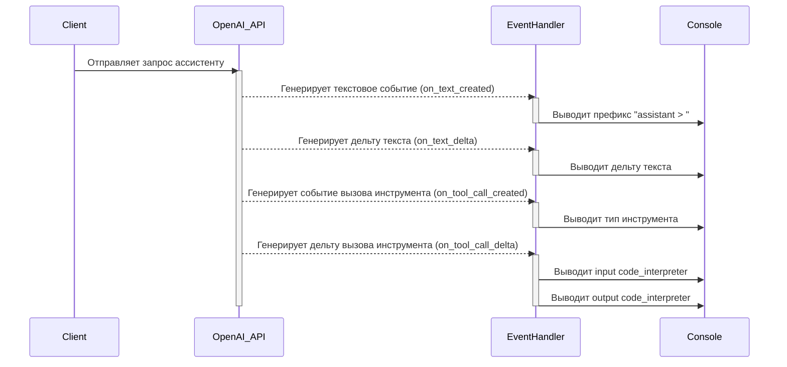

## Анализ кода `hypotez/src/ai/openai/model/event_handler.py`

### <алгоритм>

1.  **Инициализация**:
    *   Объявляется переменная `MODE` со значением `'dev'`.
    *   Импортируются необходимые классы и типы из библиотек `typing_extensions` и `openai`.
        *   `override` для переопределения методов.
        *   `AssistantEventHandler` и `OpenAI` из `openai`.
        *   `Text`, `TextDelta`, `ToolCall`, `ToolCallDelta` для работы с данными от OpenAI.
2.  **Создание класса `EventHandler`**:
    *   Создается класс `EventHandler`, наследующий от `AssistantEventHandler`.
    *   Класс `EventHandler` определяет методы для обработки событий, генерируемых при работе с ассистентами OpenAI.
3.  **Метод `on_text_created`**:
    *   Этот метод вызывается при создании нового текстового сообщения от ассистента.
    *   Выводит в консоль префикс `"assistant > "`.
4.  **Метод `on_text_delta`**:
    *   Этот метод вызывается при получении дельты (изменения) текстового сообщения от ассистента.
    *   Выводит в консоль значение дельты, что позволяет отображать текст по мере его генерации.
5.  **Метод `on_tool_call_created`**:
    *   Этот метод вызывается при создании нового вызова инструмента (например, code interpreter) от ассистента.
    *   Выводит в консоль тип инструмента, например `"assistant > code_interpreter"`.
6.  **Метод `on_tool_call_delta`**:
    *   Этот метод вызывается при получении дельты вызова инструмента.
    *   Проверяет, является ли инструмент `code_interpreter`.
    *   Если это `code_interpreter`, то выводит:
        *   `input` (код, который выполняет `code_interpreter`).
        *   `outputs` (результат выполнения кода). Если `output.type == "logs"`, то печатает логи.
    *   Пример:
        *   `delta.code_interpreter.input` может содержать: `print("Hello, world!")`.
        *   `delta.code_interpreter.outputs` может содержать `{"type": "logs", "logs": "Hello, world!\n"}`.

**Поток данных:**

1.  Клиент отправляет запрос в OpenAI API.
2.  OpenAI ассистент генерирует ответ, который может включать текстовые сообщения и вызовы инструментов.
3.  События (текст создан, дельта текста, вызов инструмента создан, дельта вызова инструмента) обрабатываются в классе `EventHandler`.
4.  Соответствующие методы `EventHandler` (`on_text_created`, `on_text_delta`, `on_tool_call_created`, `on_tool_call_delta`) вызываются, и выводятся данные в консоль.

### <mermaid>

**Зависимости в mermaid диаграмме:**

*   **Client**: Представляет клиента, инициирующего запрос.
*   **OpenAI_API**: Представляет API OpenAI, который обрабатывает запрос и генерирует события.
*   **EventHandler**:  Представляет класс `EventHandler`, который обрабатывает события от OpenAI.
*   **Console**: Представляет консоль, куда выводится информация.

Диаграмма показывает последовательность взаимодействия между этими компонентами, начиная с запроса клиента и заканчивая выводом данных в консоль через обработку событий.

### <объяснение>

#### Импорты

*   `typing_extensions.override`:  Используется для указания, что метод переопределяет метод родительского класса.  Это улучшает читаемость кода и помогает предотвратить ошибки при рефакторинге.
*   `openai.AssistantEventHandler`:  Базовый класс для обработчиков событий, связанных с ассистентами OpenAI.  Наш класс `EventHandler` наследует от него, переопределяя его методы для обработки конкретных событий.
*   `openai.OpenAI`:  Класс для взаимодействия с OpenAI API.  В данном коде напрямую не используется, но он необходим для работы `AssistantEventHandler`.
*   `openai.types.beta.threads.Text`, `openai.types.beta.threads.TextDelta`:  Типы данных, представляющие текстовые сообщения и их изменения (дельты), полученные от OpenAI ассистента.
*   `openai.types.beta.threads.runs.ToolCall`, `openai.types.beta.threads.runs.ToolCallDelta`: Типы данных, представляющие вызовы инструментов и их изменения, полученные от OpenAI ассистента.

#### Класс `EventHandler`

*   **Роль**: Обрабатывает события, генерируемые при работе с ассистентами OpenAI, и выводит соответствующую информацию в консоль.
*   **Атрибуты**: Отсутствуют.
*   **Методы**:
    *   `on_text_created(self, text: Text) -> None`:  Вызывается при создании нового текстового сообщения. Выводит в консоль префикс "assistant > ".
    *   `on_text_delta(self, delta: TextDelta, snapshot: Text) -> None`:  Вызывается при получении дельты текстового сообщения. Выводит в консоль значение дельты.
    *   `on_tool_call_created(self, tool_call: ToolCall) -> None`:  Вызывается при создании нового вызова инструмента. Выводит в консоль тип инструмента.
    *   `on_tool_call_delta(self, delta: ToolCallDelta, snapshot: ToolCall) -> None`:  Вызывается при получении дельты вызова инструмента.  Проверяет тип инструмента (если `code_interpreter`) и выводит в консоль input и output.
*   **Взаимодействие**:  Класс взаимодействует с OpenAI API через события, которые он обрабатывает, и выводит данные в консоль. Он может быть использован для более сложной обработки данных (например, сохранение в базу данных).

#### Функции

*   **Отсутствуют**. Методы класса `EventHandler` обрабатывают события и не являются самостоятельными функциями.

#### Переменные

*   `MODE`:  Глобальная переменная, определяющая режим работы приложения (в данном случае `'dev'`).  Может использоваться для выбора различных конфигураций или поведения приложения в зависимости от окружения.

#### Потенциальные ошибки и области для улучшения

*   **Обработка ошибок**:  В коде отсутствует обработка ошибок, которая может возникнуть при взаимодействии с OpenAI API.  Необходимо добавить блоки `try-except` для обработки возможных исключений, таких как ошибки сети, ошибки авторизации или ошибки API.
*   **Вывод в консоль**:  Вывод в консоль не подходит для продакшн-окружения. Следует добавить возможность вывода в логи или другие хранилища данных.
*   **Гибкость**:  Класс `EventHandler` жестко привязан к выводу в консоль. Можно сделать его более гибким, добавив возможность настраивать, куда именно выводить информацию.
*   **Поддержка других инструментов**: Код обрабатывает только `code_interpreter`.  Нужно расширить обработку и для других типов инструментов, если таковые будут использоваться.
*   **Обработка JSON**: В `code_interpreter.outputs` могут приходить JSON'ы, для них стоит предусмотреть парсинг и вывод в читаемом формате.

#### Цепочка взаимосвязей с другими частями проекта

1.  **Запрос клиента**:  Клиент (например, пользователь веб-приложения или CLI) отправляет запрос, содержащий текст или инструкции для ассистента OpenAI.
2.  **Взаимодействие с OpenAI API**:  Запрос передается в OpenAI API с использованием SDK (вероятно, через класс, использующий `OpenAI` из импортов).
3.  **Обработка событий**:  Когда OpenAI ассистент генерирует ответ, API отправляет события, которые обрабатывает `EventHandler`.
4.  **Вывод в консоль**:  `EventHandler` выводит отформатированную информацию о текстовых сообщениях и вызовах инструментов в консоль.
5.  **Возвращение ответа клиенту**:  Обработанный ответ (в данном случае вывод в консоль, но в общем случае он может быть передан клиенту через HTTP, websocket или другими способами).

В общем случае, этот код является частью слоя, отвечающего за взаимодействие с OpenAI API и обработку ответов. Другие части проекта могут включать слой для обработки клиентских запросов, слой для хранения данных и слой для пользовательского интерфейса.