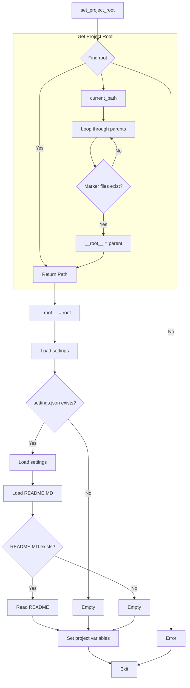

# <input code>

```python
## \file hypotez/src/logger/header.py
# -*- coding: utf-8 -*-
#! venv/Scripts/python.exe
#! venv/bin/python/python3.12

"""
module: src.logger 
	:platform: Windows, Unix
	:synopsis: Модуль определяющий корневой путь к проекту. Все импорты строятся относительно этого пути.
    :TODO: В дальнейшем перенести в системную переменную
"""
MODE = 'dev'

import sys
import json
from packaging.version import Version

from pathlib import Path
def set_project_root(marker_files=('pyproject.toml', 'requirements.txt', '.git')) -> Path:
    """
    Finds the root directory of the project starting from the current file's directory,
    searching upwards and stopping at the first directory containing any of the marker files.

    Args:
        marker_files (tuple): Filenames or directory names to identify the project root.
    
    Returns:
        Path: Path to the root directory if found, otherwise the directory where the script is located.
    """
    __root__:Path
    current_path:Path = Path(__file__).resolve().parent
    __root__ = current_path
    for parent in [current_path] + list(current_path.parents):
        if any((parent / marker).exists() for marker in marker_files):
            __root__ = parent
            break
    if __root__ not in sys.path:
        sys.path.insert(0, str(__root__))
    return __root__


# Get the root directory of the project
__root__ = set_project_root()
"""__root__ (Path): Path to the root directory of the project"""

from src import gs

settings:dict = None
try:
    with open(gs.path.root / 'src' /  'settings.json', 'r') as settings_file:
        settings = json.load(settings_file)
except (FileNotFoundError, json.JSONDecodeError):
    ...

doc_str:str = None
try:
    with open(gs.path.root / 'src' /  'README.MD', 'r') as settings_file:
        doc_str = settings_file.read()
except (FileNotFoundError, json.JSONDecodeError):
    ...


__project_name__ = settings.get("project_name", 'hypotez') if settings  else 'hypotez'
__version__: str = settings.get("version", '')  if settings  else ''
__doc__: str = doc_str if doc_str else ''
__details__: str = ''
__author__: str = settings.get("author", '')  if settings  else ''
__copyright__: str = settings.get("copyrihgnt", '')  if settings  else ''
__cofee__: str = settings.get("cofee", "Treat the developer to a cup of coffee for boosting enthusiasm in development: https://boosty.to/hypo69")  if settings  else "Treat the developer to a cup of coffee for boosting enthusiasm in development: https://boosty.to/hypo69"
```

# <algorithm>

**Шаг 1:**  Функция `set_project_root` ищет корневой каталог проекта.

*   **Вход:** Кортеж `marker_files` с именами файлов/папок, которые указывают на корень проекта.
*   **Логика:**  Начинает поиск с текущей директории файла (`__file__`) и поднимается по иерархии директорий. Для каждой директории проверяет, существует ли хотя бы один из файлов/папок в списке `marker_files`.
*   **Выход:** Путь к корневому каталогу (`Path`) или директории, где находится скрипт.

**Шаг 2:** Если найденный корневой каталог не присутствует в пути поиска (`sys.path`), то он добавляется в начало этого списка.

**Шаг 3:**  Загрузка настроек из файла `settings.json` в переменную `settings`.

*   **Логика:** Проверяет существование файла `settings.json` в директории `gs.path.root / 'src'`. Если файл существует, загружает его содержимое как словарь.
*   **Обработка ошибок:** При `FileNotFoundError` или `json.JSONDecodeError` выполняется блок `...`, который, в данном контексте,  предполагается пустым.
* **Пример:**  Если в `settings.json` есть ключ `project_name` со значением `MyProject`, то `__project_name__` получит значение `MyProject`.


**Шаг 4:** Загрузка документации из файла `README.MD` в переменную `doc_str`.

*  **Логика:** Аналогично шагу 3, но для файла `README.MD`.
*   **Обработка ошибок:** Аналогично шагу 3.

**Шаг 5:** Извлечение значений настроек и их присвоение переменным (например, `__project_name__`, `__version__`, `__author__`).

*  **Логика:** Функция `settings.get` извлекает значения из словаря `settings`, используя значения по умолчанию в случае отсутствия ключей.
*  **Пример:** Если в `settings` нет значения для ключа `project_name`, то `__project_name__` получит значение по умолчанию ('hypotez').


# <mermaid>



**Зависимости:**

*   `pathlib`: для работы с путями к файлам.
*   `json`: для работы с JSON файлами.
*   `packaging.version`:  для работы с версиями.
*   `sys`: для взаимодействия с интерпретатором Python.
*   `gs`: для работы с другими модулями проекта, скорее всего, для доступа к глобальным переменным или функциям.


# <explanation>

**Импорты:**

*   `sys`: Предоставляет доступ к системным переменным и функциям.
*   `json`: Используется для работы с JSON-файлами.
*   `packaging.version`: Нужен для работы с версиями.
*   `pathlib`:  Обеспечивает объектно-ориентированный подход к работе с файлами и каталогами.
*   `gs`: Очевидно, это часть собственного кода проекта (`src`), предоставляющая функции для работы с ресурсами проекта.

**Классы:**

Код не содержит классов.

**Функции:**

*   `set_project_root(marker_files)`: Ищет корневой каталог проекта, начиная с текущей директории и поднимаясь вверх по иерархии директорий.  Возвращает `Path` объекта для корневого каталога.
Аргументы:
    *   `marker_files`: кортеж имен файлов/папок, которые указывают на корневой каталог (по умолчанию: `pyproject.toml`, `requirements.txt`, `.git`).
Возвращаемые значения:
    *   Путь к корневому каталогу (тип `Path`).


**Переменные:**

*   `MODE`: Строковая переменная, хранящая режим работы (в данном случае `'dev'`).
*   `__root__`: Переменная, хранящая путь к корневому каталогу проекта.
*   `settings`: Словарь, хранящий настройки проекта, загруженные из файла `settings.json`.
*   `doc_str`: Строка, хранящая содержимое файла `README.MD`.
*   `__project_name__`, `__version__`, `__author__`, `__copyright__`, `__cofee__`:  Переменные, содержащие данные из настроек.
*  `__doc__`, `__details__` - пустые переменные для документации, используются в случае отсутствия  `README.MD`


**Возможные ошибки/улучшения:**

*   Обработка исключений при работе с файлами (например, `FileNotFoundError`) не всегда выполняется надлежащим образом.  Возможны ситуации, когда файлы  `settings.json` или `README.MD` не существуют.
*   Было бы полезным добавить проверку на существование файлов, прежде чем пытаться с ними работать, в этом случае исключения обрабатываются более корректно.
*   Вместо  `if settings` для проверки наличия словаря `settings` можно использовать `if settings is not None`.
*  В коде присутствует имя `copyrihgnt`, возможно, оно должно быть `copyright`.


**Связь с другими частями проекта:**

Модуль `gs` указывает на зависимость от другой части проекта.  Вероятно, `gs` содержит информацию о путях к ресурсам проекта (`gs.path.root`). Этот код устанавливает корневой путь в `sys.path`.