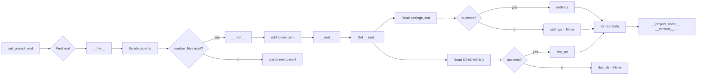

```MD
# Анализ кода hypotez/src/logger/header.py

## <input code>

```python
## \file hypotez/src/logger/header.py
# -*- coding: utf-8 -*-
#! venv/Scripts/python.exe
#! venv/bin/python/python3.12

"""
module: src.logger 
	:platform: Windows, Unix
	:synopsis: Модуль определяющий корневой путь к проекту. Все импорты строятся относительно этого пути.
    :TODO: В дальнейшем перенести в системную переменную
"""
MODE = 'dev'

import sys
import json
from packaging.version import Version

from pathlib import Path
def set_project_root(marker_files=('pyproject.toml', 'requirements.txt', '.git')) -> Path:
    """
    Finds the root directory of the project starting from the current file's directory,
    searching upwards and stopping at the first directory containing any of the marker files.

    Args:
        marker_files (tuple): Filenames or directory names to identify the project root.
    
    Returns:
        Path: Path to the root directory if found, otherwise the directory where the script is located.
    """
    __root__:Path
    current_path:Path = Path(__file__).resolve().parent
    __root__ = current_path
    for parent in [current_path] + list(current_path.parents):
        if any((parent / marker).exists() for marker in marker_files):
            __root__ = parent
            break
    if __root__ not in sys.path:
        sys.path.insert(0, str(__root__))
    return __root__


# Get the root directory of the project
__root__ = set_project_root()
"""__root__ (Path): Path to the root directory of the project"""

from src import gs

settings:dict = None
try:
    with open(gs.path.root / 'src' / 'settings.json', 'r') as settings_file:
        settings = json.load(settings_file)
except (FileNotFoundError, json.JSONDecodeError):
    ...

doc_str:str = None
try:
    with open(gs.path.root / 'src' / 'README.MD', 'r') as settings_file:
        doc_str = settings_file.read()
except (FileNotFoundError, json.JSONDecodeError):
    ...


__project_name__ = settings.get("project_name", 'hypotez') if settings  else 'hypotez'
__version__: str = settings.get("version", '')  if settings  else ''
__doc__: str = doc_str if doc_str else ''
__details__: str = ''
__author__: str = settings.get("author", '')  if settings  else ''
__copyright__: str = settings.get("copyrihgnt", '')  if settings  else ''
__cofee__: str = settings.get("cofee", "Treat the developer to a cup of coffee for boosting enthusiasm in development: https://boosty.to/hypo69")  if settings  else "Treat the developer to a cup of coffee for boosting enthusiasm in development: https://boosty.to/hypo69"
```

## <algorithm>

1. **`set_project_root`:**
   - Принимает кортеж `marker_files` с файлами/директориями для поиска корня проекта.
   - Начинает поиск с текущей директории файла.
   - Итеративно проверяет родительские директории, пока не найдет директорию содержащую один из файлов из `marker_files`.
   - Если корневая директория не в `sys.path`, добавляет её в начало.
   - Возвращает найденную корневую директорию (типа `Path`).
   
   *Пример:*  Если `__file__` указывает на `hypotez/src/logger/header.py`,  функция будет искать `pyproject.toml`, `requirements.txt`, `.git` вверх по дереву каталогов. Если найдёт `pyproject.toml` в `hypotez`, то функция возвратит `hypotez`.


2. **Получение `__root__`:**
   - Вызывается `set_project_root()`.
   - Результат сохраняется в переменную `__root__`.

3. **Чтение `settings.json`:**
   - Пытается открыть файл `gs.path.root / 'src' / 'settings.json'`.
   - Если файл существует и корректный JSON, то загружает данные в `settings`.
   - Если файл не существует или ошибка декодирования, то `settings` остается `None`.

4. **Чтение `README.MD`:**
   - Пытается открыть файл `gs.path.root / 'src' / 'README.MD'`.
   - Если файл существует, то читает его содержимое в `doc_str`.
   - Если файл не существует или ошибка, то `doc_str` остается `None`.

5. **Получение метаданных:**
   - Извлекает значения из словаря `settings` для `project_name`, `version`, `author`, `copyright`, `cofee`.
   - Использует значение по умолчанию, если ключ не найден или `settings` равно `None`.

   *Пример:* Если в `settings.json` нет `project_name`, значение будет установлено в `hypotez`.


## <mermaid>



## <explanation>

**Импорты:**

- `sys`: Для доступа к системным переменным, в частности `sys.path`.
- `json`: Для работы с JSON-файлами.
- `packaging.version`: Для работы с версиями пакетов.  Это позволяет использовать более надежные методы обработки версий, чем просто строковые сравнения.
- `pathlib`: Для работы с путями файлов и каталогов в удобном объектно-ориентированном стиле.
- `src.gs`:  Подключает модуль `gs`. Скорее всего, это собственный модуль, определяющий функции и классы для работы с файловой системой проекта (например, `gs.path.root`).  Важно понимать, как именно `gs` взаимодействует с проектом.


**Классы:**

Нет явных классов, только функция `set_project_root`.

**Функции:**

- `set_project_root(marker_files)`: Ищет корневую директорию проекта.  Аргумент `marker_files` позволяет настраивать поиск.  Функция возвращает `Path` к корневой директории.

**Переменные:**

- `MODE`: Строковая константа, вероятно, определяющая режим работы.
- `__root__`: `Path` объект, содержащий путь к корневой директории проекта.
- `settings`: Словарь, содержащий настройки проекта, загруженные из `settings.json`.
- `doc_str`: Строка, содержащая содержимое `README.MD`.
- `__project_name__`, `__version__`, `__doc__`, `__details__`, `__author__`, `__copyright__`, `__cofee__`: Строковые переменные, содержащие информацию о проекте, полученные из `settings`. Используют значения по умолчанию если `settings` равен `None` или соответствующего ключа нет в `settings`.

**Возможные ошибки и улучшения:**

- **Обработка ошибок:**  Используются `try...except` блоки для `FileNotFoundError` и `json.JSONDecodeError`. Но стоит обработать более широкий спектр ошибок (например, проблемы с разрешениями доступа к файлам).
- **Улучшение `set_project_root`:**  Можно добавить логирование, чтобы отслеживать, какие директории проверяются.  Можно добавить проверку на существование папок в `marker_files` и обрабатывать их как обычные файлы. 
- **`gs.path`:** Необходимо знать, как именно используется `gs.path.root`.  Это ключевой момент, как именно `gs` определяет `root`.
- **Переменные:** Имена переменных с двумя подчеркиваниями (`__root__`, `__project_name__`, и т.д.) могут быть зарезервированы для использования внутри самого проекта или для целей интерпретации Python.  Возможно, их использование не оптимально.

**Связь с другими частями проекта:**

Модуль `gs` и его внутренние переменные (в частности `gs.path`) явно используются для определения пути к настройкам и README.  Это указывает на связь с другими частями проекта, которые используют `gs` для работы с файлами проекта. Необходимо знать, какие именно модули и как используют `gs`.  Без понимания `gs` трудно понять полную картину взаимосвязей.